# DialogDB Architecture Overview

## Design Goals

DialogDB is designed with the following core goals:

1. **User-Owned Data**: Create a database where users own their data, rather than having it siloed within applications
2. **Local-First Operation**: Enable offline functionality with seamless synchronization when connectivity is available
3. **Flexible Schema**: Avoid rigid schemas that require migrations as applications evolve
4. **Efficient Synchronization**: Minimize data transfer when synchronizing between devices or instances
5. **Privacy and Security**: Provide strong privacy guarantees through encryption and access control
6. **Collaborative Capabilities**: Support multi-user collaboration with clear conflict resolution

## Information Model

DialogDB is built on an immutable, append-only database of facts that form a knowledge graph for cooperative user agents to query and update on the user's behalf. It combines Probabilistic B-Trees with Datalog queries to enable efficient data synchronization, local-first operation, and end-to-end encryption, following [local-first](https://inkandswitch.com/essay/local-first) principles.

### Facts as Atomic Units

At the core of DialogDB is the concept of facts - atomic, immutable units of knowledge. Facts are never modified; instead, the database only ever grows by adding new facts that may succeed previous ones. Even when "deleting" data, we simply add a retraction fact that marks the previous fact as no longer valid.

Each fact is represented as a causally related semantic triple:

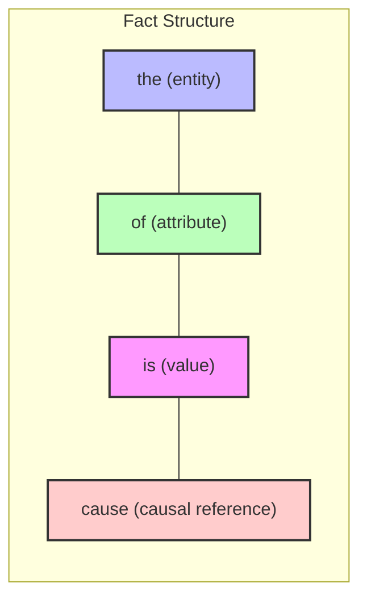

- **Entity (the)**: The subject being described
- **Attribute (of)**: The property of the entity
- **Value (is)**: The value of the property
- **Cause (cause)**: Optional reference to a fact being succeeded, establishing causality

### Temporal Model

Unlike databases with a single global timeline, DialogDB employs a [causal temporal model](https://en.wikipedia.org/wiki/B-theory_of_time), where:

- Facts exist in their own causal timelines rather than in a universal timeline
- Each fact can causally reference predecessor facts it supersedes
- Multiple independent causal chains can coexist and later merge
- Retractions mark facts as invalid from that point in the causal timeline forward
- Time is expressed through causal relationships between facts, not through wall-clock timestamps

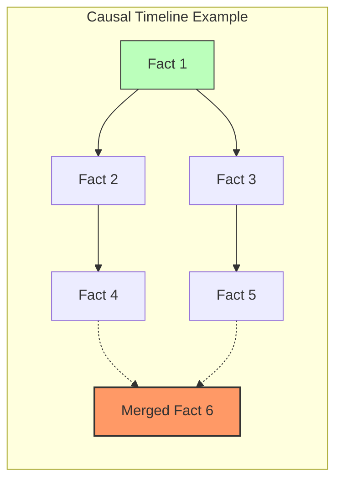

This causal model offers several advantages:

- **Flexible History**: Query data as of any point in the causal timelines
- **Auditability**: Complete history is preserved, showing exactly how data evolved
- **Disconnected Operation**: Different devices can evolve timelines independently
- **Conflict Resolution**: Divergent timelines can be merged using various strategies
- **Flexible querying**: Query across attributes that weren't planned for initially
- **Progressive enhancement**: Schema can evolve organically as needs change
- **Complete history**: The append-only nature preserves the full history of changes

### Schema-on-Query Model

DialogDB decouples raw data from interpretation, using a schema-on-query approach:

- No predefined schema requirements
- Facts can be added with any attribute at any time
- Different applications can interpret the same facts differently
- Schema evolution happens organically without migrations

### CRDT Properties and Merge Semantics

The causal references between facts from a [Merkle-CRDT (Conflict-free Replicated Data Type)](https://research.protocol.ai/publications/merkle-crdts-merkle-dags-meet-crdts/psaras2020.pdf):

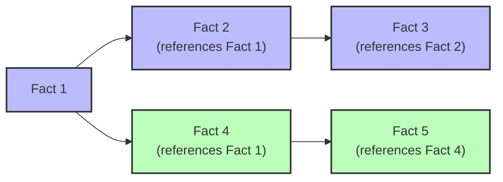

- **Causality tracking**: Each change references its predecessor, forming a directed acyclic graph
- **Query-time merge semantics**: Different merge strategies (last-write-wins, set-based, etc.) can be applied at query time
- **Eventual consistency**: All replicas converge when the same facts are present
- **Offline operation**: Changes can be made offline and merged later

CRDTs are expressed through Datalog queries, giving applications the flexibility to choose appropriate merge semantics for different types of facts at query time, rather than being hardcoded into the database.

## Architecture Components

DialogDB's architecture consists of several key components, each with a specific role:

### 1. Probabilistic B-Trees for Deterministic Data Layout

DialogDB employs Probabilistic B-Trees (Prolly Trees) for a deterministic, content-addressed tree structure:

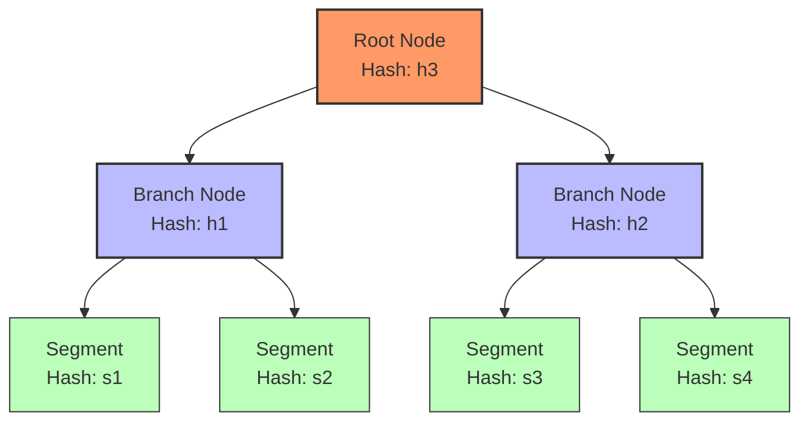

- **Deterministic layout**: The same data always produces the same tree structure regardless of insertion order
- **Content-addressed nodes**: Nodes are addressed by the hash of their content
- **Efficient change detection**: Only modified subtrees need to be synchronized
- **Mergeable structure**: Distributed instances can efficiently merge changes

### 2. Segments as Base Storage Units

The lowest layer of DialogDB consists of segments, which are:

- **Content-addressed blobs**: Each segment is identified by its content hash
- **Immutable data chunks**: Once created, segments never change
- **Serialized and compressed**: Efficiently packed for storage and transfer
- **Self-contained data units**: Can contain multiple facts

### 3. Comprehensive Indexing

DialogDB maintains multiple indexes for efficient access to facts from different perspectives:

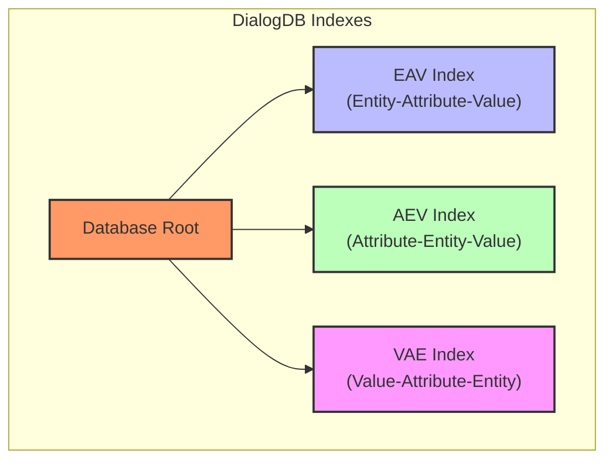

- **EAV Index**: Optimized for retrieving all attributes of a given entity ("What properties does entity X have?")
- **AEV Index**: Optimized for retrieving all entities with a specific attribute ("Which entities have attribute Y?")
- **VAE Index**: Optimized for finding entities with specific attribute values ("Which entities have attribute Y with value Z?")

This comprehensive indexing strategy means:

- **No access pattern planning**: All major query patterns are covered by one of the indexes
- **No schema migrations**: New access patterns don't require index changes
- **Consistent performance**: No performance degradation for unexpected query patterns
- **Flexibility**: Applications can use data in ways not anticipated by the original creator

### 4. Blob Store for Persistence

DialogDB uses simple blob storage for persistence:

- **Hash-addressed blob storage**: Any system that can store and retrieve immutable blobs by hash (S3, R2, IPFS, etc.)
- **No query capabilities required**: The blob store only needs to support get/put operations
- **Efficient caching**: Immutable blobs can be cached at any level without invalidation concerns
- **On-demand replication**: Only the needed segments are fetched from the blob store
- **Storage agnostic**: The blob store is completely unaware of the tree structure or semantics

The blob store acts merely as a buffer in the cloud, storing content-addressed blobs without any knowledge of how they relate to each other or what they contain.

### 5. DID:Key Mutable Pointers

To enable mutability in an immutable data structure, DialogDB uses:

- **Cryptographically signed pointers**: Identified by DID:Key identifiers (Decentralized Identifiers)
- **Root references**: Points to the current root hash of the Probabilistic B-Tree
- **Access control mechanism**: Updates require signing with the private key or delegation
- **Convergence mechanism**: Allows concurrent actors to coordinate on the latest state
- **STM-like concurrency**: Provides optimistic concurrency control via compare-and-swap operations

The mutable pointer is completely unaware of the blob store or tree structure. Its only job is to verify that updates are properly authorized and ensure updates don't unintentionally override current state.

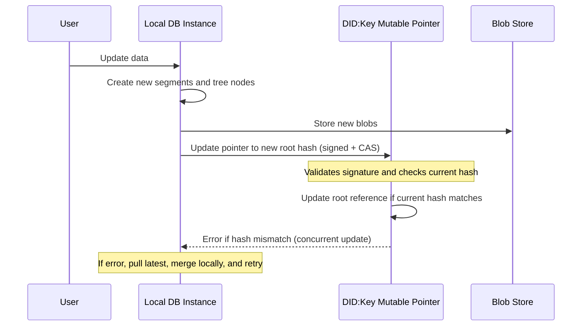

## Decoupled Architecture

A key strength of DialogDB is that its components are fully decoupled from each other:

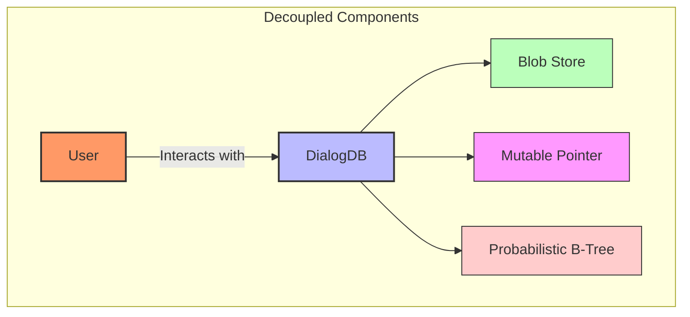

This decoupling enables several important capabilities:

1. **Multiple Independent Blob Stores**:
   - Users can push/pull from multiple remotes, similar to Git
   - Each blob store only sees encrypted content-addressed blobs
   - Resilience through storage diversity (different providers, locations)

2. **Independent Mutable Pointer**:
   - Acts like Git's reference to HEAD commit
   - Uses compare-and-swap semantics to prevent unintentional overrides
   - Only job is to authorize updates and prevent conflicts

3. **Flexible Tree Implementation**:
   - The tree structure is independent of storage and pointer mechanisms
   - Can be optimized without changing other components
   - Encryption can be implemented at this layer only

This strict separation of concerns provides several benefits:

- Components can be replaced or upgraded independently
- Multiple implementations can interoperate seamlessly
- Security boundaries are clearly defined
- Specialized optimizations can be applied to each component

## Data Flow and Operations

### Local-First Operation

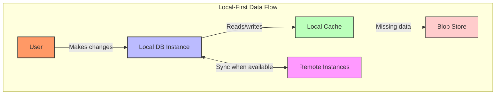

DialogDB embraces local-first principles:

1. **Local querying**: All queries run against the local database instance
2. **On-demand hydration**: Missing segments are fetched from the blob store as needed
3. **Local caching**: Frequently accessed segments are cached for performance
4. **Background synchronization**: Changes are propagated asynchronously
5. **Offline-capable**: Work continues even when disconnected
6. **User ownership**: Data belongs to users, not applications

### Write Operations

1. New facts are created, potentially with causal references to predecessors
2. Facts are organized into segments and tree nodes
3. New nodes are stored in the local blob store
4. A signed update with compare-and-swap check to the DID:Key mutable pointer is issued
5. If the update succeeds, new blobs are eventually pushed to remote blob stores
6. If the update fails (concurrent update), latest changes are pulled, merged locally, and the process retries

### Read Operations

1. Read operations use the local indexes
2. If segments are missing, they're fetched from the blob store
3. Fetched segments are cached locally for future access
4. The tree is traversed locally to resolve the query
5. Different query semantics can be applied to the same data (current view vs. history)

## Conflict Resolution and Git-like Workflows

When concurrent changes occur, DialogDB employs Git-like workflows:

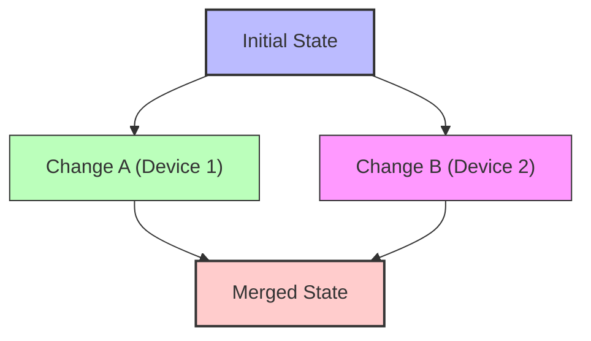

### Query-Time Merge Semantics

1. **Causal consistency**: Changes that are causally related maintain their order
2. **Query-time resolution**: Different merge strategies can be selected at query time
   - Last-write-wins: Take the most recent value for a given attribute
   - Set-based: Treat multi-valued attributes as sets to be merged
   - Custom logic: Apply domain-specific merge functions
3. **Git-like merging**: Similar to Git's merging capabilities, different strategies for different data types
4. **Audit trail**: All changes are preserved in the history, enabling tracing of how conflicts were resolved

### Compare-and-Swap Updates

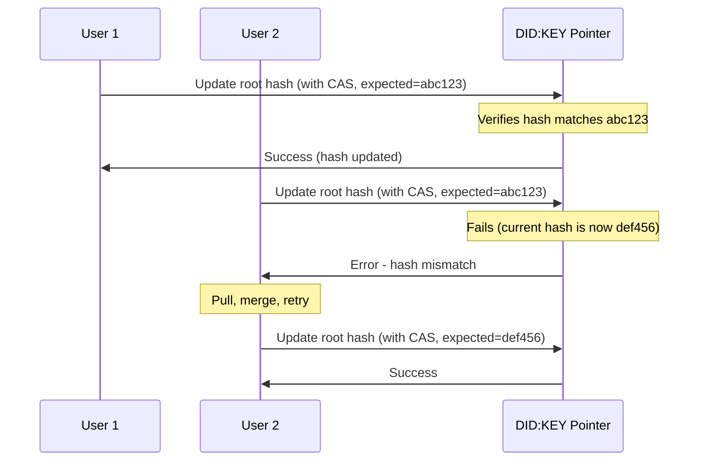

This Git-like approach allows for optimistic concurrency control while providing clear paths for conflict resolution.

## Data Access and Querying

### Datalog Query Language

DialogDB uses Datalog as its query language, particularly well-suited for working with graph-structured facts:

```json
{
  "match": {
    "name": {"?": "name" },
    "email": {"?": "email" },
  },
  "when": [
    "case": [
        {
          "the": "person/name",
          "of": { "?": "person" },
          "is": {"?": "name" },
        },
        {
          "the": "person/email",
          "of": { "?": "person" },
          "is": {"?": "email" },
        },
    ]
  ]
}
```

Datalog offers several advantages for querying a fact database:

- **Declarative semantics**: Specify what you want, not how to retrieve it
- **Graph traversal**: Naturally navigate relationships between entities
- **Recursion**: Follow paths of arbitrary depth through the data
- **Pattern matching**: Express complex relationships concisely
- **Logical rules**: Define reusable query components

### Query-Time Schema and Time-Travel

The schema-on-query approach is fundamentally different from traditional databases:

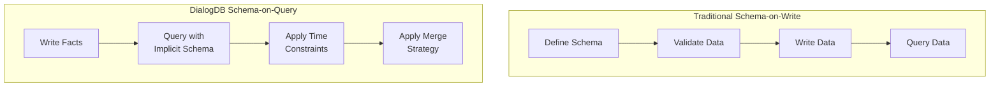

This approach enables:

- **Evolution without migration**: Schema changes don't require database migrations
- **Multiple interpretations**: Different clients can interpret data differently
- **Temporal queries**: Access data as-of specific points in causal timelines
- **Conflict resolution at query time**: Apply different merge strategies depending on the query needs
- **Access pattern flexibility**: All query patterns are efficiently supported through the indexes
- **Zero schema planning**: No need to anticipate query patterns or access methods in advance

## Key Advantages

- **Efficient synchronization**: Only changed tree parts need to be transferred
- **Local-first operation**: All queries run locally for high performance
- **Offline capability**: Local database continues to function without connectivity
- **Verifiable data integrity**: Content addressing ensures data hasn't been tampered with
- **Flexible deployment**: Can run entirely in a browser tab or across distributed servers
- **Natural caching**: Immutable, content-addressed segments enable efficient caching
- **Schema flexibility**: Semantic model allows schema to evolve without migrations
- **Convergent replication**: Merkle-CRDT properties support consistent merging of concurrent changes
- **Consistent query performance**: Comprehensive indexing ensures all access patterns are efficient
- **Zero schema planning**: No need to anticipate access patterns or query types in advance
- **Selective replication**: Only fetch and replicate the parts of the tree that are needed
- **Git-like workflows**: Support for forking, merging, and collaborative development
- **Expressive queries**: Datalog query language enables powerful knowledge graph traversal

## Prior Art and Inspiration

DialogDB builds on ideas from several important projects in the database field:

- Datalog querying and fact-based modeling from [Datomic](https://docs.datomic.com/datomic-overview.html)
- Deterministic synchronization from [Merkle-CRDTs](https://research.protocol.ai/publications/merkle-crdts-merkle-dags-meet-crdts/psaras2020.pdf)
- Content-addressed data structures from [Prolly Trees](https://docs.canvas.xyz/blog/2023-05-04-merklizing-the-key-value-store.html)
- Causal consistency models from [RhizomeDB](https://github.com/RhizomeDB/spec)
- Local-first principles from [Ink & Switch](https://inkandswitch.com/essay/local-first)

We acknowledge and appreciate the contributions of these prior projects that have helped shape our approach. While building on these foundations, DialogDB focuses particularly on user data ownership, privacy, and interoperability between applications.

## Benefits Summary

The DialogDB information model provides several powerful capabilities:

- **Temporal history**: Complete history of all facts is preserved
- **Auditability**: Every change can be traced through causal references
- **Time-travel queries**: Access data as-of any point in causal timelines
- **Flexible schema**: No migrations needed as data models evolve
- **Multi-directional queries**: Traverse the knowledge graph from any starting point
- **Distributed operation**: Work offline and synchronize efficiently when connected
- **Conflict-free merging**: Automatically resolve concurrent changes
- **Privacy-preserving**: End-to-end encryption with selective sharing
- **User ownership**: Data belongs to users, not applications
- **Application interoperability**: Same data can be used by multiple applications
- **Consistent performance**: Comprehensive indexing ensures efficient queries
- **Query-time merge semantics**: Different applications can interpret the same data with different merge strategies

## Conclusion

By reimagining the relationship between users, applications, and data, DialogDB creates a foundation for a more user-centric, privacy-respecting, and resilient digital ecosystem. Its temporal model, schema-on-query approach, and decoupled architecture enable a new generation of applications that respect user ownership while enabling powerful collaboration capabilities.
