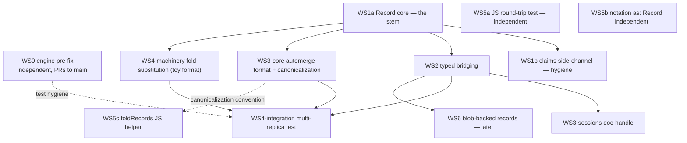

# SPEC: Automerge Documents as Record Values in Dialog

**Status**: Draft v5 for review
**Date**: 2026-07-08
**Verified against**: `main` @ `d2af7b7a` (2026-07-08 — re-verified after #372, the blob landing; every cited anchor byte-identical)
**Builds on**: [`notes/record-value.md`](./record-value.md) (PR [#221](https://github.com/dialog-db/dialog-db/pull/221), merged decision record), [`notes/divergence-clock.md`](./divergence-clock.md), [`notes/sync.md`](./sync.md), [`notes/causal-information-design-decision.md`](./causal-information-design-decision.md), [`notes/version-control.md`](./version-control.md) (PR [#240](https://github.com/dialog-db/dialog-db/pull/240), design)
**Companion**: [`notes/automerge-integration-rationale.md`](./automerge-integration-rationale.md) — the same design as a step-by-step walkthrough: each decision, its alternatives, and why it won
**Automerge source surveyed**: `~/Workspace/automerge` — Rust crate `automerge` v0.10.0 (Automerge 3), MIT, MSRV 1.89 (v2 survey; nothing on dialog `main` affects it — re-pin at WS3)

> **Revision note (v2).** v1 proposed a storage-side reconciliation pass in the pull path, which required a byte-prefix format tag and a merge registry to dispatch on type-erased bytes. Review showed the dispatch problem was self-inflicted: it only exists if merge runs where type knowledge has been erased. v2 moved merge to the typed query boundary. **No storage, sync, or format changes remain in this plan.**
>
> **Revision note (v3).** v2's code survey mixed branch and main state; v3 re-verifies every claim against `main` @ `f777fe7c`. Two discoveries shrink the plan rather than change its direction:
>
> 1. **The fold adapter v2 proposed already exists in pick-one form.** `AttributeQueryOnly` (`dialog-query/src/attribute/query/only.rs`) collapses `Cardinality::One` siblings at read time today — a sliding-window group-consecutive winner pass plus a "challenge" verification for value-bound scans. The merge hook is now a *format-aware substitution* in that machinery, not a new adapter (§4.4).
> 2. **The typed write path already supersedes.** Typed attribute asserts emit `associate_unique` → `Instruction::Replace` (`attribute/statement.rs:23-25`); same-value `Replace` is a no-op. §4.4's physical-convergence story is the typed path's default behavior, not an opt-in.
>
> Consequences: v2's §6.8 read-your-writes gate is reclassified as a **pre-existing engine quirk that affects scalars today** and is fixed at the merge layer (one small change, WS0), not by fold policy. Cause plumbing is explicitly deferred to `version-control.md` — production claims all carry `cause: None` today, and `instruction.rs` documents a cause-population behavior `tree.rs` does not implement (doc/impl mismatch, flagged upstream). The §4.4 determinism rule is corrected to the *actual* implemented rule (`choose`: higher cause, fact-hash tiebreak) and the default `RecordFormat::merge` adopts it, giving one convention system-wide. Notation: `as: Record` already parses at runtime (docs just don't say so); the qualified-name surface is deferred and reshaped to avoid colliding with the planned `ConceptRef` grammar (§4.6). Estimates trimmed accordingly (§5).
>
> **Revision note (v4).** Re-verified against `main` @ `99602b2c`; every anchor holds. Two design changes and three refreshes, driven less by main itself than by what is in flight on its branches. (1) **Write-back rides pull** (§4.4): divergence only ever enters a replica through pull, and pull is already a write attributed to the puller — so post-pull reconciliation ships **default-on** for writable, format-linked branches (a git merge commit, exactly), closing most of §6.4's quiescent-divergence hole; repair triggered by arbitrary reads stays flag-gated off. (2) **The deferred notation shape becomes a sibling key** (§4.6): `feat/composite-types` shipped concept-typed fields as `as: Entity` + `conforms: <descriptor>` — structural, registry-free — so record formats mirror it: `as: Record` + `format: automerge/Text`, superseding v3's object form. Refreshes: the blob layer then **landed outright as #372** while v4 was being drafted — `dialog-blobs` deleted, a blob ordering added to the artifact tree beside the three fact indexes, an entity-addressed `BlobArchive` API, push shipping referenced blobs — with the `blob/size`/`blob/slice` query surface still owed by its delivery plan (§4.7); `feat/incremental-maintenance`'s `restrict(entity)` re-evaluation model confirms §6.11; WS4 gains a coordination note for the incremental branches.
>
> **Revision note (v5).** Resolution is now **deliberately unscheduled**. v4 promoted pull-triggered reconciliation to a default; review pushed back twice — pull is schema-blind (it cannot classify a sibling set as conflict vs. cardinality-many), and reads must not write (which indicts read-repair too). v5 accepts the consequence: the fold is the *only* record-specific engine machinery, quiescent diverged docs are an accepted, measurable cost (§6.4), and physical convergence happens when the next ordinary edit `Replace`s — the write path that already exists. Read-repair is removed, not deferred. The detect/project/resolve decomposition — repository reports touched groups off the pull differential (the `blob_changes` pattern), session classifies by schema, and **only information-preserving merges are ever auto-written** — is recorded as the designed evolution path, none of it built (§4.4). WS4 trims to the substitution + tests.

---

## 1. Goal

Allow an automerge CRDT document (e.g. a collaborative rich-text document) to live as a **single atomic value** in one `{the, of, is}` claim, such that:

1. It is written, read, replicated, and content-addressed like any other value — opaque to the query layer.
2. Concurrent edits to the same document on different replicas **converge via CRDT merge** rather than surfacing as divergent siblings.
3. The core (storage, sync, wasm blob) takes **no automerge dependency and no format changes**.

## 2. Current state (verified against `main` @ `d2af7b7a`)

| Thing | Where | State |
|---|---|---|
| `Value::Record(Vec<u8>)` variant | `rust/dialog-artifacts/src/artifacts/value.rs:40` | Placeholder; payload passes through `to_bytes` (`value.rs:63-71`) but the storage decode path is `unimplemented!()` (`value.rs:245`) — a live panic. No deployment can hold *readable* Record data, so the payload encoding is unclaimed design space. `Value` carries no rkyv derives (only `Datum` does, storing tag + bytes), so retyping touches serde/byte surfaces only. |
| `ValueDataType::Record` tag | `value.rs:850` (`Record = 7`) | Exists in the on-disk tag scheme, index keys, the wasm surface, **and the live notation runtime** (see §4.6). Unchanged by this plan. |
| Query type system `Type::Record` | `dialog-query/src/type_system.rs:165,251`; descriptor `dialog-query/src/types.rs:169` | Models Record as an opaque carried-not-inspected type; #352's narrowing code threads a Record primitive bit without inspecting values. `feat/composite-types`' large `type_system.rs` rewrite preserves all three Record sites (±1-line drift when it lands). |
| Typed attribute layer | `dialog-query/src/attribute.rs:35` (`type Type: Scalar`), `types.rs:255` (`Scalar: Typed + Into<Value> + TryFrom<Value>`), `schema.rs:113` (`Cardinality`, defaulting to `One`) | **This is where type knowledge and cardinality live.** The merge hook belongs here. |
| **Winner selection — already exists** | `dialog-query/src/attribute/query/only.rs`; dispatch `attribute/query/dynamic.rs:58-63`; typed routing `attribute/query/typed.rs:73` | `AttributeQueryOnly` collapses `Cardinality::One` siblings at read: **sliding window** over adjacent same-`(the, of)` siblings when entity/attribute is bound; **challenge** (secondary `(the, of)` lookup, the `VERIFICATION_COST` of `schema.rs:97`) when only the value is bound. Rule `choose()` (`only.rs:24-39`): higher `cause` wins, fact-hash tiebreak. `Cardinality::Many` and untyped/dynamic reads yield all siblings. |
| **Typed writes — already supersede** | `dialog-query/src/attribute/statement.rs:23-25`; `Changes::associate_unique` (`update.rs:146-151`) | `Cardinality::One` typed asserts emit `Instruction::Replace`. Raw `the!()` fact-builder writes are additive `Assert`. `Replace` on an already-present value is a **no-op**. |
| **Query-time merge point** | `dialog-repository/src/layer.rs:76` (`merge_grouped`), `:144-158` (`tombstones_from`); `repository/branch/session.rs:334-352` (`QueryEnv`) | One choke point unions branch scans + transaction overlay, preserving the `SortKey` adjacency invariant (`update.rs:225-248`) the sliding window depends on. Tombstones are lifted **from Retracts only** — a pending `Replace` does not shadow its committed prior. See §6.8 (resolved, WS0). |
| **`cause` — aspirational today** | `cause.rs:36` (`Cause(Blake3Hash)`); overlay `update.rs:359`; tree `tree.rs:227-315` | Every production write carries `cause: None`; `choose()`'s cause arm never fires, so the effective winner rule is deterministic content order. `instruction.rs:19-21` documents Replace populating `cause` from the superseded prior — **not implemented** in `tree.rs` (doc/impl mismatch, flagged). `version-control.md` (landed, design) redesigns cause as `Cause(Vec<Version>)` with Lamport editions. |
| Claims side-channel to eliminate | `dialog-query/src/selection/match.rs:120-123` | `claims: HashMap<String, Arc<Claim>>` beside bindings, TODO pointing at PR #221. The engine already threads the claim handle as `Term<Record>` (`only.rs:151`) — the note's first consumer is half-wired. |
| `ConditionalSend` / `ConditionalSync` | `rust/dialog-common/src/sync.rs` | Exist exactly as the note's trait bounds require. |
| `RecordFormat` trait, `Record` struct | — | Do not exist yet (only the `match.rs` TODO references them). |
| `automerge` dependency | — | Not present anywhere in the workspace. Stays out of the core under this plan. |
| Blob layer — **landed, #372** | `dialog-artifacts/src/blob_index.rs` + `key/blob.rs` (blob ordering at tag 4, history tag 3 reserved; `BlobRecord { version, size }`); `repository/branch/blob.rs` (`branch.blobs()` → `BlobArchive`; `Blob::from(entity)` / `Blob::import(chunks)` / `.slice(range)` / `.read()` / `.size()` / `.write()`); `push.rs` ships newly-referenced blobs via the tree differential; design record `notes/blob-replication.md` | `dialog-blobs` deleted. The three fact indexes and every file this spec cites are byte-identical before/after (`update.rs`, `tree.rs`, `pull.rs`, `session.rs`, all of `dialog-query`). The `blob/size`/`blob/slice` query surface is still owed (delivery plan item 3). See §4.7. |

### How concurrent writes behave today (and why storage stays out of this)

- Index keys embed the value: `(the, of, value_type, blake3(value_bytes))` (`update.rs:193-249`). Two different values for one `(the, of)` are two different keys.
- Pull is a three-way merge (`repository/branch/pull.rs:151-163`); `TransientTree::integrate` (`search-tree/src/tree/transient.rs:364`) replays the base→local diff onto upstream. Its hash-LWW arm fires only on *identical keys* (metadata races); different values coexist as sibling claims **in storage**.
- Supersession is a write-time behavior: `Instruction::Replace` scans the `(the, of)` range and deletes **all** different-valued priors from all three indexes (`tree.rs:227-315`), and that diff replays cleanly cross-replica. Typed attribute writes take this path by default; raw fact asserts accumulate.
- **Correction to v2**: sibling preservation is a *storage-level* property, not a reader experience. Typed `Cardinality::One` reads already project **one deterministic winner** per `(the, of)` (`AttributeQueryOnly`) — `divergence-clock.md`'s "projecting concurrent states" exists today in pick-one form. What is missing for records is only that the projection *discards* the loser instead of *merging* it. Untyped/dynamic reads (including today's JS surface) see all siblings.
- The generic tree still cannot distinguish a conflict from an intentional cardinality-many set — only the schema layer can, which is exactly where the existing winner selection lives.

**Consequence for this design**: storage is value-blind and schema-blind *on purpose*, and the read boundary already collapses siblings where cardinality says to. The merge hook is therefore **not a new stage but a substitution**: make the existing winner selection format-aware where the descriptor knows the attribute is a record format. Physical convergence rides the existing `Replace` supersession, which typed writes already perform.

## 3. What automerge gives us (the load-bearing facts)

Core APIs in `~/Workspace/automerge/rust/automerge/src/automerge.rs`:

- `decode` = `Automerge::load(&[u8])`, `encode` = `Automerge::save(&self)` — both pure on `&self`. Use plain `Automerge`, not `AutoCommit` (whose `save` needs `&mut self`).
- **Saved bytes are canonical**: replicas holding the same change-set produce byte-identical `save()` output regardless of application order (upstream tests `tests/test.rs:906,1190,2065`). Byte-level `Eq`/`Hash`/`blake3` identity therefore works — and two replicas that independently write the same merged state mint the **identical tree key**.
- Merge is idempotent and monotone: `merge(a, b) = b` (same canonical bytes) when `a`'s changes ⊆ `b`'s. Folding stale-vs-new is harmless, so **no concurrency detection is required for correctness** — cause/edition machinery remains an upgrade for scalars and default-merge records, not a dependency here.
- Upstream merge signature is `fn merge(&mut self, other: &mut Self) -> Result<_, AutomergeError>` — the trait impl clones both sides; merge of two successfully-loaded docs is practically infallible (errors indicate corrupt internal state, which `load` already rejects).
- Constraints: whole-document load/save only (no partial reads); canonical output is stable per automerge version, not across majors — pin one workspace version; canonicalize with fixed `SaveOptions` (**no compression** and `retain_orphans: false` — decided, §6.7).
- `Automerge` is `Send + Sync` (no `Rc`/`RefCell` in the crate) — satisfies `ConditionalSend + ConditionalSync` natively.

## 4. Design

### 4.1 `Record` + `RecordFormat` — exactly as the note specifies

New module `rust/dialog-artifacts/src/artifacts/record.rs`, implementing `record-value.md` as written: `Record(Arc<RecordState>)` with `source: Vec<u8>` and the lazy `forms: RwLock<HashMap<TypeId, ErasedForm>>`; `realize::<F>()`; `TryFrom<F>` for eager encode; `From<Vec<u8>>` for storage hydration; `Eq`/`Hash`/`Serialize`/`Deserialize` over `source` bytes. The trait keeps the note's shape, including the merge extension from its §Rationale-4 (with `Clone` added to the bounds, which the default already requires):

```rust
trait RecordFormat: ConditionalSend + ConditionalSync + Sized + Clone + 'static {
    fn decode(bytes: &[u8]) -> Result<Self, RecordError>;
    fn encode(&self) -> Result<Vec<u8>, RecordError>;
    fn merge(a: &Self, b: &Self) -> Self { b.clone() } // default: see §4.4 — folded in choose() order
}
```

`Value::Record(Vec<u8>)` is retyped to `Value::Record(Record)`. The `unimplemented!()` at `value.rs:245` becomes `Record::from(bytes)` — decode never fails; bytes pass through untouched. **The record payload is the format's natural encoding** (an automerge value is stored as exactly `save()` output). No tag, no envelope, no change to `Datum`, keys, discriminants, or block encoding. On-disk bytes for every existing value type are identical before and after.

Touch points (verified on main): ~7 exhaustive match sites in `value.rs`, 2 wasm arms in `web.rs:411,598`, 2 CSV arms in `csv/row.rs:32,66`, 1 in `query/formula/conversions.rs:30`. Then eliminate the claims side-channel (`selection/match.rs:120-123`) by giving `Claim` a `RecordFormat` impl and binding it as `Value::Record` — the note's stated first consumer, whose `Term<Record>` handle the engine already threads (`only.rs:151`). Naming note: `dialog-capability` has an unrelated `Claim` trait (`claim-based-serialization.md`); keep the artifact `Claim` unambiguous in docs and code.

### 4.2 Typed bridging — a `RecordFormat` type is an attribute type

To use `TextDocument` as an attribute (`#[derive(Attribute)] struct Body(TextDocument)`), the type needs what every scalar already has: `Typed` (mapping to the existing `Record` descriptor, `types.rs:169`), `Into<Value>` (encode → `Value::Record`), and `TryFrom<Value>` (realize). Coherence prevents blanket impls over `F: RecordFormat` alongside the existing scalar impls, so these are generated — either by a small `#[derive(RecordType)]`-style macro or by extending the existing attribute derive. This is glue, not architecture: no new concepts in the type system, and the `Record` descriptor already exists.

**Decided: lazy decode (no eager option).** The generated field holds a typed lazy handle (`Recorded<F>`: `Record` + phantom type) — **eager encode on write** (bytes must exist for identity/keys), **lazy, memoized decode on read** via `realize() -> Result<Arc<F>>`. Rationale: (a) decoded docs cannot cross the wasm/worker boundary — bytes ship regardless, so eager decode is wasted work for every JS consumer; (b) materialization cost stays flat for list queries (decode cost scales with doc *history*, and eager would pay it per row, invisibly); (c) generated structs keep cheap `Clone` (Arc bump, vs. deep op-set copy) and byte-wise `Eq`; (d) failure moves from query-time row errors to the accessing field — the §6 decode-failure posture extended to the single-sibling case; (e) it is what `Record`'s memoized `forms` cache was designed for. The fold composes: it constructs the merged `Record` via `TryFrom<F>`, which pre-populates the memo cache, so fold work double-serves the subsequent open. Residuals: fallible/asymmetric access vs. scalar fields (truthful — record decode genuinely can fail); a naive main-thread `realize()` remains possible (docs/lint concern; sessions go through the §4.3 doc-handle); and bytes still ship with rows — the bytes rung is fixed by deferred-from-storage / WS6 blob-backing, not by lazy decode.

### 4.3 `dialog-automerge` — an edge crate, not a core dependency

New optional workspace crate wrapping `automerge = "0.10"`:

```rust
pub struct TextDocument(automerge::Automerge);

impl RecordFormat for TextDocument {
    fn decode(bytes: &[u8]) -> Result<Self, RecordError> {
        Ok(Self(Automerge::load(bytes)?))
    }
    fn encode(&self) -> Result<Vec<u8>, RecordError> {
        // Canonical form (§6.7): no compression, no orphans. Identity must
        // depend only on automerge's own encoder, never on a deflate library.
        Ok(self.0.save_with_options(canonical_options()))
    }
    fn merge(a: &Self, b: &Self) -> Self {
        let (mut out, mut rhs) = (a.0.clone(), b.0.clone());
        match out.merge(&mut rhs) {
            Ok(_) => Self(out),
            // Merge of two loadable docs failing means corrupt internal
            // state; degrade to the deterministic default rather than
            // poisoning the read path.
            Err(_) => Self(b.0.clone()),
        }
    }
}
```

Editing model: `realize::<TextDocument>()` → `fork()` → `transact(|tx| tx.splice_text(...))` → new `Record` → typed commit. The typed statement layer already emits `Instruction::Replace` for `Cardinality::One` attributes (`statement.rs:23-25`), so read-fold-edit-write is the path of least resistance, not a discipline to enforce. `cause` on the committed claim inherits whatever the repository populates — today nothing (§2), multi-parent `Vec<Version>` once `version-control.md` lands (§6.5). Rich text uses automerge's mark/block APIs internally; Dialog never sees them. **Only applications that declare automerge-typed attributes link this crate** — the core wasm blob and native core are unaffected.

**Live sessions and merge timing.** The crate should ship a doc-handle abstraction for open editing sessions: subscribe to the attribute; when sync lands a concurrent sibling mid-session, merge it **into the live in-memory document** (the standard automerge pattern — pending edits and cursors survive), so the next commit's `Replace` is inclusive rather than data-losing. This gives merge work three app-controlled moments, none on the sync path and none per-keystroke: (1) the fold at document *open*; (2) incremental absorption of arrivals during a session; (3) physical collapse on the next ordinary edit — the commit is already a `Replace`, so the session's merged doc supersedes every sibling; no scheduled write-back exists in this plan (§4.4).

**Threading and latency constraints (normative).**

- **All merge/fold/decode work runs off the UI thread.** In the browser deployment, automerge (JS or wasm) lives in the worker beside the dialog transactor; the fold executes during worker-side query evaluation. *The main thread is never handed unfolded siblings* — it receives one document. (Rust-native: run the session off the UI thread; the API is already async.)
- **The fold adds no async dependency edges.** It is CPU inside the existing query await (one worker round-trip), never an additional awaited hop on the read path.
- **Divergence adds zero to time-to-first-paint (progressive open).** At open, load one sibling (the deterministic `choose()` winner) and render — identical cost to the no-divergence case. The remaining sibling is then merged in the worker and delivered to the live doc as an ordinary incoming-changes delta, reusing the mid-session absorption path: to the CRDT, a conflict-at-open is just a sync that arrived very early in the session. Plain fold-before-respond remains the default for non-editor reads (list rendering), which are off-main-thread per the first constraint. *UX caveat*: content order may paint the *other* replica's fork first, with your edits popping in a beat later — same visual as any late sync, but worth a "prefer a locally-authored sibling first when identifiable" refinement.
- **Both threads pin the same automerge version.** The worker (fold/repair) and the editor thread (live doc, applying deltas) each carry an automerge instance; version skew between the two bundles is the in-app variant of §6.7 and must be locked in the build.
- **Divergence never adds network to the open-time critical path** (matters once WS6 blob-backing lands): if the second sibling's bytes aren't local, open renders the local one and absorbs the other when it arrives — never block on a remote fetch to show a document.

### 4.4 The merge hook — format-aware resolution in the existing winner selection

v2 proposed building a group-consecutive fold adapter at the typed read boundary. The adapter already exists: `AttributeQueryOnly` collapses `Cardinality::One` siblings today, with exactly the two strategies the fold needs — the **sliding window** over adjacent siblings (the `SortKey` adjacency invariant, `update.rs:225-248`, preserved through `merge_grouped`, `layer.rs:24-31`) and the **challenge** secondary lookup for value-bound scans. The hook is a substitution, not an addition:

**Where**: extract the combining step (`choose`, `only.rs:24-39`) into a resolution strategy sourced from the attribute descriptor — the object that already carries cardinality. Default strategy: `choose`, unchanged for every existing attribute. Record-format attributes: the derive supplies `realize` both → `F::merge` → `TryFrom<F>` (pre-populating the memo cache). The typed layer statically knows `F`; no registry, no dispatch on type-erased bytes, untyped paths untouched. Two candidate wirings — a serde-skipped strategy slot on the dynamic query (identity unaffected: the strategy is a pure function of `(the, format)`, both already part of attribute identity) or a typed fold evaluator beside `Only` constructed before erasure — decided at the §7 design checkpoint. The commitment is the shape: **one substitution point, both scan strategies inherit it.**

- 1 sibling (the overwhelmingly common case): pass through — zero added cost; the sliding window already short-circuits.
- N > 1 siblings on a `Cardinality::One` record attribute: fold with `F::merge` in stream order, yielding **one** value.
- Challenge path: fold the challengers; yield the candidate only if it equals the fold product — value-bound queries inherit fold semantics from the same substitution (see §6.10).

**Determinism (corrected from v2)**: the implemented rule is `choose()` — higher `cause` wins, fact-hash tiebreak; with production causes all `None`, the effective rule is deterministic content order, identical on every replica. Automerge's merge is order-insensitive in output bytes (canonical form), so fold order is irrelevant for real CRDTs. The **default `RecordFormat::merge` adopts `choose()`'s rule** rather than v2's separate value-hash-order convention: scalars and non-CRDT records resolve identically — one convention system-wide — and both upgrade to true causal LWW automatically when `version-control.md`'s editions make cause comparison meaningful.

**Scope guards** (each is a *non*-change): `Cardinality::Many` attributes never fold — the `All` path is untouched and sibling sets are its intended semantics. Scalar attributes keep `choose` — today's behavior exactly. Untyped/dynamic queries (`Term<Any>`, raw artifact scans, current JS surface) see all siblings — same as today; the JS app holds the type knowledge there and can merge with `@automerge/automerge` directly, which works precisely because stored bytes are naked `save()` output.

**Read-your-writes (v2's §6.8 gate — now a concrete fix, WS0).** The query-time union of branch scans and the transaction overlay lifts tombstones **from Retracts only** (`tombstones_from`, `layer.rs:144-158`), so a pending `Replace` does not shadow its committed prior: both stream as siblings and `choose()` picks by content order — a pre-existing quirk that can lose *scalar* read-your-writes today (no test covers "committed X, mid-transaction replace with Y, read → Y"), and would let a stale sibling beat an uncommitted record write. Fix at the layer: a pending `Change::Replace` also shadows same-`(the, of)`, different-value branch facts. One small change at the single union site (`QueryEnv`, `session.rs:334-352`); mid-transaction reads then agree with post-commit state for scalars and records alike, and no fold-specific overlay policy is needed. Ships as WS0 with the missing test.

**Physical convergence — existing machinery only.** The fold fixes what readers *see*; storage converges through writes that already work:

1. App reads the attribute → gets the folded document. App edits it → typed commit (already a `Replace` via `associate_unique`).
2. `Replace` supersedes **all** different-valued priors at that `(the, of)` (`tree.rs:227-315`) — both siblings deleted from all three indexes, merged+edited claim inserted. A same-value `Replace` is a **no-op**, so concurrent identical write-backs don't even mint a claim.
3. The diff replays cleanly on other replicas (exact-match removes; canonical bytes mean concurrent identical write-backs collide onto the same key).

No new sync stage, no parsing of untrusted bytes at pull time, no schema knowledge demanded of `dialog-repository`. Until a write happens, siblings persist in storage — the same lifecycle scalars have today, except every reader already sees the merged projection (this is `divergence-clock.md`'s "projecting concurrent states" upgraded from pick-one to merge for records).

**Resolution — deliberately unscheduled (v5).** Nothing in this plan writes the fold back. Physical convergence happens exactly one way: the next ordinary edit — read the folded doc, change it, typed commit — is already a `Replace` that supersedes every sibling. Documents that diverge and then go quiet keep both siblings indefinitely: every reader still sees the same merged doc (the fold is the correctness floor), and the standing cost is the read tax (§6.2) plus doubled storage/sync for that value (§6.4) — accepted, bounded, and measurable: a diagnostic scan for multi-sibling `Cardinality::One` record groups reports exactly how much standing divergence real usage produces. Read-repair is **removed, not deferred** — a write smuggled into the read path is an architecture violation, and projection already covers correctness.

**The designed evolution path — recorded, none of it built.** If measurement ever says standing divergence matters, resolution decomposes coherently as detect / project / resolve, each where its knowledge lives. *Detect*: the repository reports which `(the, of)` groups a pull touched, derived from the differential it already runs — the `blob_changes` pattern from #372; structural, no schema judgment, so the conflict-vs-cardinality-many question never reaches a layer that can't answer it. *Project*: the existing read fold, unchanged. *Resolve*: the session that initiated the pull — which holds the schema, the linked formats, and write capability — classifies touched groups and commits folds, under one rule: **only information-preserving merges are ever auto-written**. Record folds keep both sides' edits; `choose()` picks are lossy and therefore stay projections forever; cardinality-many is never touched. Step one needs zero repository changes (the wrapper reads the base hash, pulls, runs the public `differentiate`, reconciles in a follow-up commit). Step two — pull accepting a caller-supplied reconciliation stage so the fold lands inside the merge revision, citing both parents — belongs to the `version-control.md` chapter, when merge revisions become first-class. Every schedule, including "never," stays within one invariant: storage may hold siblings; every schema-aware reader sees the deterministic projection; any participant may decline to resolve and remains correct.

### 4.5 wasm / JS surface

- The TS `Value` already crosses as `{ type: ValueDataType, value }` with `Record = 7` distinguished from `Bytes = 0` (`web.rs:67-70`; generated `dialog_artifacts.d.ts`), and the Record arms pass naked `Uint8Array` bytes both directions (`web.rs:411`, `:598`) — directly consumable by `@automerge/automerge`'s `load()`; no stripping, no tag awareness. **No test exercises Record over the JS boundary today** — WS5 adds the round-trip test.
- No automerge inside the dialog wasm blob. The two-wasm-blob interop surface is plain byte arrays, which is what both sides already speak.
- Typed-layer fold parity for the TS client tracks whatever typed query surface TS grows; until then the JS app folds explicitly (WS5 ships `foldRecords(rows, format)` + the doc-handle pattern, §6.13/§6.15).

### 4.6 Notation surface (YAML/JSON)

The notation's `as` field is **live runtime code**, not just a design doc: `AttributeDescriptor.content_type` deserializes `as` into `ValueDataType` (`descriptor.rs:43`), and `AttributeDescriptor::resolve` validates values against it. Consequently **`as: Record` already parses today** — `notation.md` and `schema.json` merely omit it, and no test pins it.

**Ship now (WS5, documentation catching up to code):** add `Record` to the notation's value-type table and `schema.json`'s `ScalarType` enum, plus a conformance test — "opaque record, never folded." Zero runtime risk.

```yaml
body:
  description: Collaboratively edited body
  the: note/body
  cardinality: one
  as: Record          # opaque record — parses today, documented by WS5
```

**Deferred, reshaped (v4): format-qualified record attributes as a sibling key.** v2 proposed bare `as: automerge/Text`; v3 flagged the collision with concept-reference grammar (`ConceptRef` uses exactly the `domain/PascalCase` shape) and reshaped to an object form. The codebase has since chosen the pattern for real: `feat/composite-types` ships concept-typed fields as **`as: Entity` plus a sibling `conforms:` refinement** carrying the target descriptor — structural, explicitly "without a registry" (its own doc comment), storage type syntactic in `as`. Record formats mirror it exactly:

```yaml
body:
  description: Collaboratively edited body
  the: note/body
  cardinality: one
  as: Record               # storage type — syntactic, parses today
  format: automerge/Text   # refinement — schema metadata, never touches disk
```

- `as` keeps deserializing into `ValueDataType` unchanged; `format` is an optional field on `AttributeDescriptor`, exactly parallel to `conforms` on `ConceptFieldDescriptor`. The storage type stays derivable from schema text alone — no name resolution, no collision with concept references, and the descriptor's `resolve` check keeps enforcing the storage type for schema-respecting tools.
- The runtime binds format names to implementations (`dialog-automerge` registers `automerge/Text` ↔ `TextDocument`); a notation-driven evaluator uses the binding + `cardinality: one` to apply the read-side fold. Unbound format names degrade to opaque records (no fold) — safe, because the storage type was never in question.
- Whether `format` joins the attribute's structural identity is the same question `conforms` already poses for concept-typed fields (its identity hashing uses the target's `concept:{hash}` URI) — resolve both the same way, together.
- Tracked under WS5 as a **joint decision with the `feat/composite-types` owners**; only the `as: Record` documentation ships unconditionally.

### 4.7 Phase later (unchanged from the note) — deferred deserialization and blob-backed large records

`record-value.md`'s "Records From Storage" (storage yields `Record::from(bytes)` lazily) remains the follow-up it always was. Separately, documents that outgrow inline datum storage (tree-node bloat above ~tens of KB) move to the blob layer — and that layer **landed with #372** (`notes/blob-replication.md` is the design record): a blob ordering in the artifact tree beside the three fact indexes (tag 4; history tag 3 reserved) carrying intrinsic `BlobRecord { version, size }` metadata; blake3/BAO root identity with verified streaming; an entity-addressed archive API — `branch.blobs()`, `Blob::from(entity).slice(range).read(archive)` / `.size(archive)`, `Blob::import(chunks)` for content-bound replication; and push shipping exactly the newly-referenced blobs via the tree differential. That is the hydration surface a blob-backed `Recorded<F>` needs, ranged reads included — WS6 becomes: store the `{hash, size}` reference inline (the blob index already carries the size), hydrate via `slice`/`read`. The record's delivery plan still owes the `blob/size`/`blob/slice` query formulas (its item 3), which WS6 would ride or contribute to. Worth doing when real document sizes demand it, orthogonal to everything above.

## 5. Workstreams, complexity, and time estimates

Assumptions: one engineer fluent in this codebase; focused engineering days including tests; ranges are p50–p80.

| # | Workstream | Deliverable | Complexity | Estimate |
|---|---|---|---|---|
| WS0 | Engine pre-fix | `tombstones_from` shadows same-`(the, of)` different-value branch facts for pending `Replace`; the missing read-your-writes test; correct the `instruction.rs` cause-population doc (or implement it under `version-control.md`, not here) | **Low** — one choke point, standalone, benefits scalars today | 0.5–1 d |
| WS1 | `Record` + `RecordFormat` core | New module per the note; retype `Value::Record`; fix the `unimplemented!()`; ~12 match sites; serde/Hash/Eq surfaces (no rkyv exposure — §2); claims side-channel removal. Splits **WS1a** (the stem: trait + `Record` + retype + panic fix + match sites + serde) / **WS1b** (claims side-channel removal — hygiene; nothing downstream waits on it, §5.1) | **Medium** — mechanical but touches identity/serialization invariants | 4–7 d |
| WS2 | Typed bridging | `Recorded<F>` lazy handle (eager encode on write, memoized `realize()` on read, §4.2); `Typed`/`Into<Value>`/`TryFrom<Value>` generation for `RecordFormat` types; attribute-derive integration | **Low–Medium** — macro glue over existing descriptors | 2–3 d |
| WS3 | `dialog-automerge` crate | `TextDocument`, canonicalization (`save_nocompress`, decided §6.7), merge, doc-handle (mid-session absorption + progressive open), convergence + byte-equality property tests (incl. cross-order build → identical bytes) | **Medium** — APIs fit well; the doc-handle carries the session complexity | 4–7 d |
| WS4 | Format-aware resolution | Extract `choose` into a descriptor-sourced strategy; fold substitution in sliding-window + challenge paths; decode-failure policy (§6.9 gate); determinism tests; multi-replica integration test (diverge → fold → edit → converge) | **Medium** — the skeleton exists; the §6.9 gate and wiring choice carry the risk; coordinate with `feat/incremental-maintenance` (touches `dynamic.rs`/`all.rs`, not `only.rs`) | 2–3 d |
| WS5 | wasm/TS + notation surface | Record round-trip test over the JS boundary (none exists); **worker-side** `foldRecords` + doc-handle helper (main thread never sees unfolded siblings); JS interop test round-tripping stored bytes through `@automerge/automerge`; notation: document + test `as: Record`; `format:` sibling-key decision jointly with the composite-types work | **Low–Medium** | 2–3 d |
| WS6 | Blob-backed records *(later, optional)* | Size threshold, blob-ref hydration via the landed blob layer (#372: `BlobArchive` ranged reads; `BlobRecord` already carries size); rides or contributes the delivery plan's `blob/size`/`blob/slice` item | **Medium–High** | 5–8 d |

### 5.1 Dependency graph — what actually blocks what

The table's ordering is a solo-engineer serialization; the true graph is much wider. **WS1a is the only stem** — everything record-typed compiles against it — and the plan has exactly one convergence point, the WS4 integration test. Solid arrows are hard dependencies (compiles-against); dotted are soft (a convention or test hygiene).



Why each hard edge exists:

- **WS1a → WS2**: `Recorded<F>` wraps `Record`; the generated impls target `RecordFormat`.
- **WS1a → WS3-core**: the crate implements the trait — and *only* the trait. Its property tests exercise `TextDocument` and canonical bytes directly, no derive, so WS3-core does **not** wait for WS2.
- **WS1a → WS4-machinery**: the fold is `realize` → `F::merge` → `TryFrom<F>`. A toy format (e.g. CBOR set-union) makes it fully testable **without automerge**, so WS4-machinery does not wait for WS3.
- **WS2 → WS3-sessions**: the doc-handle subscribes to a *typed* attribute (`Body(TextDocument)`).
- **{WS2, WS3-core, WS4-machinery} → WS4-integration**: the multi-replica test (diverge → fold → edit → converge) declares a real typed automerge attribute and drives the shipped path end-to-end, including the typed `Replace` on the edit leg — the plan's single convergence point.
- **WS3-core ⇢ WS5c** (soft): the JS helper must emit byte-identical canonical output, so it consumes WS3-core's `SaveOptions` *decision*, not the crate.
- **WS0 ⇢ WS4-integration** (soft): without the overlay fix, mid-transaction assertions on default-merge records are hash-order flaky (true-CRDT formats survive via merge monotonicity). Land WS0 first so fold tests measure the fold, not the quirk.

The schedule in waves:

- **Wave 0 — five parallel tracks, startable now**: WS0 (PRs to `main`, not the feature branch — it's a standalone scalar fix) ∥ WS1a ∥ WS5a (pins the naked-bytes/tag-7 JS invariant *through* the WS1a retype) ∥ WS5b (documents behavior the runtime already has) ∥ the `format:` sibling-key coordination with the `feat/composite-types` owners (a conversation; the sooner it starts, the less WS5 waits).
- **Wave 1 — after WS1a merges**: WS2 ∥ WS3-core ∥ WS4-machinery, with the §7 wiring checkpoint at this boundary. WS1b whenever.
- **Wave 2 — the joins**: WS3-sessions (after WS2); WS4-integration (after WS2 + WS3-core + WS4-machinery); WS5c (after WS3-core's convention).
- **Later**: WS6 (needs WS2's `Recorded<F>` shape; rides #372's landed blob layer).

**Critical path** (team): WS1a → WS2 → (WS3-sessions ∥ WS4-integration) → WS5c; everything else runs beside it. Solo, the table's row order stands.

**Landing topology**: WS0 targets `main` directly. Everything else lands on `feat/automerge-records` (cut from `main @ d2af7b7a`; spec committed as `83f0a0b8`), with per-workstream branches or worktrees hanging off it.

**Totals**: headline feature — automerge attributes stored, replicated, and converging across replicas, with the §4.3 threading/latency guarantees — **WS0–WS5 ≈ 15–24 days (≈ 3–4.5 weeks)**; solo wall-clock ≈ 13–20 days, and the §5.1 wave schedule compresses team wall-clock to ≈ 9–15 days. v2 estimated 16–28 days for the same scope *plus* machinery main turned out to already have (the fold adapter, the Replace write path); the delta is banked, not reinvested. Remaining tail risk lives in WS4's §6.9 gate and the WS3 doc-handle.

## 6. Tradeoffs, risks, and open questions

The design's costs cluster around one theme: **zero storage/sync changes were bought by paying at read time and accepting logical-but-not-physical convergence.** Grouped by kind; items marked **[WS4 gate]** need decisions before implementation.

### Performance

1. **~~Eager decode on every typed read~~ — resolved: lazy decode, decided in §4.2.** Generated fields hold a `Recorded<F>` lazy handle; decode is on-demand and memoized, so list views pay no decode cost. Residual: row *bytes* still load and ship (lazy fixes the CPU rung, not the bytes rung — that's deferred-from-storage / WS6), so keeping heavy record attributes out of list-view concepts remains good schema hygiene with a soft failure mode.
2. **Fold cost under standing divergence.** 2× load + merge per read until a write collapses siblings; the realize cache doesn't survive across scans. Fine for prose-scale docs; see #4 for why "until a write" can be forever.
3. **Snapshot storage ⇒ snapshot sync — a deliberate strategic trade.** automerge-repo syncs *deltas*; dialog ships full canonical doc bytes as a new value per committed edit session, and superseded snapshots persist in prior revisions until GC/pruning exists. Deflate makes consecutive snapshots share ~no bytes, defeating chunk dedup — an argument for canonicalizing with `save_nocompress()` (also #7). Documents-as-durable-values is the intended model; high-frequency collaborative editing over dialog sync will not compete with automerge-repo's delta protocol, and the spec should not pretend otherwise.

### Convergence

4. **Quiescent divergence — accepted (v5).** The common end-state of collaboration is that everyone *stops writing*: those siblings persist until the next edit, which may be never. Costs, per quiescent diverged value: the §6.2 read tax, doubled storage, doubled sync to every new replica, and a longer §6.10 exposure window. Accepted in exchange for zero resolution machinery — and measurable: a diagnostic scan for multi-sibling `Cardinality::One` record groups reports standing divergence, and the recorded evolution path (§4.4) can be built later with no migration if the number turns out to matter.
5. **Merge events are causally under-recorded — tracked by `version-control.md`, not this plan.** Facts on main: production claims all carry `cause: None`; the single-hash `Cause` (`cause.rs:36`) could cite at most one parent; `instruction.rs` documents a cause-population behavior `tree.rs` doesn't implement (WS0 corrects the doc). `version-control.md` redesigns cause as `Cause(Vec<Version>)` with Lamport editions — and `Replace`'s supersession scan already visits every prior, making it the natural single population point when that lands. The fold write-back is an ordinary `Replace` and inherits those semantics for free; this spec builds **no** cause plumbing. Bonus: `choose()` (and the default record merge, §4.4) upgrade from content order to true causal LWW automatically when editions arrive.
6. **Value-based CAS must become fold-aware when it lands.** A reader of a diverged record observed the *fold product*, which byte-matches neither stored sibling — naive "is the value still what I read?" CAS would spuriously fail on record attributes. Anchor CAS on the winner's fact identity / cause-set rather than the fold product; `version-control.md`'s two-tier conflict detection is the eventual home. Interaction to design with the transactor work.
7. **Cross-build canonical bytes are weaker than cross-replica.** Dialog's model is independently built tools on one repo; deflate output is not specified across flate2 versions, nor the format across automerge majors. Different builds can emit different "canonical" bytes for the same change-set → key churn between builds (logically convergent, physically noisy). **Decided: canonical stored form = `save_nocompress`** — identity depends only on automerge's own encoder (pinned as a repo-level compatibility fact); size is reclaimed later *below* the identity layer (uniform, format-blind block/wire compression in dialog-storage — the git arrangement: hash uncompressed, compress at rest).
   **Documented alternative — heads-based identity.** A `RecordFormat::reference()` hook (default `blake3(encode())`; automerge overrides with a hash of its sorted heads) would make identity invariant across compressor *and* automerge-major versions and permit deflated payloads, with no storage-layer changes (statically dispatched on the typed write path). Its price: the system-wide invariant "a reference certifies its bytes, checkable format-blind" breaks for records — the key↔bytes binding becomes writer-asserted to storage, so a write-capable peer can silently equivocate (occupy a legitimate claim's key with garbage that wins same-key LWW; detectable at decode per §6.9, but unattributable — no causal trace, unlike visible supersession). Relays remain unable to tamper (block-level content addressing is unaffected). Rejected for now on auditability grounds; adoptable later per-format via the hook at the cost of a one-time re-key migration, whereas the reverse migration would also have to re-establish the invariant — asymmetric reversibility favors starting strict.

### Correctness edges

8. **~~Read-your-writes through the transaction overlay~~ — resolved: fixed at the merge layer, WS0.** The quirk pre-exists for scalars (tombstones lift from Retracts only; a pending `Replace` doesn't shadow its committed prior, and `choose()` can pick the stale sibling). The WS0 layer fix makes pending `Replace` shadow same-`(the, of)` different-value branch facts at the single union site — mid-transaction reads agree with post-commit state for scalars and records alike, and the fold needs no overlay-order policy. The previously-missing test ships with it.
9. **[WS4 gate] Deterministic decode-failure policy.** A corrupt or hostile (deflate-bomb) sibling is decoded at *read* time by every replica. Policy: resource-bounded decode; drop undecodable siblings from the fold deterministically; if none decode, fall back to `choose()` on the raw artifacts; never fail the whole query (that hands any collaborator a DoS). Note the pick-one paths never decode at all — this gate is fold-only.
10. **Value-position semantics — grounded in existing behavior.** The challenge path already defines the convention for pick-one: querying by a loser value yields zero rows (tested, `only.rs` / `dynamic.rs` winner tests). Under fold, the same substitution yields: constant-value queries (`is(concrete)`, VAE index) on a *diverged* record attribute return zero rows — the fold product byte-matches neither stored sibling — until an edit converges storage. Rare (whole-doc joins), but `Claim`-as-record bindings may encounter it; document as the record instance of the established rule.
11. **Fold is an aggregation for incremental subscriptions — but not a new class.** `AttributeQueryOnly` is already an N-claims→1-row aggregation; whatever delta handling DBSP/incremental views grow for winner selection applies to the fold unchanged (the combining function differs, the operator shape doesn't). `feat/incremental-maintenance` confirms the direction: its `restrict(entity)` hook re-evaluates affected queries scoped per entity — re-scan, re-pick/re-fold — rather than differentiating deltas through the operator, so the fold rides the same re-derivation path as `choose`.

### Ecosystem

12. **Format protection is notation-level, not storage-level.** On disk, `note/body` is the same key and the same `Record` discriminant regardless of `as:` — a schema-ignoring tool *can* write foreign bytes into a record attribute; the failure surfaces as #9-style degradation at read, not prevention at write. Structural identity (plus the descriptor's `resolve` type check) protects only schema-respecting tools.
13. **JS gets the weakest guarantees first, on the flagship platform.** Untyped reads (the current JS surface) see all siblings — so a JS app *can* fold correctly with `@automerge/automerge` — but one that reads one sibling and blind-writes does a data-losing `Replace`: the exact failure CRDTs exist to prevent, in the service-worker deployment. WS5 must ship a minimal `foldRecords(rows, format)` helper + the read-fold-edit-write discipline in docs, not just raw byte access. Relatedly, blind `Replace` without a prior read discards forked edits on any platform — the typed edit API already makes read-through-edit the default (§4.3).
14. **Old nodes and Record data.** Pre-Record nodes replicate Record-bearing blocks fine (sync is content-addressed) but panic on query decode — true today regardless of this plan. WS1 removes the panic going forward.
15. **Mid-session sibling arrival is part of the no-lost-edits discipline.** If a concurrent sibling lands while a doc is open and the app keeps committing from its pre-arrival in-memory doc, its next `Replace` supersedes the sibling with a document that doesn't contain those changes. The §4.3 doc-handle (subscribe + merge arrivals into the live doc) is the required pattern; the JS helper in WS5 must cover it too, not only the read-time fold.

## 7. Suggested landing order

Per the §5.1 waves:

1. **Wave 0, in parallel**: PR WS0 to `main` (standalone scalar fix, no record dependency); PR WS1a to the feature branch (pure refactor + panic fix; no behavior change); land WS5a + WS5b anytime; open the `format:` conversation with the composite-types owners.
2. **Wave 1, after WS1a**: design-review checkpoint on the resolution-strategy wiring (serde-skipped slot vs. typed fold evaluator, §4.4), then WS2 ∥ WS3-core ∥ WS4-machinery. WS1b whenever.
3. **Wave 2, the joins**: WS3-sessions; WS4-integration — the multi-replica diverge → fold → edit → converge test is the plan's convergence point; WS5c.
4. WS6 when document sizes demand it.
