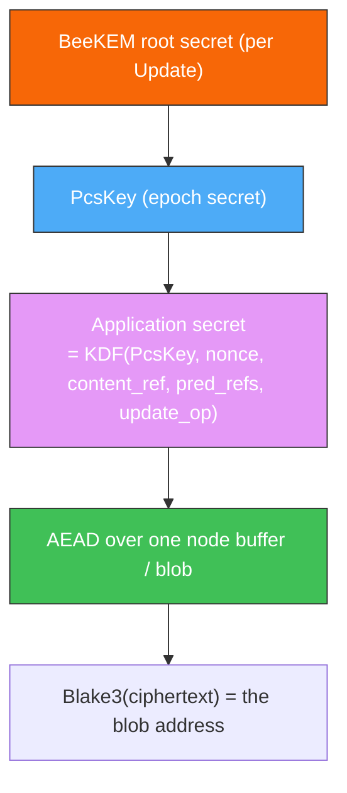
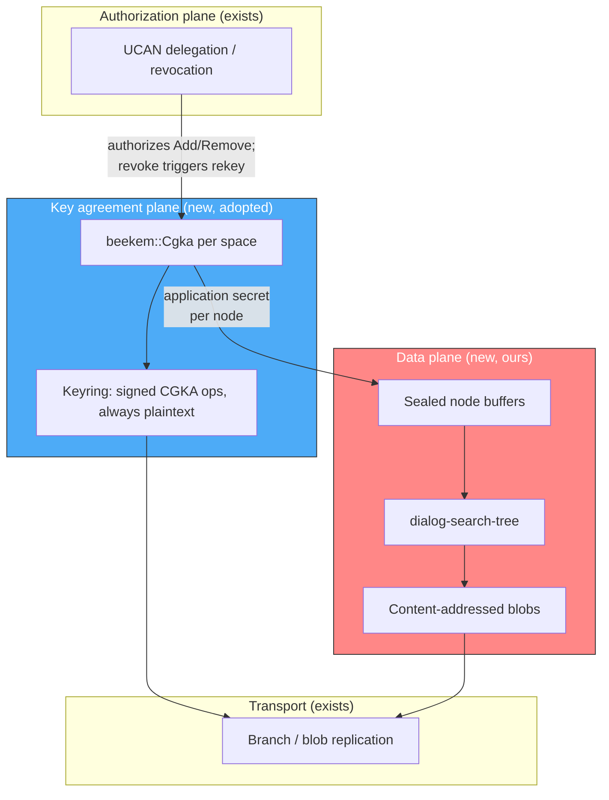
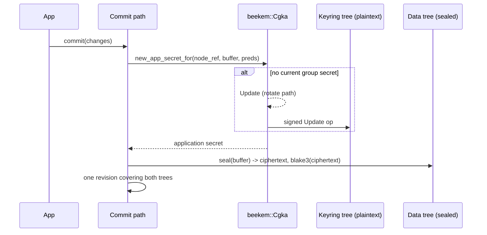

# BeeKEM in Dialog

A review of [BeeKEM] ([paper], [`beekem` crate]) against what Dialog already
has, and a proposal for how to get group key agreement into Dialog without
rebuilding the half of it we have already built.

[BeeKEM]: https://www.inkandswitch.com/keyhive/notebook/02/
[paper]: https://eprint.iacr.org/2026/1434.pdf
[`beekem` crate]: https://docs.rs/beekem/latest/beekem/

## The short version

BeeKEM answers exactly one question: *what symmetric key does the group use
right now, and how does that key change as members come and go?* It is a
decentralized continuous group key agreement (DCGKA) protocol — TreeKEM
adapted so that concurrent operations merge instead of requiring a central
service to serialize them.

It is deliberately **not** an authorization system, **not** a sync protocol,
**not** a PKI, and **not** a content encryption scheme. In Keyhive those are
separate components (convergent capabilities, Beelay, prekeys, per-chunk
application secrets) and BeeKEM is the small cryptographic core in the middle.
Dialog already has three of those four. That is what makes adoption tractable
and it is also where the overlap has to be managed carefully: we want
Keyhive's BeeKEM, not Keyhive's capability model, which competes head-on with
`dialog-capability`.

The recommendation, in one line: **depend on the `beekem` crate, drive it from
the revision DAG we already have, and spend our own effort on the content
encryption layer, which is the part nobody can hand us.**

And build that encryption layer *first*, against a static key — see
[Suggested sequence](#suggested-sequence). It is the invasive, format-defining
half, it is useful on its own, and BeeKEM slots into a one-function seam
behind it.

## What BeeKEM actually is

### The tree

A perfect binary tree over member slots. Each leaf is a member (`id`, X25519
public key) or empty or a tombstone. Each inner node holds one or more
*versions*: a public key plus ciphertexts of the matching secret key.

The whole protocol rests on one invariant:

> **Invariant 1.** Access to the private key of a node `v` is sufficient to
> decrypt the encrypted private key of any node `u` on the direct path of `v`.

So any member walks leaf → root, decrypting as they go, and lands on the group
secret at the root. A node's secret is encrypted under a key derived by
Diffie-Hellman between the two children, so either child's holder can recover
it — that is the trick that makes an update cost `O(log n)` ciphertexts rather
than `O(n)`.

Four operations, all of them "edit a leaf and then edit every node up to the
root":

| Operation | Effect | Group secret after |
| --- | --- | --- |
| `Create` | two-level tree, caller in leaf 0 | undefined |
| `Add` | claim an empty leaf for the new member, **blank** every ancestor | undefined |
| `Remove` | blank the leaf (leaving a tombstone) and every ancestor | undefined |
| `Update` | fresh key pair per level along the direct path, re-encrypted for each sibling | **defined** |

Only `Update` defines a group secret. Membership changes destroy it and the
next update re-establishes it. That is a feature: it means "who is in the
group" and "what key does the group hold" are never in disagreement.

### The concurrency story

This is the part that distinguishes BeeKEM from TreeKEM and the part that
matters most to Dialog, because Dialog is a local-first database where
concurrent writes are the normal case, not an exception.

- Operations form a **hash DAG** (`G`), each op naming its predecessors.
- Materialization is a deterministic function from op set to tree: topologically
  sort, apply sequential ops one by one, apply concurrent *batches* specially.
- Concurrent updates to the same node produce a **conflict node** that keeps
  *all* versions rather than picking a winner.
- The **resolution** of a blank or conflict node is the set of its highest
  non-blank, non-conflict descendants. An update encrypts its new secret
  separately for every node in the sibling's resolution — this is where the
  `O(log n)` degrades toward `O(n)`, in proportion to how many members updated
  while partitioned.
- Merge rules: remove-wins over concurrent add; members added in a batch are
  removed and reinserted in a deterministic (e.g. lexicographic) order, because
  two branches may have handed the same leaf to different people; and no group
  secret is defined by a merge.

The four properties the materialization function guarantees — strong
convergence, remove liveness, add liveness under remove-wins, no secret after
merge — are stated in §4.2 of the paper. BeeKEM is, in the authors' words, a
CRDT.

### What it needs from its host

1. **Authenticated causal broadcast.** Ops must arrive after their causal
   predecessors and their author must be authenticated. The crate says so
   plainly: *"We assume that all operations are received in causal order (a
   property guaranteed by Keyhive as a whole)."*
2. **A PKI.** `Add` needs the addee's initial X25519 public key before they
   have ever participated.
3. **Durable op history.** Decrypting old content re-derives the old group
   secret by replaying the op graph up to that point
   (`Cgka::derive_pcs_key_for_op`). The log is load-bearing, not a journal.

In Dialog, (1) is sync, (2) is `did:key`, (3) is the repository. All three
already exist.

## What Dialog already has

```mermaid
flowchart TB
    subgraph beekem["What BeeKEM needs"]
        ACB["Authenticated causal broadcast"]
        PKI["PKI: member -> agreement key"]
        SIGN["Signing / verification"]
        NIKE["NIKE + AEAD"]
        DAG["Op DAG + concurrency detection"]
        LOG["Durable, replicated op log"]
        TREE["The BeeKEM tree itself"]
        CONTENT["Content encryption"]
    end

    ACB --> S1["sync + revision DAG"]
    PKI --> S2["did:key + X25519-from-Ed25519"]
    SIGN --> S3["dialog-credentials signers"]
    NIKE --> S4["secret::Seal (ECDH/HKDF/AES-GCM)"]
    DAG --> S5["dialog-artifacts::history"]
    LOG --> S6["branch / blob replication"]
    TREE --> N1["nothing comparable — new"]
    CONTENT --> N2["nothing at all — new"]

    style N1 fill:#FF8787,stroke:#333,color:#FFFFFF
    style N2 fill:#FF8787,stroke:#333,color:#FFFFFF
    style S1 fill:#40C057,stroke:#333,color:#FFFFFF
    style S2 fill:#40C057,stroke:#333,color:#FFFFFF
    style S3 fill:#40C057,stroke:#333,color:#FFFFFF
    style S4 fill:#40C057,stroke:#333,color:#FFFFFF
    style S5 fill:#40C057,stroke:#333,color:#FFFFFF
    style S6 fill:#40C057,stroke:#333,color:#FFFFFF
```



### Identity is a direct match

`beekem`'s `MemberId` and `TreeId` are both literally
`ed25519_dalek::VerifyingKey` newtypes. Dialog's principals are `did:key`
Ed25519 identities, and `Ed25519Verifier` already round-trips through
`ed25519_dalek::VerifyingKey::from_bytes`. `MemberId` is a member's `did:key`;
`TreeId` is the space's subject DID. No mapping layer worth the name.

### We already solved BeeKEM's PKI problem, and better

`Add` needs the new member's agreement key. Keyhive solves this with published
**prekeys** — a whole distribution mechanism that has to be online, replicated,
and refilled.

Dialog doesn't need any of that. `rust/dialog-credentials/src/secret.rs`
derives an X25519 agreement key from the Ed25519 key that a `did:key` already
carries. Anyone holding a DID can compute the agreement key for it, with
nothing published and no interaction:

```rust
let recipient = X25519PublicKey::from_ed25519(&verifier).await?;
```

So `Add` can seat a member from their DID alone. The tradeoff is real and
should be stated: an identity-derived agreement key is long-lived and cannot be
rotated independently of the identity, so it is weaker than a single-use
prekey. Contain it by treating the derived key strictly as a bootstrap
credential — the added member's first `Update` replaces it, and until then the
group secret is undefined anyway, because `Add` blanks the path. Nothing of
value is encrypted to the derived key except the material that the first update
immediately supersedes.

This is one of the clearest wins in the whole exercise: we skip an entire
subsystem Keyhive had to build.

### The causal DAG is already here, and it is better than BeeKEM's

`rust/dialog-artifacts/src/history.rs` and
`rust/dialog-capability/src/history/` give us:

- `Version` = (`Origin`, `Edition`) — a Lamport timestamp plus
  `Blake3(issuer + subject)`, comparable across repository boundaries.
- `Cause` — the set of versions a claim supersedes; a hash DAG.
- `RevisionRecord` — signed, content-addressed, with parents *and skip links*.
- `causality::causality` — tiered concurrency detection: O(1) when editions or
  origins settle it, O(k) DAG walk otherwise, pruned by strictly decreasing
  edition.

BeeKEM's `CgkaOperationGraph` is a plain hash DAG with head tracking and a
topological sort. Ours is strictly more capable. The awkward part is that
`beekem` carries its own graph internally and does not expose a seam to
substitute ours.

I would **accept the duplication**. The CGKA graph holds only membership and
rekey operations for one space — call it tens to low thousands of entries over
a repository's life, against millions of facts. Reimplementing BeeKEM's replay
and merge semantics on top of our DAG to save that is the classic bad trade:
we would be re-deriving proven, peer-reviewed convergence logic to avoid a
rounding error in memory. Our DAG's real job here is different and unglamorous:
**it is the causal broadcast that feeds the CGKA graph in the right order.**

### Sealed secrets are the NIKE and the AEAD

`secret::Seal::conceal` / `Secret::reveal` is ECDH over X25519, HKDF-SHA256
with a context label and both public keys bound into `info`, AES-256-GCM with
the recipient bound as AAD — with a WebCrypto arm so the browser gets the
platform's constant-time AES rather than software AES compiled to wasm.

`beekem` uses X25519 + ChaCha20-Poly1305 internally, via `keyhive_crypto`. If
we adopt the crate we do *not* get to reuse our sealing code for the tree
internals; we get a second AEAD in the dependency graph. That is an acceptable
cost (ChaCha in wasm is fine, and the code is not ours to maintain), but it is
a real consequence, and if we ever port instead of adopt, `secret::Seal` is
precisely the primitive to port onto.

### Capabilities answer a question BeeKEM does not ask

This is the overlap the Keyhive project page describes, and it is the one place
where taking too much would hurt us.

`dialog-capability` + `dialog-ucan` decide *who is permitted* to change
membership. BeeKEM decides *who can decrypt*. They are complementary and both
are necessary:

- A UCAN revocation (`notes/revocation-design.md`) removes authority. It does
  not remove knowledge. After revoking Bob's delegation, Bob still holds every
  content key he ever derived. Without a rekey, revocation is a policy
  statement that the ciphertext ignores.
- Conversely a BeeKEM `Remove` with no capability check is a protocol that lets
  anyone evict anyone.

So: `/ucan/revoke` on a read delegation should *trigger* a BeeKEM `Remove` +
`Update`, and a BeeKEM membership op should carry the UCAN proof that
authorized it. Keyhive's convergent capability model is the part we should
**not** import — we have our own, it is further along, and it is integrated
with the rest of Dialog.

## What does not map, and should not be forced to

**The prolly tree is not the BeeKEM tree.** This is worth being blunt about
because the surface similarity invites a bad idea.

| | `dialog-search-tree` | BeeKEM tree |
| --- | --- | --- |
| Keyed by | fact keys, ordered | member slot index |
| Shape | probabilistic B-tree, content-defined boundaries | perfect binary, left-balanced |
| Size | millions of entries | one leaf per member device |
| Storage | content-addressed blobs, structurally shared | in-memory, rebuilt by replay |
| Identity of a node | Blake3 of its encoding | position in an array |
| Mutation | persist a new version, share unchanged nodes | destructive replay from the op log |

They share the word "tree" and nothing else. The BeeKEM tree is a few hundred
lines of array-indexed binary tree arithmetic — `parent(i)`, `sibling(i)`,
`direct_path(i)`, plus resolution computation. There is no version of
"leverage the prolly tree for this" that ends well; it would mean paying
content-addressed persistence costs for a structure that is derived state,
rebuilt from the op log on every structural merge anyway.

What *is* reusable from the storage side is everything below the tree: the
blob store, `ContentAddressedStorage`, blob replication, and the branch
machinery that will carry the op log.

## The part we have to build: content encryption

Dialog today encrypts nothing. `grep -rl encrypt rust/*/src` returns exactly
the four files of the sealed-secret module. `notes/privacy.md` describes L0–L3
tiering as a design, not as code. **This, not BeeKEM, is the bulk of the work**,
and it is where a database differs sharply from a messenger.

### Content addressing forces deterministic encryption

`ContentAddressedStorage::store(bytes, hash)` verifies `hash == blake3(bytes)`,
and `Link { node: Blake3Hash, .. }` addresses children by that hash. If we
encrypt node buffers with a random nonce, two replicas that independently
compute the *same logical node* produce *different* ciphertexts, hence
different hashes, hence different links all the way up. Structural sharing
collapses, diffs blow up, and the convergence property that makes a prolly tree
a prolly tree is gone.

The fix is the one BeeKEM's own implementation already uses for content:
derive the nonce from the plaintext with SIV.

```rust
let nonce = Siv::new(&pcs_key.into(), content, doc_id.as_bytes());
```

Same key + same plaintext ⇒ same ciphertext ⇒ same hash ⇒ convergence
preserved. The cost is the usual convergent-encryption leak: an observer can
tell that two blobs hold identical plaintext under the same key. Inside one
space, among members who can decrypt both anyway, that is a narrow leak — but
it must be a documented decision, not an accident.

### Rotation must not mean re-encryption

In a messenger, PCS rotation only affects future messages. In a database the
data at rest is the product. If the group secret directly encrypted node
buffers, every rekey would re-encrypt and re-hash the entire tree.

So the key hierarchy has to have an indirection, and BeeKEM's application
secret already is one:



`Cgka::new_app_secret_for(content_ref, content, pred_refs, signer, rng)`
derives a distinct key per piece of content, keyed by the content's own
reference and its predecessors — which is *precisely* the shape of Dialog's
`Version` and `Cause`. `EncryptedContent` carries `pcs_key_hash`,
`pcs_update_op_hash`, `nonce`, `content_ref`, `pred_refs` in the clear, so any
member can re-derive the key for old data by replaying the op graph to that
epoch (`Cgka::decryption_key_for`). Rotation therefore costs one op; existing
blobs are untouched and stay readable.

Two consequences to accept up front:

1. **The op log is permanent.** Pruning it makes old ciphertext undecryptable.
   Checkpointing helps replay cost, not retention.
2. **Forward secrecy for data at rest is not what BeeKEM gives you.** A removed
   member keeps everything they already replicated and every epoch key they
   already derived. BeeKEM guarantees they learn no *future* epoch secret. Real
   forward secrecy over existing data means re-encrypting it, which means new
   hashes for every affected node. Say this in the docs before a user assumes
   otherwise.

### Where the seam goes

Encryption has to happen where the node buffer is produced, before hashing —
`buffer.blake3_hash()` at the `store` call sites in `accessor.rs` and
`differential.rs`. The natural shape is a "sealed buffer" that owns
encrypt-then-hash and decrypt-after-fetch, so no call site does it by hand and
none can forget. Some metadata (`pcs_key_hash`, `pcs_update_op_hash`, `nonce`)
must ride in a plaintext header on each blob, since a reader needs it *before*
it can decrypt.

This is the largest single piece of work in the proposal and the one most
worth designing separately — it interacts with `notes/privacy.md`'s L1/L2/L3
layering, which asks for *nested* encryption (links, then ranges, then values)
rather than one envelope per node.

## Adopt the crate, or port the algorithm?

| | Adopt `beekem` 0.3 | Port onto Dialog primitives |
| --- | --- | --- |
| Correctness | peer-reviewed, proven, tested by the authors | ours to get right, including merge convergence |
| Crypto | X25519 + ChaCha20-Poly1305 via `keyhive_crypto` | reuses `secret::Seal` and the WebCrypto arm |
| Deps added | `beekem`, `keyhive_crypto`, `chacha20poly1305`, `future_form`, `dupe` | none |
| Op DAG | second, internal DAG | our DAG directly |
| Signatures | raw ed25519 `Signed<T>`, not varsig | our own envelope |
| Licence | Apache-2.0 (fine alongside MPL-2.0) | — |
| Effort | adapter layer | weeks, plus the review burden of homegrown crypto |

**Adopt.** The dependency list is lean and every one of them is either already
in our tree (`blake3`, `ed25519-dalek`, `nonempty`, `rand` 0.8, `serde`) or
wasm-clean. `AsyncSigner<F>`/`FutureForm` exists precisely so a non-extractable
WebCrypto signing key works, which is exactly our browser situation. Writing our
own DCGKA to save two dependencies would be the worst kind of not-invented-here:
the paper's entire contribution is that the merge semantics are subtle enough to
need proofs.

Known impedance mismatches, all small: `Signed<CgkaOperation>` uses raw ed25519
rather than varsig, so CGKA ops carry a signature format nothing else in Dialog
uses; `rand::CryptoRng` needs wiring to our `getrandom`; and the crate's
`no_std`/`alloc` posture means `BTreeMap` where we would reach for `HashMap`.
None of these is load-bearing.

The one thing to verify before committing: that `beekem` +`keyhive_crypto`
actually build for `wasm32-unknown-unknown`. The dependency list says they
should — no tokio, no `mio`, no `net` — but per
`.claude/rules/cross-target-integration-tests.md` that is exactly the class of
assumption that bites late. Prove it with a spike before anything else.

## Proposed architecture



### The keyring must be readable before anything else

The one genuinely new structural constraint. A member who has just been added
holds no content key. To get one they must read the CGKA op log. If that log
lived in the encrypted tree, it could not be read without the key it contains —
a bootstrap cycle.

So the keyring is **never encrypted**: signed CGKA ops, replicated by the same
blob path as everything else, readable by anyone who can reach the space's
storage. This is not a leak, it is the design — BeeKEM control messages are
public by construction (public keys, ciphertexts, member DIDs). It does mean
membership is metadata visible at L0, which `notes/privacy.md` should be
updated to say out loud. There is precedent: that note already contemplates
UCAN delegations stored in-tree.

Where it physically sits is a separate question with a two-phase answer — its
own tree first, a tag-6 region of the main tree once nested encryption makes
that readable. See [How it fits together](#how-it-fits-together-concretely).

### One group per space

`TreeId` is a single DID, and CGKA state is `O(members)` with a full op history
each. So: one BeeKEM group per space (the subject DID), not per branch and not
per fact-group. Branches within a space share the group; a branch is a view of
the same encrypted data, and forking a branch must not fork the key state.

`notes/privacy.md`'s L3 "different facts encrypted for different groups" would
mean *multiple* BeeKEM groups over one repository. That is expressible but each
group carries its own tree, op log and replay cost, so it should be a
deliberate, coarse-grained partition — a handful of access classes, not a group
per collection.

### Members are devices, not people

A leaf is a signing key. A person with three devices is three leaves, and
removing one device is a real `Remove` + `Update`. Keyhive layers
individuals/groups above BeeKEM; the `beekem` crate itself is flat. Dialog's
UCAN delegation graph is the natural place to expand "this team may read" into
the concrete set of device DIDs to seat — which is another piece of Keyhive we
do not need to import, because we already have the graph.

## How it fits together, concretely

The question that decides the shape of everything else: *where does the
BeeKEM tree live?*

**Nowhere. You never store it.** The BeeKEM tree is derived state — a
materialized view over an append-only log of signed operations, rebuilt by
replay. `beekem` rebuilds it from the op graph on every structural merge
anyway. Persisting it would be persisting a cache whose source of truth sits
right next to it.

So the real question is where the *op log* lives, and there the instinct to
reach for a separate region of the tree is right. It is the idiom we already
use: one prolly tree, partitioned by a leading tag byte.

| Tag | Region |
| --- | --- |
| 0 | entity index (EAV) |
| 1 | attribute index (AEV) |
| 2 | value index (VAE) |
| 3 | history index (claim lineage) |
| 4 | blob index |
| 5 | coverage |
| **6** | **keyring — CGKA ops (proposed)** |

There is precedent for protocol data living in-tree under reserved
attributes: `WriteScope::Machinery` exists so the delegation records can be
written as `dialog.*` facts. CGKA operations are the same kind of thing.

### The catch: you cannot navigate an encrypted tree without a key

If node buffers are encrypted whole, a newcomer cannot reach the tag-6 region,
because getting there means descending through the root and index nodes — and
those are shared across every region. The keyring would be behind the very key
it exists to hand out.

So this splits into two phases, and the first one is deliberately dumber:

- **Phase 1 — the keyring is its own tree.** Its own root hash, never
  encrypted, published in the branch's commit alongside the data tree's root.
  Same prolly tree machinery, same CAS, same blob replication, no interaction
  with the encryption layering at all. A reader fetches it with no key, which
  is the whole point.
- **Phase 2 — the keyring becomes tag 6.** Once `notes/privacy.md`'s nested
  L1/L2/L3 encryption exists, navigation (links, ranges) decrypts at a lower
  tier than values do, so a reader can route to the keyring region and read
  plaintext values there while every other region's values stay sealed. Then
  the separate tree folds back in.

Phase 1 costs one extra root hash in the commit. Phase 2 is where we want to
end up, but it depends on a layering that does not exist yet, and blocking
group key agreement on it would be backwards.

### A day in the life

**Alice creates the space.** `Cgka::new(TreeId = space DID, MemberId = her
device DID, her share key)` yields one signed `init_add` op. It goes in the
keyring. In memory: a two-leaf tree with Alice in slot 0. No group secret
exists yet — `Create` does not define one.

**Alice writes.** The commit path asks the CGKA for a key per node buffer:

```rust
let (secret, maybe_op) = cgka
    .new_app_secret_for(&content_ref, &buffer, &pred_refs, &signer, &mut rng)
    .await?;
```

There is no PCS key yet, so the CGKA performs an `Update` on her behalf and
returns the new op alongside the secret. The commit writes both halves in one
revision: encrypted data nodes into the data tree, the update op into the
keyring. Atomic, because it is one commit.

**Alice adds Bob.** Two things, in two planes. A UCAN delegation to Bob (the
existing path, unchanged), and `cgka.add(bob_did, X25519PublicKey::from_ed25519(bob_did))`
— no prekey lookup, because Bob's agreement key falls out of his DID. `Add`
blanks the path, so the group secret goes undefined; the next write by anybody
rekeys automatically via the step above.

**Bob syncs.** He pulls blobs the usual way. The keyring is plaintext, so he
reads it holding nothing. He replays it — `new_from_init_add`, then each
subsequent op in causal order through `merge_concurrent_operation` — and the
tree reconstructs in memory. His leaf's secret is the X25519 key derived from
his own Ed25519 identity, so he can climb from his leaf to the root.

**Bob reads a node written three rotations ago.** Each encrypted buffer carries
a plaintext header naming its epoch (`pcs_key_hash`, `pcs_update_op_hash`) and
its nonce. `decryption_key_for` replays the op graph *to that point* and
re-derives that epoch's key. Nothing was ever re-encrypted; old data stays
readable because the log is complete.

**Alice removes Bob.** `/ucan/revoke` withdraws authority; `cgka.remove(bob)`
withdraws knowledge. The next write rekeys. Bob keeps every byte he already
replicated — that is inherent, and the docs must say so — but he derives no
future epoch key.

**Alice and Bob rekey while partitioned.** Two `Update` ops naming the same
predecessors. On merge, both versions survive as a conflict node, and the next
update encrypts for the resolution set instead of a single sibling. Our
revision DAG's only job here is to deliver both ops with their predecessors
first; BeeKEM's materialization does the converging.



### What this costs

The CGKA lives in the session handle, built on branch open by scanning the
keyring range, held for the session's life. An `Update` op is a public key plus
one ciphertext per level — call it a kilobyte in a 64-member group. Membership
changes and rotations are rare events measured in hundreds over a repository's
life, against millions of facts. The keyring is a rounding error in storage;
its cost is replay time on open, which is what checkpointing is for when it
starts to matter.

## Sharp edges

- **Writes may have to rekey first.** After a membership change the group
  secret is undefined, so the next writer must `Update` before it can encrypt.
  `new_app_secret_for` does this automatically, but it turns some writes into
  operations that must be broadcast — and a reader offline at that moment
  cannot decrypt until it receives the update. Worth surfacing in the write
  path rather than hiding.
- **Concurrency cost is real.** Update cost degrades toward `O(n)` in
  proportion to how many members updated while partitioned. For a database
  where every replica is often offline, "partitioned" is the steady state.
  Budget for the linear case; the paper's §6.2 measurements are the right
  starting point.
- **Cross-fork security vs. our branches.** The paper's novel property (§3.3)
  concerns attackers holding state from both sides of a partition. Dialog has
  first-class branching, so we will exercise this harder than a chat app.
  BeeKEM achieves a κ-bounded form; `BeeKEM_FS` (§7) trades concurrency
  tolerance for full FS/CFS. We want the concurrency, so we take the bounded
  form — knowingly.
- **Replay cost grows with history.** Structural merges replay the op graph.
  The paper says full replay is fine in practice and suggests checkpointing;
  for a long-lived repository we should plan the checkpoint rather than
  discover we need it.
- **Nothing here protects writes.** BeeKEM controls who can *read*. Who can
  *write* remains a UCAN question, and an encrypted-but-unauthenticated write
  is still garbage a peer can inject. The two planes must be checked together
  at the sync boundary.

## Suggested sequence

**Encryption first.** The original ordering here put the CGKA first and the
sealed buffers last; that was wrong. BeeKEM is *additive* — a new tree, a new
op log, nothing existing changes shape. Encryption is *invasive*: it changes
the on-disk node format, the hashes in every `Link`, and what sync diffs look
like. Invasive format work should happen while the format is young, and it does
not need BeeKEM to be useful.

Two properties make this order safe rather than merely appealing:

- **The key provider is a narrow seam.** Everything the sealing layer needs
  from key agreement is one function — given a content reference and its
  predecessors, hand back a symmetric key and the epoch identifiers to record
  in the header. A static-key implementation satisfies it on day one; the CGKA
  implementation drops in later without touching the sealing layer.
- **Ciphertext cannot shift tree shape.** Chunk boundaries come from
  `distribution::rank(key, manifest)` — hashes of *keys*, decided while the
  node is being built. Sealing a finished node buffer happens strictly after
  that, so it cannot move a boundary. This was the scariest possible
  interaction between the two layers and it is already ruled out.

The revised order:

1. **Sealed buffers, static key.** Encrypt-then-hash at the node-buffer seam,
   SIV nonce so identical plaintext under one key yields identical ciphertext
   and convergence survives, plaintext header carrying epoch identifiers. Key
   delivered to the profile's own devices with `secret::Seal` — no group
   protocol involved. This alone ships something real: a space an untrusted
   blob store cannot read, which is `notes/privacy.md`'s L0 with nothing else
   required.
2. **Two epochs, still no BeeKEM.** A fake key provider that rotates on demand,
   so nodes written under different epochs coexist in one tree and a reader
   re-derives the right key per node from the header. This is the step that
   keeps (1) honest: without it, it is far too easy to bake in an assumption
   that the key is stable and discover it only when the CGKA arrives.
3. **Spike: `beekem` on `wasm32-unknown-unknown`.** An hour's work, and it
   gates only steps 4–6, so it can happen any time before them. If the crate
   does not build for wasm we port instead — which changes nothing about
   steps 1–2.
4. **Adapters.** `MemberId`/`TreeId` from `Did`; `AsyncSigner<F>` for
   `SignerCredential`; `ShareKey` from `X25519PublicKey::from_ed25519`.
5. **The keyring, and swap the provider.** Plaintext op log (its own tree,
   per [How it fits together](#how-it-fits-together-concretely)), ops delivered
   to `Cgka::merge_concurrent_operation` in causal order, and the static key
   provider from (1) replaced by a CGKA-backed one. Test the interesting case
   directly: two replicas, disjoint updates while partitioned, converging to
   identical tree state after merge.
6. **Capability binding.** UCAN proof carried on membership ops; `/ucan/revoke`
   on a read delegation drives `Remove` + `Update`. Where the two planes meet,
   and where the design is most ours.
7. **L1/L2/L3 layering.** A refinement of a working single envelope, not a
   prerequisite for one. Folding the keyring into a tag-6 region falls out of
   this.

The failure mode this order avoids: building group key agreement that encrypts
nothing, being unable to demonstrate it end to end, and only then discovering
what sealing does to node sizes, read amplification, spilled values, and the
blob index. The failure mode it introduces — hard-coding a single-key
assumption into the sealing layer — is exactly what step 2 exists to prevent,
and step 2 is cheap.
