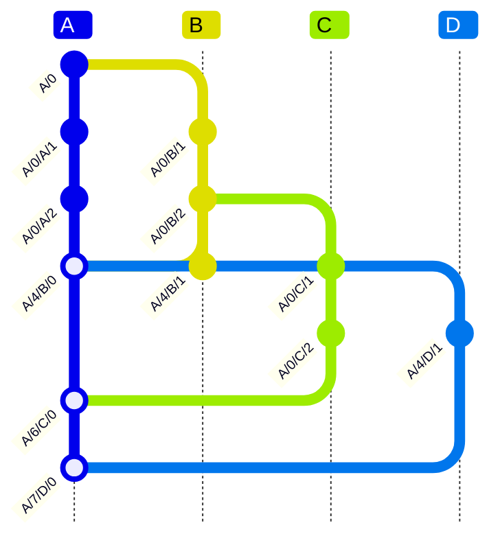

# Branching Model for DialogDB

## Overview

This document explores an extension to the [divergence clock](./divergence-clock.md) design that introduces git-like branching capabilities while maintaining the efficiency and partial replication benefits of the original approach.

## Motivation

The original divergence clock design assumes a single canonical convergence point that all replicas synchronize through. While this works well for centralized collaboration, it limits the flexibility of distributed workflows and can lead to unexpected results when merging two separate database instances.

Git's branching model demonstrates the power of explicit upstream relationships and flexible merge topologies. By extending our divergence clock with branch awareness, we can support:

- Multiple stable branches coexisting
- Explicit choice of upstream branch
- Cross-tree merging capabilities
- Evolutionary deployment from single-branch to multi-branch

## Design Goals

The branching model aims to achieve several key capabilities that extend beyond the original [divergence clock](./divergence-clock.md) design:

### **1. Database Merging with Meaningful Concurrency**

Enable merging of completely independent databases while preserving correct conflict semantics:

```js
// Database A develops independently with origin="did:key:databaseA"
DatabaseA facts: [databaseA/5/replica1/1], [databaseA/3/replica2/1]

// Database B develops independently with origin="did:key:databaseB"
DatabaseB facts: [databaseB/7/replica3/1], [databaseB/2/replica4/1]

// When merged: contradicting facts from different origins correctly appear concurrent
// since they developed in complete isolation
```

**Key Properties:**
- Explicit `origin` field prevents false temporal relationships between independent databases
- Entity collisions represent convergence (intentional) or can be avoided with origin-scoped identifiers
- Prolly tree assembly combines leaves from multiple databases efficiently

### **2. Selective Database Operations**

Any query result can be treated as its own database, enabling:
- Partial database merging (e.g., "merge only users created after 2024")
- Database slicing and composition
- Federated workflows where different organizations contribute specific data sets

### **3. Inherited Capabilities from Divergence Clock Model**

**Partial Replication**: Query-driven segment loading without requiring full database state

**Conflict Visibility**: Applications can see and choose between concurrent values rather than having conflicts resolved automatically

**Atomic Multi-Fact Updates**: Transaction boundaries are preserved during conflict detection and resolution

**No Coordination Overhead**: Replicas can work offline without coordinating on every update

**Local-First Operation**: All operations work locally with asynchronous synchronization

These goals position the branching model as "git for databases" with query-driven partial replication and proper conflict semantics for federated/collaborative scenarios.

## Extended Divergence Clock


Instead of `{ since, at, drift }`, we propose `{ origin, since, drift, at }` where:

- `origin` - The branch, identified by [did:key], it forked from (explicit upstream).
- `since` - Count of commits in the origin branch when this change was made
- `drift` - Number of commits made since last synchronization with origin branch
- `at` - The branch, identified by [did:key], making the change

## API Design

```typescript
const db = await Dialog.open('did:web:gozala.io')
const branch = db.branch()
branch.did() !== db.did()
branch.origin.did() === db.did()

await branch.transact([
  {
    assert: {
      the: 'note/title',
      of: 'note:01',
      is: 'Hello world'
    }
  }
])
// Pull updates from the remote
await db.pull()
// Merge updates receieved from the remote
// This will update since & reset drift
branch.merge(db)

await branch.transact([
  {
    assert: {
      the: 'note/body',
      of: 'note:01',
      is: 'It is a beautiful day'
    }
  }
])

// Now merge changes back into the main so that local
// commits are integrated with main branch of the db.
await db.push(branch)
```

### Branch Operations

**Branch Creation:**

- `db.branch()` - Creates new branch forked from current database
- Sets `origin` to the source database's DID:key
- Branch gets its own unique DID:key identity

**Local Development:**

- `branch.transact()` - Makes commits with increasing `drift` values
- Facts tagged with `{ origin: db.did(), since: fork_point, drift: N, at: branch.did() }`

**Synchronization:**

- `db.pull()` - Syncs with remote to get latest fork state
- Updates local `since` value and resets branch `drift` counters

**Integration:**

- `db.push(branch)` - Publishes branch commits to remote
- Remote handles fork `since` advancement and conflict resolution
- Only successful push updates local fork state

## Indexing Strategy

Facts are indexed with the extended clock structure:

```
EAVT Index: "${entity}/${attribute}/${value}/${origin}/${since}/${at}/${drift}"
AEVT Index: "${attribute}/${entity}/${value}/${origin}/${since}/${at}/${drift}"
VEAT Index: "${value}/${entity}/${attribute}/${origin}/${since}/${at}/${drift}"
TEAV Index: "${origin}/${since}/${at}/${drift}/${entity}/${attribute}/${value}"
```

This naturally groups facts by origin branch while preserving query efficiency.

## Concurrency Detection

Two operations are concurrent if:

- Same `origin` and `since` values
- Different `at` values

This preserves the efficient local conflict detection from the original design.

## Fork/Branch Model

This design distinguishes between two types:

- **Forks**: Independent lineages (like git's main/develop/release branches)
- **Branches**: Always track a specific fork, never each other

### Inheritance Rule

When branching from a branch, the new branch inherits the **same fork**, avoiding nested tracking chains:

```
A (fork) → B (branch from A) → C (branch from A, not B!)
```

## Branching Visualization



| Operation | Origin | Since | At | Drift | Resulting Clock | Notes |
|-----------|--------|-------|----|----|-----------------|-------|
| Initial commit | A | 0 | A | 0 | `A/0` | A is fork |
| Create A → B | A | 0 | B | | B ready to commit | B is branch from A |
| Commit on A | A | 0 | A | 1 | `A/0/A/1` | |
| Commit on A | A | 0 | A | 2 | `A/0/A/2` | |
| Commit on B | A | 0 | B | 1 | `A/0/B/1` | |
| Commit on B | A | 0 | B | 2 | `A/0/B/2` | |
| Create B → C | A | 0 | C | | C ready to commit | C inherits B's fork (A) |
| Commit on C | A | 0 | C | 1 | `A/0/C/1` | C tracks A, not B |
| Commit on C | A | 0 | C | 2 | `A/0/C/2` | |
| Push B to remote | A | 2 | B | 0 | `A/4/B/0` | Remote: A.since=2 + B.drift=2 |
| Pull by D | A | 4 | D | | D syncs to A.since=4 | D updates local state |
| Commit on D | A | 4 | D | 1 | `A/4/D/1` | |
| Push C to remote | A | 4 | C | 0 | `A/6/C/0` | Remote: A.since=4 + C.drift=2 |
| Push D to remote | A | 6 | D | 0 | `A/7/D/0` | Remote: A.since=6 + D.drift=1 |
| Pull by B | A | 7 | B | | B syncs to A.since=7 | B updates local state |

## Key Advantages of Fork/Branch Model

### **No DAG Complexity**

- All branches track forks directly
- No nested tracking chains (C tracks A, not B)
- Avoids cross-timeline dependencies that break partial replication

### **Multiple Independent Hierarchies**

```
Repository can have multiple forks:
- A (main) → B, C, D (all branches from A)
- E (develop) → F, G (branches from E)
- H (release) → I (branch from H)
```

### **Simple Linearization**

- All branches sharing a fork use the same clock namespace
- Easy to determine ordering within each hierarchy
- Cross-hierarchy operations still possible but explicit

## Nested Retraction Approach

After exploring various approaches to handle concurrent modifications while preserving partial replication, we've settled on a **nested retraction model** that encodes awareness and dependencies directly in the path structure.

### The Fundamental Problem

Local fork updates break concurrency detection:

```
// ❌ BROKEN: Local fork increments cause false concurrency
Replica 1: A/0/B/1, A/0/B/2 → local merge → A/2 → A/2/B/1
Replica 2: A/0/C/1, A/0/C/2 → local merge → A/2 → A/2/C/1

// When synced: A/2/B/1 and A/2/C/1 appear concurrent (wrong!)
// Reality: These changes may not have been truly concurrent
```

### Solution: Awareness Through Path Structure

Instead of advancing fork clocks locally, we encode awareness and conflicts through nested paths combined with explicit retractions:

```
B makes change: /A/4/B/1 → { assert: { the: 'name', of: 'entity:123', is: 'A' }}

C overrides B:  /A/4/B/1/C/1 → { retract: { the: 'name', of: 'entity:123', is: 'A', cause: '/A/4/B/1' }}
                /A/4/C/2 → { assert: { the: 'name', of: 'entity:123', is: 'B' }}

D overrides B:  /A/4/B/1/D/1 → { retract: { the: 'name', of: 'entity:123', is: 'A', cause: '/A/4/B/1' }}
                /A/4/D/2 → { assert: { the: 'name', of: 'entity:123', is: 'C' }}

E overrides C&D: /A/4/B/1/C/1/E/1 → { retract: { the: 'name', of: 'entity:123', is: 'B', cause: '/A/4/C/2' }}
                 /A/4/B/1/D/1/E/2 → { retract: { the: 'name', of: 'entity:123', is: 'C', cause: '/A/4/D/2' }}
                 /A/4/E/3 → { assert: { the: 'name', of: 'entity:123', is: 'E' }}
```

### Key Properties

**Perfect Locality**: All conflicts with a specific change are nested under that change's path, ensuring related modifications cluster together in the index.

**Explicit Dependencies**: Retraction facts with `cause` references create explicit dependency edges, building a DAG at query time.

**Awareness Encoding**: The path structure encodes which changes each actor was aware of when making their modification.

**Query-Time Resolution**: When querying `{ the: 'name', of: 'entity:123' }`, the system:

1. Collects all matching facts from the clustered paths
2. Builds dependency DAG from `cause` references
3. Applies retractions to determine final state
4. Returns only non-retracted assertions

This approach preserves both the partial replication benefits (locality) and correct conflict semantics (awareness) without requiring complex coordination protocols.

### Nested Path Indexing

Facts are indexed using their full nested path, ensuring perfect locality:

```
EAVT Index:
"entity:123/name/A/A/4/B/1" → { the: 'name', of: 'entity:123', is: 'A', cause: {...} }
"entity:123/name/B/A/4/C/2" → { the: 'name', of: 'entity:123', is: 'B', cause: {...} }

TEAV Index:
"A/4/B/1/entity:123/name/A" → { the: 'name', of: 'entity:123', is: 'A', cause: {...} }
"A/4/B/1/C/1/entity:123/name/retract-A" → { retract: {...}, cause: 'A/4/B/1' }
"A/4/C/2/entity:123/name/B" → { the: 'name', of: 'entity:123', is: 'B', cause: {...} }
"A/4/B/1/C/1/E/1/entity:123/name/retract-B" → { retract: {...}, cause: 'A/4/C/2' }
```

### Query Resolution Process

When querying for `{ the: 'name', of: 'entity:123' }`:

1. **Range Scan**: Collect all facts matching entity/attribute from EAVT index
2. **DAG Construction**: Build dependency graph from retraction `cause` references
3. **Conflict Resolution**: Apply retractions to eliminate superseded assertions
4. **Result**: Return remaining valid assertions

**Example DAG:**

```
B/1 → (retracted by C/1, D/1)
C/2 → (retracted by E/1)
D/2 → (retracted by E/2)
E/3 → (no retractions) ✓ Winner
```

### Advantages Over Coordination-Based Approaches

**No Remote Coordination Required**: Branches can make conflicting changes independently without waiting for fork updates.

**Correct Concurrency Semantics**: The nested path structure naturally encodes which changes were made with awareness of others.

**Efficient Partial Replication**: Related conflicts cluster together, requiring minimal additional reads for conflict resolution.

**Audit Trail Preservation**: Complete history of conflicts and resolutions is maintained in the index structure.

## Query Model


### Branch-Specific Queries

```typescript
// Query specific branch
const results = await db.branch().query(...)

// Query main database
const results = await db.query(...)
```

### Cross-Branch Queries

```typescript
// Potential future extension
const results = await branch.and(otherBranch).query(...)
```

Following Datomic's model, each query operates against a specific branch context.

## Alternative Approaches Considered

We explored several other approaches before settling on nested retractions:

### Vector Clock with Remote Coordination

**Approach**: Use `{ since, now, root }` vector clocks with strict remote validation to prevent local fork updates.

**Advantages**: Mathematically sound concurrency detection, prevents manipulation

**Disadvantages**: Requires coordination for every update, introduces latency and availability issues

### Fractional Indexing

**Approach**: Use rational numbers between sequence positions to encode awareness (e.g., `[5, 1/4]` vs `[5, 1/2]`)

**Problem**: Still vulnerable to false positives and negatives in concurrency detection

### HLC as Secondary Component

**Approach**: Use Hybrid Logical Clocks as tie-breakers within same `since` values

**Problem**: Doesn't solve fundamental awareness problem - actors can still manipulate timestamps

### Full DAG with Hash References

**Approach**: Use traditional git-like DAG with hash-based parent references

**Problem**: Breaks partial replication due to need for ancestry traversal across tree boundaries

The nested retraction approach emerged as the only solution that maintains both **correct conflict semantics** and **partial replication locality** without requiring coordination overhead.

## Evolutionary Deployment

The design supports gradual adoption:

**Single Branch (Current):**

- `mainBranch.did() === db.did()`
- All facts use same origin
- Existing behavior preserved

**Multi-Branch (Extended):**

- Multiple origins coexist in same tree
- Facts naturally segregated by origin
- Cross-branch operations become possible

## Open Questions and Tensions

### Cross-Branch Merging Semantics

The merge mechanics resolve several key questions:

1. **Fact Identity**: Facts retain their original `{ origin, at }` identity but get a new `since` value representing the merge point. This preserves lineage while establishing temporal ordering.

2. **Conflict Resolution**: When merging branch B into A, any conflicts between B's facts and A's existing facts are resolved using the merge's `since` value as the tiebreaker.

3. **Schema Evolution**: Different branches can evolve different schemas. Conflicts are detected at the fact level during merge, not at the schema level.

**Resolved through merge mechanics:**

- Facts keep their branch identity (`at` field)
- Temporal ordering established via updated `since`
- Merge commits create explicit integration points
- Other branches can sync to merge points deterministically

### Partial Replication Constraints

The original design's strength is enabling queries without full replication. Branching introduces complexity:

1. **Cross-Branch Dependencies**: If facts from branch A reference entities defined in branch B, how do we maintain partial replication?

2. **Ancestry Tracking**: Unlike git's explicit parent references, our clock-based approach avoids multiple parents to preserve locality. This limits some merge scenarios.

3. **Query Planning**: Cross-branch queries may require replicating segments from multiple origins, potentially breaking the partial replication guarantee.

### Git-Like vs CRDT-Like Merging

There's tension between git's explicit merge commits with multiple parents and CRDT's constraint-free merging:

**Git Approach:**

- Explicit merge commits reference multiple parents
- Rich merge semantics but requires full history
- Conflicts resolved at merge time

**CRDT Approach:**

- Facts can be merged from any context
- Simpler model but limited merge semantics
- Conflicts resolved at query time

Our current design leans toward the CRDT approach to preserve partial replication, but this may limit the expressiveness of cross-branch merging.

## Implementation Considerations

### Branch Lifecycle

**Creation**: New branches created by forking existing branch, setting origin relationship

**Development**: Local commits tagged with branch identity and increasing drift

**Synchronization**: Pull operations update local understanding of origin branch state

**Integration**: Merge operations combine branch commits into target branch

**Archival**: Branches can be abandoned without affecting fact storage - they simply become unreferenced namespaces

### Tree Structure

All branches coexist in the same prolly tree structure, naturally segregated by the `origin` component of their clock values. This avoids the complexity of maintaining separate trees while enabling branch-specific operations.

## Future Directions

1. **Multi-Parent References**: Explore limited support for facts that reference multiple parent commits while preserving partial replication

2. **Semantic Merge Strategies**: Develop application-specific conflict resolution for cross-branch merging

3. **Branch Policies**: Implement governance mechanisms for branch creation, merging, and lifecycle management

4. **Federation Support**: Enable merging of completely separate database instances with different root origins

## Conclusion

The branching extension maintains the core benefits of the divergence clock design while adding git-like flexibility. The key insight is that branches can coexist in the same tree structure through the extended clock mechanism, avoiding the complexity of separate tree management while enabling rich collaborative workflows.

The main challenge is balancing git-like merge semantics with the partial replication requirements that make the system uniquely suited for local-first applications. The proposed design errs on the side of preserving partial replication while leaving room for future extensions toward richer merge capabilities.

[did:key]:https://w3c-ccg.github.io/did-key-spec
