# Commit History Encoding

## Goal

Supporting concurrent writes into database implies that multiple actors can create concurrent commits _(containing assertions / retractions)_ than need to be reconciled by all partial replicas. Reconciliation requirements following:

1. Identifying concurrent changes.
2. Order all changes (including concurrent ones)

To make this more concrete, when query reads set of facts we need to identify if some facts are conflicting - updated same state via concurrent changes. This would enable projecting concurrent states that consumer could choose from.

Ordering changes would enable us to produce commit index so that we could perform reconciliation without having to replicate full commit history. Furthermore, we would like to index history such that reconiling query results would incur minimal reads, or more simply we would like to avoid following pointers to random parts of the tree.

### Current Design

Currnt design assumed that every causal triple `{ the, of, is, cause }` MUST have a `cause` that reference another causal triple with the same `{ the, of }` as the original. This constrained implied that all causal references would be colocated in the same subtree as selected facts and therefor require no extra reads to reconcile.

### Problem

Limiting causal references to the same fact lineage has implications on the possible consistency guarantees possible. Specifically it becomes impossible to update multiple facts atomically. Below is an illstrutaion the problem, where two concurrent changes are made one updating `by` and `msg` attributes and another updating only `msg` attribute which ends up in a state in which `by` attribute is from one change and `msg` attribute is from another resulting in missatribution.

Desired behavior would be to reconcile changes such that either only `msg` changes to `"Hi"` or both `msg` and `by` change.

```mermaid
stateDiagram-v2
  before: <pre align=left>{<br/>  'id﹕b4be4'﹕{<br/>    by﹕'gozala',<br/>    msg﹕"Hej"<br/>  }<br/>}</pre>
  after: <pre align=left>{<br/>  'id﹕b4be4'﹕{<br/>    by﹕'cdata',<br/>    msg﹕"Hi"<br/>  }<br/>}</pre>


  change: <pre align=left>{<br>  the﹕"msg"<br/>  of﹕ "id﹕b4be4"<br/>  is﹕ "Hi"<br/>}</pre>

  conflict: <pre align=left>{<br>  the﹕"msg"<br/>  of﹕ "id﹕b4be4"<br/>  is﹕ "Hello"<br/>}<br/>{<br>  the﹕"by"<br/>  of﹕ "id﹕b4be4"<br/>  is﹕ "cdata"<br/>}</pre>

  before --> change
  before --> conflict
  change --> after
  conflict --> after
```



> 💭 I think this may actually be a problem with automerge and other popular CRDT implementations.

## Idea

I think there are two potential ways we could address such limitation that I'll try to describe below

### Partially extending causal reference space

We could lift imposed limitation on causal references e.g instead of requiring that all causal references share same `{ the, of }` we could require that all causal references share attribute namespace (slice of `the` before `/`).

This approach would extend consistency guartees from fact to schema boundary, while still keeping relevant causal information in cousin branches so close by in the tree.

Main downside of this approach is that it introduces a very subtle nuance to what can and can not be updated with consistency guarantees. Furthermore, it undermines premise of open-ended cooperation model because it becomes impossible to retain any consistency guarantees across schemas and therefor creates incentive for centralizing around schemas

> 💭 Such an incentive MAY actually be desired as it promotes some standardization effort, yet I still worry that transactional gurantees limited to namespace may prove error prone. Ideally we could avoid limit on transactional guarntees, while making gurantees within the namespace more optimal just like selects are.

### Causal Index

We could revisit design for causal references and model it more closely to datomic's (which transaction ID). We can not use datamic's approach directly as it assumes central authority. However, it should be possible to use a different [logical clock].

#### Vector Clock

Popular CRDTs like Automerge use [vector clock]s which are effectively a par of `{ site, time }` where `site` is unique identifier and `time` is [lamport timestamp].

This design implies additional state, specifically each `site` MUST be unique and `time` should only increase. Later requires tracking time of every origin and still does not help us identify if following two assertions are concurrent

```js
{
  the: "counter/count",
  of: 'uuid:ba1827ea-34f8-43f3-9a46-72ed0081cc59',
  is: 3,
  cause: {
    time: 5,
    site: "did:key:z6Mkk89bC3JrVqKie71YEcc5M1SMVxuCgNx6zLZ8SYJsxALi"
  }
}

{
  the: "counter/count",
  of: 'uuid:ba1827ea-34f8-43f3-9a46-72ed0081cc59',
  is: 7,
  cause: {
    time: 2,
    site: "did:key:z6MkffDZCkCTWreg8868fG1FGFogcJj5X6PY93pPcWDn9bob"
  }
}
```

#### Merkle Clocks

Merkle clocks formalized by [Merkle CRDT] paper propose use of hash references instead, which removes a need from having to track sites. In fact our current design is more or less that except we impose single causal link and to the same lineage. We could change that instead use the `root` hash of the tree as a causeal reference.

However, given two assertions where `cause` fields are just some hashes would still not enable us to identify whether those assertions are concurrent. It would require traversing causal DAG until one is identified to be an ancestor of the other or common ancestor is found. Furthermore, to do traversal efficient we would need to device some indexing strategy.

#### Hybrid Logical Clocks (HLC)

[HLC](https://muratbuffalo.blogspot.com/2014/07/hybrid-logical-clocks.html) is an interesting candidate which synthesizes wall clock with a lamport clock. It basically takes timestamps and corrects time drifts by making intentional drifts so that new change will not appear in the past in case local time is behind last change.

This is a very elegant solution and makes it possible to compare any two assertions to determine which one took place. It is not [Byzantine fault] tolerant, but neither is overal design.

By use of HLC we could very easily obtain order, however it does make identifying concurrent changes far more difficult. HLC based solution could exhibit same problem as our current solution if smaller change happens after larger one because two will not appear concurrent.

In other words with HLC we do not account for two sites making changes unaware of each other.

### Divergence Clock

I think we could synthesize ideas from various logical clocks that would offer the best tradeoffs given our propblem domain. Here are desired properties for our clock:

1. Ability to identify concurrent changes
2. Ability to compare any two events (without having to read arbitrary tree branches)

We could accomplish first goal we must capture synchronization points e.g. tree root a.k.a revision from where changes where made. This way if two changes have same a same revision they could be considered concurrent. However, since revision is a cryptogrphic hash we would not be able to compare two changes with different revisions as it would not be clear which one is older.

We can build upon this general idea but instead of using revision hash we could use monotonically growing tree size as synchronization point instead. Specifically we could use `{ since, drift, at }` tuple to represent our logical clock where:

- `since` - Is count of commits in the shared tree (not local replica state)
- `drift` - Is the number of commits made since last synchronization with shared tree
- `at` - Is the unique identifier of the site that produced change

The key insight is that `since` represents the shared convergence point - when two operations have the same `since` value but different `at` values, they were created from the same shared state and are therefore concurrent.

With such a time stamps we would be able to identify concurrent changes by comparing `since` and `at` fields. If `since` is same but `at` is different changes are concurrent. Any two timestamps could also be compared by replacing `at` with a hash of the change.

Above could be encoded into a lexicographic `${since}/${at}/${drift}` path that we could use to index commits in a deterministic order.

## Push and Reconciliation Mechanism

The system operates similar to git with a shared remote tree serving as the convergence point. Push operations use compare-and-swap semantics:

1. **Attempt Push**: Try to update the shared tree root from current known state to new state including local commits
2. **Handle Conflicts**: If the push fails (tree root has changed), the remote returns the current root hash
3. **Reconcile**: Pull the new shared state and merge local changes into it
4. **Retry**: Attempt push again with reconciled state

This approach ensures that only one replica can successfully update the shared tree at a time, while others must reconcile their changes with the latest shared state before proceeding.

### Push Operation State Diagram


### Pull Operation State Diagram


## Query-Time Conflict Resolution

When queries encounter facts with the same `{ the, of, cause: { since } }` but different `cause.at` values, they are identified as concurrent conflicts. The system provides deterministic resolution by:

1. **Default Winner**: Sort conflicting facts by their content hash and select the first one as the default value
2. **Conflict Visibility**: Queries can optionally request to see all conflicting values for application-level resolution
3. **Partial Replication Compatibility**: This resolution happens during query evaluation using only the facts present in replicated tree segments

## Divergence Clock Visualisation


| Operation | Since | At | Drift |
|----------------|------------|-------------|--|
| Pull |     | A | |
| Commit | 0 | A | 1 |
| Commit | 0 | A | 2 |
| Pull |   | B | |
| Commit | 0 | B | 1 |
| Commit | 0 | B | 2 |
| Push |  2 | A | |
| Pull |   | B | |
| Commit | 2 | B | 1 |
| Pull |  | C |  |
| Commit | 2 | C | 1 |
| Commit | 2 | C | 2 |
| Push | 4 | B | |
| Pull |   | C |  |
| Commit | 4 | C | 1 |
| Push | 7 | C |  |

## Query-Driven Partial Replication

The divergence clock design enables efficient partial replication through query-driven segment loading. Since all queries in the datalog-based system reduce to range scans over indexed facts, the system can:

1. **Identify Required Segments**: Based on query predicates
`{ the, of, is }`
2. **Replicate Relevant Subtrees**: Pull only tree segments containing facts that match the query constraints and index nodes leading to them.
3. **Maintain Causality**: The lexicographic ordering of `${since}/${at}/${drift}` ensures causal relationships are preserved within replicated segments
4. **Resolve Conflicts Locally**: Concurrent facts with same `since` values will be co-located in nearby tree segments, enabling local conflict resolution

This approach allows querying without requiring full database replication, unlike traditional CRDTs.


## Indexing Strategy with Divergence Clocks

The system maintains multiple index trees where facts are indexed by different orderings with the divergence clock embedded in the key structure:

```
EAVT Index (Entity-Attribute-Value-Time):
"user:123/name/Alice/5/A/1" -> { the: "name", of: "user:123", is: "Alice", cause: {since: 5, at: "A", drift: 1} }

AEVT Index (Attribute-Entity-Value-Time):
"name/user:123/Alice/5/A/1" -> { the: "name", of: "user:123", is: "Alice", cause: {since: 5, at: "A", drift: 1} }

VEAT Index (Value-Entity-Attribute-Time):
"Alice/user:123/name/5/A/1" -> { the: "name", of: "user:123", is: "Alice", cause: {since: 5, at: "A", drift: 1} }

TEAV Index (Time-Entity-Attribute-Value):
"5/A/1/user:123/name/Alice" -> { the: "name", of: "user:123", is: "Alice", cause: {since: 5, at: "A", drift: 1} }
```

This design ensures that:

1. **Range Queries Work Efficiently**: Scanning for all facts about `user:123` in EAVT index co-locates related facts regardless of when they were created
2. **Conflicts Are Discoverable**: Facts with the same entity/attribute/value but different cause values appear adjacent in each index
3. **Temporal Queries Are Supported**: TEAV index enables efficient "as of" queries and total ordering of all operations
4. **Partial Replication Is Preserved**: Tree segments contain related facts based on the primary index components, with temporal information encoded in the path

## Alternative Approach

Instead of trying to captureing complete commit history inside a tree we could take completely different approach and instead have upstream tree and local workspace tree for local changes between. Reconciliation can take place on-push by merging local changes into upstream tree. This way tree would represent reconciled merge state so at query time no reconciliation would be required.

This approach has a tradeoff making it impossible to surface conflicts at query time as they would need to be resolved before changes are pushed and once pushed information about prior conflict will be gone.

Perhaps there are more lessons here to learn from datomic, as far as I understand in datomic tree represents current state, yet history is persisted in it's own index from which everything could be recovered. In other words datomic is can be though of index over the transaction log which is persisted to optimized for querying current state.

In other words we could probably consider hybrid approach where superseded entries are pruned from the tree and are moved into an archival subtree (that still can be queried).

[logical clock]:https://en.wikipedia.org/wiki/Logical_clock
[vector clock]:https://en.wikipedia.org/wiki/Vector_clock
[Lamport timestamp]:https://en.wikipedia.org/wiki/Lamport_timestamp
[Merkle CRDT]:https://research.protocol.ai/publications/merkle-crdts-merkle-dags-meet-crdts/psaras2020.pdf
[Byzantine fault]:https://en.wikipedia.org/wiki/Byzantine_fault
