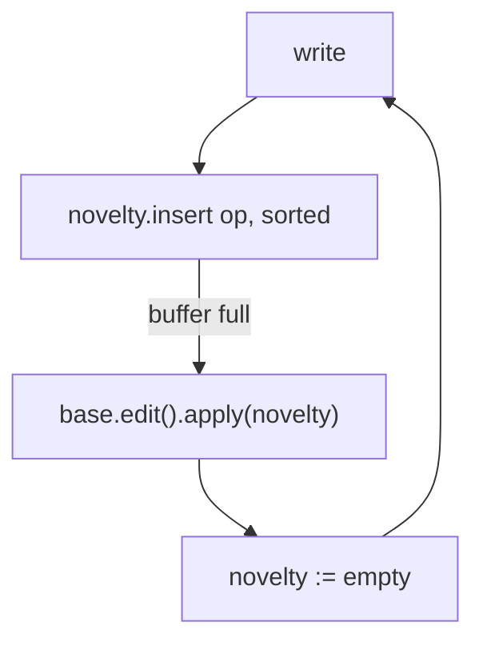

# Novelty Buffer

## Goal

The primary goal is **cheap, frequent sync by exchanging only root nodes.**

Today every commit rebuilds the canonical search tree along the touched path,
re-hashing the spine up to the root, and two replicas reconcile by diffing the
trees. We want recent writes to live in a buffer at the root so that two replicas
which have diverged for a short while differ *only in that root buffer* and can
get back in sync by trading root nodes and unioning their buffers, with no tree
walk.

Amortizing write cost falls out of the same mechanism: a write appends to the
root buffer instead of rebuilding the spine, and the expensive base rebuild
happens only when the buffer fills.

The mental model: this is a **hitchhiker tree with the buffer only at the root.**
A hitchhiker tree puts a write buffer in every inner node and cascades full
buffers down one level at a time. We collapse that to a single buffer at the
root: writes append to it, and when it fills it flushes in one shot into the base
and drains to empty. No per-node logs, no staged level-by-level cascade.

---

## Why only at the root

Two reasons, both load-bearing.

**Sync.** The root is the unit replicas exchange. If buffers lived in inner nodes
too, recent writes would be scattered down the spine and a sync would have to
walk to find them. With the buffer only at the root, all the recent novelty *is*
the root: exchange roots, union buffers, done.

**Merkle stability.** A buffer embedded in an inner node is part of that node's
bytes, so a buffered write would change that node's hash, its parent's link, and
every hash up to the root, churning the spine on every write and destroying
structural sharing. Keeping the buffer only at the root means the base nodes
below are never touched by buffering: their hashes are stable, structural sharing
is intact, and only the single root identity moves as writes arrive.

---

## Model

The tree carries a root-level novelty buffer:

```text
ArtifactTree {
    base: PersistentTree<KeyBytes, State<Datum>>,  // canonical tree, unchanged
    novelty: <sorted buffer of pending ops>,       // lives in the root, durable
}
```

A write appends its op to `novelty`. That is the whole cost of a write in the
common case: no descent, no node rewrite, no base mutation.

### What an op is

A buffered op is an artifact-level instruction (`Assert(Artifact)` /
`Retract(Artifact)`), one logical buffer above the EAV / AEV / VAE indexes, not a
buffer per index. Both variants carry the full artifact, so at flush each derives
its index keys exactly as `ArtifactTreeExt::apply` does today. (The buffer cannot
be `State<Datum>` directly: `State::Removed` carries no datum, so a retraction
would have no key; the instruction carries the artifact and resolves this.)

Because the buffer holds artifact-level ops, it lives on the `ArtifactTree`
layer, not on the generic `dialog_search_tree::PersistentTree` (which knows
nothing of artifacts).

### The buffer is sorted

The buffer's logical order is **canonical (sorted), not arrival order.** This is
decided, for two independent reasons that point the same way:

- **Sync convergence.** Two replicas that exchange roots and union their buffers
  must arrive at the *same* root. That requires "same buffered op-set produces the
  same root" — the buffer must be a canonical function of its op-set, not its
  write history. An append-order log would give two replicas byte-different roots
  for the same facts, so they could never recognize convergence. (Append order is
  fine for a hitchhiker's *node-local* buffer precisely because it never has to
  byte-match a peer's; ours does.)
- **Read merge.** Reads merge-join the buffer against sorted base range scans
  (see below), which requires the buffer sorted in the same order the base is.

The sort order is the single total order over the flat key space. The artifact
key is one `[u8; 162]` `KeyBytes` with a leading tag byte, so EAV / AEV / VAE are
three tag-prefixed regions of *one* sorted key space: a single comparator covers
all three indexes. This is the same order the query layer already calls
`SortKey`, "the one total order consistent with all three tree index layouts."

(Whether the buffer is physically kept sorted as ops arrive, or stored loosely
and sorted when materialized, is an implementation/perf detail to benchmark; the
existing `Changes` overlay sorts on read. The buffer's *logical* order is
canonical either way.)

### Tree hash

The tree's hash folds the sorted novelty into the base root hash with a streaming
Blake3 hasher:

```text
tree_hash = blake3( base_root_hash ++ serialize(sorted novelty) )
```

This is the only thing the novelty changes. Every node underneath stays
byte-identical and its hash is untouched; structural sharing is fully intact.
Because the novelty is sorted/canonical, the tree hash is a pure function of
`{base, op-set}`: two replicas with the same base and the same buffered ops have
the same tree hash, which is what makes the root the unit of sync.

### Flush

When the buffer reaches its capacity, flush **all of it** into the base in one
batch, then drain to empty:

```text
flush:
    base = base.edit().apply(novelty)   // one canonical rebuild for the batch
    novelty = []
    tree_hash = base.root_hash          // buffer empty, tree_hash == base
```

The base rebuild is a `TransientTree` batch-apply over the whole op batch: one
root-to-leaf rebuild absorbs every buffered op. Noop elimination and
cardinality-one supersession happen here, where the base segments are loaded
anyway, so the write path stays read-free.

### Buffer capacity

Capacity is the write-amplification knob: a bigger buffer means rarer base
rebuilds (better write amortization) but more recent novelty to merge on reads
and to exchange on sync. Hitchhiker trees run buffers ~5-10x their fanout
(900-1000 ops against fanout 100-200); for our base fanout `Q = 254` an
analogous buffer is on the order of a few thousand ops. The exact value (and
whether it is fixed or adaptive) is a tuning question for the benchmark. It is
*not* `sqrt(Q)`; that figure applies to per-node Bε buffers, not a flat root
buffer.



---

## Read path

A read consults the base and merges the novelty over it. Because both are in the
same sort order, this is a **merge-join**, not a per-read sort of the whole
buffer: an asserted op shadows or adds a base fact, a retraction tombstones the
matching base fact.

This is the same shape the codebase **already** implements for query-time
overlays, and the novelty buffer should reuse that machinery rather than reinvent
it:

- `QueryLayer` (`dialog-repository`) composes sources with `.with(statement)` /
  `.join(..)`, building an in-memory `Changes` overlay.
- At query time it k-way-merges each branch's tree scan with the overlay via
  `merge_grouped`, ordered by `SortKey`.
- Retracts lift into tombstones (`tombstones_from` / `filter_tombstones`) that
  filter the branch stream before the merge, so a pending retract shadows a
  committed fact without touching the tree.

The difference is lifetime: the `QueryLayer` overlay is per-query and in-memory
and is discarded at commit; the novelty buffer is durable, lives in the root, and
persists across commits. The read-merge is otherwise the same: sorted overlay
merge-joined with a sorted base scan, retract-as-tombstone.

---

## Sync

The base is fully history-independent and hash-pruned, exactly as today:
identical base subtrees are skipped wholesale. Buffering does not weaken this.

The recent divergence between two replicas lives entirely in the root buffer.
Reconciliation, common case first:

- **Same base** (the common case for frequent sync: both replicas flushed to the
  same base last and have only buffered since): union the two sorted buffers over
  the shared base, re-sort, dedup. If the union exceeds the flush threshold,
  flush it into the shared base. This is the "just exchange roots" fast path: no
  tree walk, no segment diff.
- **Different bases** (rare: the replicas flushed at different points): fall back
  to full hash-pruned base reconciliation to merge the two bases, then flush the
  union of both buffers into that merged base. The result is `(merged_base,
  empty)`: when bases diverge we do not try to keep a buffer over the merged
  base, we compact straight through it. So a different-base sync always ends at a
  clean flush boundary.

Because the buffer is sorted/canonical, the union is an order-free set union and
the resulting root converges bitwise across replicas with the same op-set.
Whole-tree bitwise convergence is fully restored at flush boundaries, where the
buffer is empty and the tree is just its canonical base.

---

## Durability

The novelty buffer is **part of the tree's durable state**, not an in-memory
staging area. It lives in the root node, is content-addressed, and the
`tree_hash` commits to it. A write is durable the moment it is appended and folded
into the hash, it survives restart, and it travels with the root during sync. The
base rebuild on flush is background compaction of already-durable writes, not the
point at which they become durable. This is what makes amortization and the
root-only sync span commits rather than batching within a single commit.

---

## Relationship to existing work

Built on the copy-on-write batch-edit work:

- **Flush is `TransientTree` batch-apply.** Pushing the whole buffer into the base
  in one canonical rebuild is what a single `edit()` batch already does.
- **Caller-owned delta.** A flush persists the rebuilt base nodes into a
  caller-owned `Delta` the caller flushes, as commit does today.
- **`PersistentTree` is the read handle for the base.** The base is read as now;
  the novelty merge wraps the base read.

And on the read side it reuses the existing overlay machinery (`merge_grouped`,
`SortKey`, tombstones) rather than introducing a new merge.

---

## Open questions

- Op serialization: how `serialize(sorted novelty)` is defined canonically so the
  streaming tree hash is well-defined and replica-stable.
- Physical buffer representation: kept sorted on insert vs sorted on materialize
  (the existing `Changes` sorts on read); benchmark write throughput, read-merge
  cost, and hash-advance cost. The logical order is canonical regardless.
- Buffer capacity value, fixed vs adaptive (the write-amplification knob).
- Different-base sync: the fallback reconciliation protocol and how often replicas
  actually fall out of the same-base fast path in practice.
