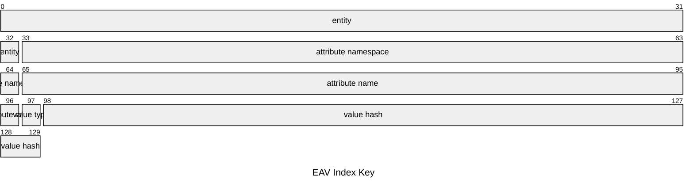

# Value Types

## Context

### Fact

Data in dialog is modeled as facts that is reminiscent to modeling product types a.k.a records in various programming languages. It is also very similar to modeling tables in relational databases:

```ts
const Person = fact({
  this: Object,
  name: String,
  street: String,
})
```

#### Entity

Above we defined `this` attribute denotes **entity** which is equivalent of:

- Unique document identifier in document database
- Primary keys in relational database
- Record reference in programming languages

Every fact has `this` attribute which is implied, we only specified it above for illustration purposes, it is usually never specified and the above fact is identical to more concise definition below

```ts
const Person = fact({
  name: String,
  street: String,
})
```

### Rules

Facts in dialog represent datalog rules that define set of relations. Above fact definition is equivalent of the following rule definition, where `5BWnbwEfPuk6TWqAXTS4HaB7P5b25TVWEC6fKUFEBj88` is attribute namespace derived from as the hash of the `Person` schema definition.

```js
const Person = fact({
  name: String,
  street: String,
}).where(person => [
  {
    match: {
      the: `5BWnbwEfPuk6TWqAXTS4HaB7P5b25TVWEC6fKUFEBj88/name`,
      of: person.this,
      is: person.name,
    },
  },
  {
    match: {
      the: `5BWnbwEfPuk6TWqAXTS4HaB7P5b25TVWEC6fKUFEBj88/street`,
      of: person.this,
      is: person.street,
    },
  },
])
```

In classical datalog it corresponds to following rule:

```prolog
person(This, Name, Street) :-
  attribute(This, '5BWnbwEfPuk6TWqAXTS4HaB7P5b25TVWEC6fKUFEBj88/name', Name, _NameCause),
  attribute(This, '5BWnbwEfPuk6TWqAXTS4HaB7P5b25TVWEC6fKUFEBj88/street', This, Street, _StreetCause)
```

### Casual Triples

All data in datalog is stored as set of relations `{the, of, is, cause}` often referred as causal triples. It is similar to RDF triples, but with addition of `cause` for tracking causality. This is also why facts are modeled as set of attributes where attribute name corresponds to the namespaces `the` field and all attributes share same entity (`of` field).

### Indexes

Dialog indexes causal triples for various access patterns. Index key encode components of the triple with a layout optimized for specific access. For example Entity Attribute Value (EAV) index has a following layout


```js
`${of}${namespace(the)}${name(the)}${type(is)}${hash(is)}`
```



#### Attribute Namespace

Capturing attribute **namespace** in a key facilitates locality of the related triples. As illustrated above namespace was derived from the schema definition, although it could be manually specified, which in turn ensures that triples relevant for the fact will end up collocated.

#### Value Type

Capturing **value type** in a key enables query engine to select attributes of desired type. Furthermore it allows for the same named attribute with different types to co-exist. This is subtle, yet important detail that enables dialog to have schema-on-query semantics.

In an open ended system anyone could associate whatever value they wish with whichever entity they want and under whichever name they desire. In practice this means that two independent applications could choose different format for representing say `time` (one may choose Unix timestamp, another may choose ISO 8601 string). Instead forcing them to coordinate consensus dialog enables them to avoid collisions and simply query data as they see fit. This means we may have triples like ones below without causing any problems.

> ℹ️ In fact it is likely to have rules in place that derives one from the other

```js
{
  the: 'note/inserted',
  of: 'uuid:f15d02dd-97bf-4e41-85c1-4b6a067eafda',
  is: '2023-01-01T00:00:00Z'
}
{
  the: 'note/inserted',
  of: 'uuid:f15d02dd-97bf-4e41-85c1-4b6a067eafda',
  is: 1672531200
}
```

Applications could define their facts as follows and not have to be aware of each other's existence. Independent rule could be later added by third party that can simply derive one from the other and in reverse

```js
fact({
 the: "note",
 title: String,
 inserted: String
})
```

```js
fact({
 the: "note",
 title: String,
 inserted: Number
})
```

### Optional Attributes

Unfortunately there are lot of subtle nuances that come into play when modeling data with optional attributes. Currently conventional approach is a non-trivial and can be illustrated by a following example:

```js
const Optional = fact({
  at: String,
  is: Object,
}).when(({ at, this: of, is, _ }) => ({
  explicit: [
    Collection({ this: of, at, of: is })
  ],
  implicit: [
    Collection.not({ this: of, at }),
    Data.same({ this: null, as: is }),
  ],
}))

const Person = fact({
  name: String,
  address: String,
}).where((person) => [
  Name(person),
  Optional({ this: person.this, at: person.address, is: person.address }),
])

const Name = fact({
  the: Person.the,
  name: String,
})
```

While it is certainly possible to simplify this by extending `fact` DSL with an optional attributes there is one very subtle issue, that is unless `fact` has a non-optional attribute along the side of optional attributes it will end up matching every single entity in all of the triples.

#### Correspondence to Maybe / Option type

Languages with algebraic data types (ADTs) it is common to have a variant type like [`Maybe`](https://wiki.haskell.org/Maybe) or [`Option`](https://doc.rust-lang.org/std/option/enum.Option.html). In both cases when value is absent you end up representing it with an explicit `Nothing` variant.

> ℹ️ There is actually a very compelling case made by roc language designers that [`Maybe` types are not a good way to model data](https://www.roc-lang.org/faq.html#option-type), which is worth considering.

#### Dilemma about Nothing

So how do we represent `Nothing` in dialog ? There are several options that offer different trade-offs that we will explore below:

##### Maybe Not

We could simply choose to not have a representation for `Nothing` and instead do a language specific mapping through queries as it was illustrated earlier. This keeps dialog core simple while pushing some of the complexity into a query engine.

Rich Hickey also makes compelling case for this line of thought in [Maybe Not](https://youtu.be/YR5WdGrpoug?feature=shared&t=464) talk.

##### Omitting Value

We could simply omit `is` field in our triples to denote absence of value. It fits well with the way we encode index keys and query them, specifically keys for triples with absent values could simply omit the value component in keys:

```js
`${of}${namespace(the)}${name(the)}${type(is)}${hash(is)}`
`${of}${namespace(the)}${name(the)}${type(is)}`
```

This would allow us to query for triples with optional values by constructing a key range that conceptionally corresponds to:

```ts
{
  '>=': Key.toKey([
    'uuid:f15d02dd-97bf-4e41-85c1-4b6a067eafda', '5BWnbwEfPuk6TWqAXTS4HaB7P5b25TVWEC6fKUFEBj88',
    'name',
    String
  ])
}
```

While query for triples that have required values by constructing a key range that conceptionally corresponds to:

```ts
{
  '>': Key.from([
    'uuid:f15d02dd-97bf-4e41-85c1-4b6a067eafda', '5BWnbwEfPuk6TWqAXTS4HaB7P5b25TVWEC6fKUFEBj88',
    'name',
    String
  ]),
}
```

> ℹ️ If we do not have anything in the key after type component it will hold triple with absent value.


###### ⚠️ Choosing between Some & Nothing

There is a problem with this approach however in regards to coordination we covered in the [value types](#value-type). Can `string` and `Maybe<string>` co-exist or is every `string` a `Maybe<string>` ?

Like with any other value types two applications may evolve independently and one defining some attribute as `string` and other as `Maybe<string>`. If we say that they both are effectively `Maybe<string>` we can run into a situation where one application may update value to `Nothing` which would make fact no longer match the query of the other that expected a string. On the other hand if we say that `string` and `Maybe<string>` can co-exist like with any other type we may end up in an interesting dilemma when one sets value to `Nothing` and other to `Some<string>`, when queried for `Maybe<string>` is the value `Nothing` or `Some<string>` ?

> 🤔 It is interesting to note that this echoes some of what Rich Hickey was talking about in his talk.

I do not believe there is a right choice here and either one could lead to a confusing situation.
