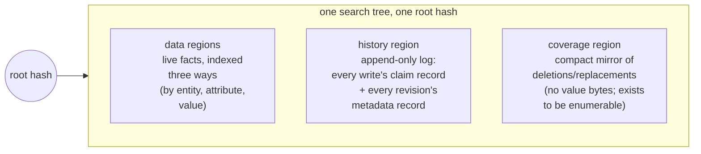
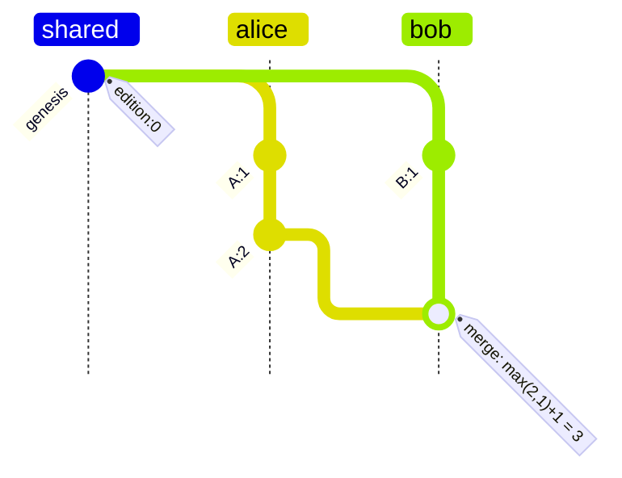
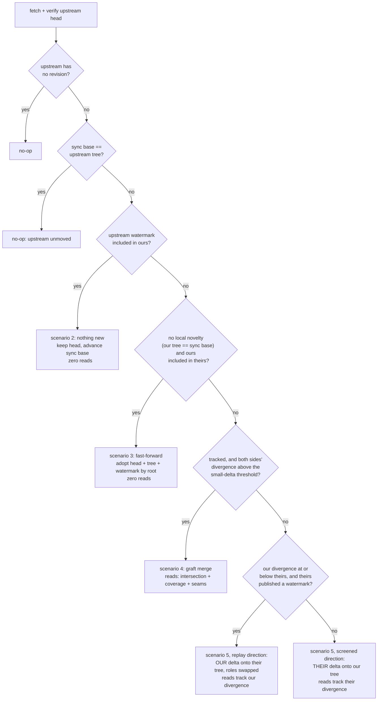
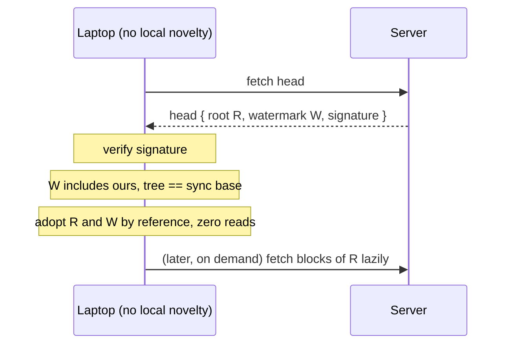
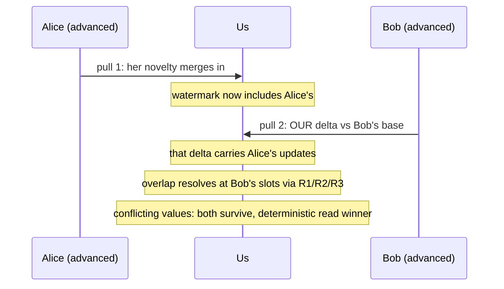
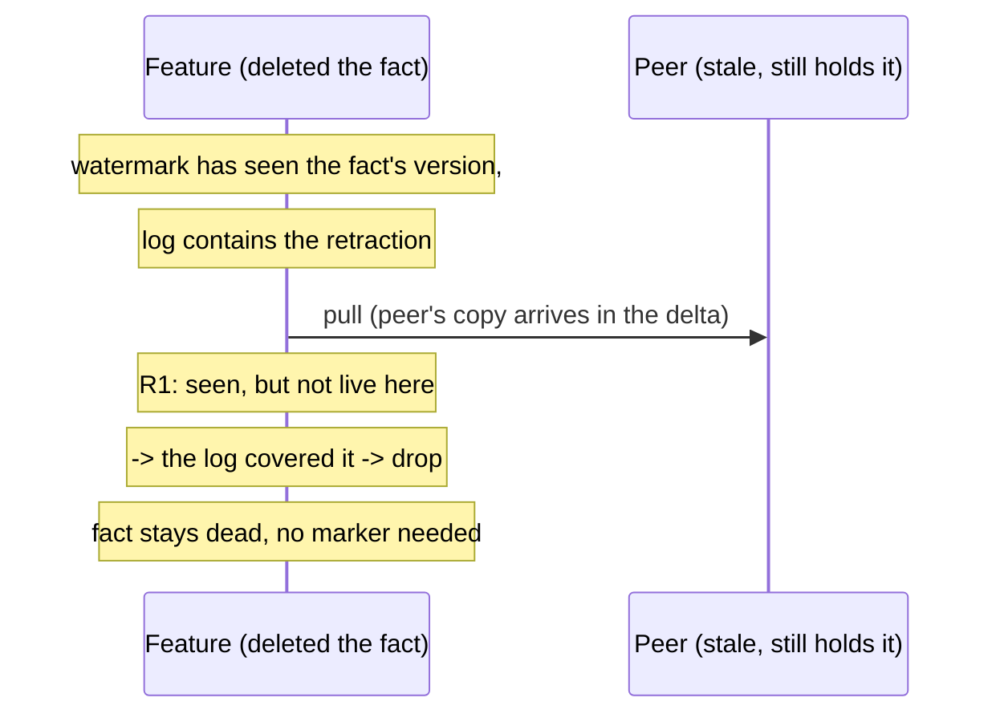
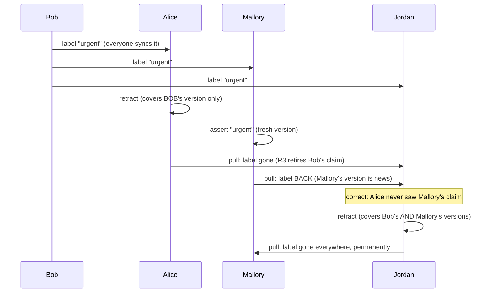
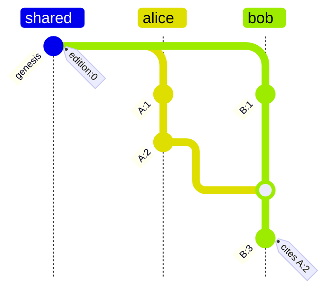

# Version Control

How Dialog keeps a database consistent across devices and people that edit it independently and sync later. This document is both an explainer and the spec: it defines every term it uses and assumes no background beyond "git exists", and it describes exactly what is implemented, scenario by scenario, with the test that pins each one.

## The problem

Picture a notebook app. You edit on your laptop on a plane, your phone edited yesterday and has not synced, and a collaborator has a copy of her own. Eventually the copies exchange changes. Four things must be true afterwards:

1. **Everyone ends up with the same data.** Two copies that have seen the same changes must be byte-for-byte identical, regardless of who synced with whom, in what order, how many times.
2. **Deletions stick.** Syncing with a stale copy must not bring a deleted fact back from the dead.
3. **You can tell what happened first.** When two copies changed the same thing, the system must be able to say "yours came after mine", "mine came after yours", or "neither saw the other".
4. **No coordinator.** All of this works offline and peer to peer.

And one more, which shapes the merge design throughout:

5. **Sync cost tracks what you exchange, not what exists.** A replica that only cares about a slice of the data must never be forced to download someone else's unrelated churn just to merge.

## The picture in one page

Vocabulary, each term defined once:

- A **fact** is one statement: entity, attribute, value, like `(alice, person/email, "alice@example.com")`.
- A **repository** is a collection of facts under a cryptographic identity (a DID).
- All facts live in one **search tree** of content-addressed blocks: the hash of the root block identifies the entire state. Two trees with the same root are identical, full stop.
- A **branch** points at the current state through a **revision**, a named snapshot ("the tree with root X, by writer Y, building on Z").
- A **replica** is any copy: laptop, phone, server.
- **Pull** merges another replica's branch into yours; **push** publishes yours (and only fast-forwards). An **upstream** is a branch you sync with; a branch can track several.
- The **sync base** is, per upstream, the upstream's tree root as of your last sync with it: the divergence marker both sides' deltas are measured against.

The tree is divided into regions by key prefix:



One root hash covers the facts *and* the story of how they got there, which gives the principle everything else rests on:

> **The log is the truth. The current facts are a cache.**
>
> A fact is live exactly when nothing in the log has withdrawn or replaced it. The data regions materialize precisely that live set so queries are fast. Deletion is not a marker in the data; it is an entry in the log, and merges keep the cache consistent with the growing log.

## Naming every change: editions, origins, versions

Merging histories requires comparing changes from different writers. Every revision is named by two ingredients.

**The edition** answers "how much history had this revision seen?":

- First revision on a branch: edition `0`.
- Commit on top of a revision: that revision's edition plus one.
- Merge of two revisions: the larger of the two editions, plus one.

Those three rules buy the property the whole design leans on: **if revision B was made by someone who had seen revision A, B's edition is strictly greater than A's.** Flipped around, that is concurrency detection with no searching: two revisions with the same edition from different writers cannot have seen each other.



Alice's `A:2` (edition 2) and Bob's `B:1` (edition 1) are ordered neither way by inspection alone, but Bob's merge has seen both, so it lands above both at edition 3.

**The origin** answers "who is counting?". It is built from a three-step ladder of derived identities, each folding the previous:

- A **replica** is a repository as seen by one profile: `hash(repository, profile)`.
- A **branch** is a named line of work on a replica: `hash(replica, branch-name)`. This opaque identifier — never the name — is what published heads carry.
- An **origin** is a branch as advanced by one session key: `hash(branch, operator)`.

The same person on two branches, or on two devices, gets two origins. Each origin is therefore a **single sequential actor**: it produces revisions one at a time, never in parallel with itself.

**The version** is the pair `(origin, edition)`, the globally unique name of a revision.

**The rule everything rests on:** one origin never produces two different revisions with the same edition. It is enforced structurally: branch-head writes go through compare-and-set, and each session has its own key and so its own origin. Two distinct revisions claiming one version is protocol corruption; replicas order the offenders deterministically by content hash to avoid diverging, but such a history is broken and should surface an error. (Consequence: resetting a branch backwards and committing would re-mint a used edition; reset exists for fast-forward bookkeeping, not rewind.)

## The watermark

The single most load-bearing derived structure. A replica's **watermark** (in code: `Context`) summarizes everything its head has ever incorporated:

```text
watermark = { origin -> (highest edition seen, revision count seen) }

seen(version)  exactly when  version.edition <= watermark[version.origin].edition
```

Why one entry per writer suffices, exactly and not approximately: each origin writes sequentially, each revision building on its own previous one, so the revisions you have seen from any origin are always a prefix of that origin's history. Seen their 7 means seen their 0 through 6. The table has one entry per writer, never grows with edits, and answers "have I seen this change?" in one lookup.

Each entry carries a second number beside the edition: **how many of that origin's revisions the ancestry actually contains**. Editions are Lamport depths, not write counts — an origin's first commit atop a deep adopted history mints an edition near the whole depth — so the count is what makes delta-size estimates exact: prefixes of one origin's chain are nested, so the difference of two counts is precisely the number of revisions one side has that the other lacks. Verification bounds it (a count can never exceed `edition + 1`), so a hostile inflated count is refused with the head.

Watermarks also order replicas by knowledge: if every entry of watermark P is at or below the corresponding entry of watermark Q, then Q has seen everything P has (in code: `Q.includes(P)`). The pull scenarios below are gated entirely on this comparison.

**Where the watermark lives.** Three places, in order of authority:

1. **On every head, inside the signature.** A published revision carries its watermark as a field, and the signing payload commits to it byte for byte. This is the branch memory record a peer fetches, so reading a replica's knowledge costs one small read and is exactly as trustworthy as the head itself: tampering with the watermark, or stripping it, fails verification.
2. **In a per-branch-handle memo**, keyed by head version. A fixed head's watermark never changes, so entries never invalidate. Every commit extends the memo by its own version; every pull writes the merged head's watermark back.
3. **Derivable by walking the ancestry records** in the tree. The fallback for heads minted before watermarks were published; costs one signature-verified read per ancestry revision.

A test pins that all three agree (`it_publishes_the_watermark_with_the_head`, `it_maintains_the_context_memo_incrementally`).

## What a revision is made of

**The head** is the small signed value published to the branch cell: the branch identifier, the issuer (session key) DID, the tree root, the edition, the watermark, and the issuer's signature over all of it. The branch identifier is the content-derived branch entity — one opaque hash folding the profile, the repository, and the branch name — NOT the name itself: the name is whatever someone privately called their branch and no peer needs it, so it never travels (though a guessable name remains enumerable from the hash by anyone holding the public DIDs). Those two identity fields are the whole story: the origin derives from exactly `(branch identifier, issuer)`, so the head carries neither the repository DID nor the profile DID separately — the identifier already commits to both, and the in-tree record carries the attribution readably. An origin is never carried as a field, always recomputed, so a hostile issuer cannot mint into anyone else's origin. Parent edges live in the in-tree record, not on the head. A replica verifies the signature **before anything else happens** with a head it did not mint: a forged or tampered head is rejected before a single block of its tree is read. Pull is the trust boundary (`it_refuses_to_pull_a_forged_head`).

**The record** is the revision's metadata written into the tree itself, one atomic fact in the reserved `dialog.` namespace: parent versions (the edges of the history graph), attribution, skip links, and its own signature. Two details:

- The record cannot contain the tree root, because it lives inside that tree and a hash cannot contain itself. The head carries the root; that is why both exist.
- The record defends itself: its signature covers its fields, and the version it is filed under is recomputable from its own contents, so a tampered record, or a valid one copied to another slot, fails the check every reader performs.

Records are stored in two of the three index orderings (by entity and by attribute, the two shapes queries take); the value ordering is skipped, since a record blob is unique to its revision and nothing looks one up by value. Readers memoize verified records by version (a version's record is immutable, so the memo never invalidates), which spares the tree read, the decode, and the signature verification on the repeated ancestry steps of skip extension, context walks, and causality. Because records are ordinary facts, history is queryable: "who committed this", "is X an ancestor of Y", "show the log" are normal queries over built-in derived relations, and records that do not verify are simply not projected.

**Skip links**: besides its parent, a revision records anchors deep in its first-parent run — the most recent ancestors whose editions are divisible by 2, 4, 8, ... (the distinct ones; at most log2(run length) entries) — so ancestor search takes logarithmically many steps. The anchor shape is what makes recording them free: a child's table is a pure function of its parent's version and table (the parent supersedes every anchor level its edition's power-of-two divisibility reaches; deeper anchors carry forward unchanged), so extending it costs one record lookup — memo-warm on a held branch handle — where the previous shape re-walked log2(depth) ancestor records out of the tree on every commit and was the single depth-growing term in the commit profile. A shortcut never jumps across a merge (it would skip the ancestry entering through the other parent; the child of a merge starts a fresh table that may anchor at the merge but carries nothing beyond it), and searches never jump below the edition they seek.

**A known gap, stated honestly:** the record names the profile it acts for, but only the session key's signature backs that claim. Binding it cryptographically needs delegation proofs plus a time-anchoring story (delegations expire; revisions are forever; the history carries no wall clocks). Until then the profile field is attribution metadata; the session key is the bound identity.

## One tree for data and history

History entries are keyed origin-first (writer, then edition), so one writer's records form one contiguous span of the log, ordered by edition within it. Per-writer contiguity is what lets a merge adopt another replica's log wholesale by subtree hash: two sides' novel records cluster apart instead of interleaving. Causally ordered listings come from walking the revision DAG, not from scanning the region. Three consequences the design leans on:

1. **History and data cannot drift apart**: one root covers both.
2. **Pulling merges history for free**: entries ride the same tree diff as data, and every entry's key is unique to its version, so the log union is conflict-free.
3. **Same root means same everything**: fast-forward detection is one hash comparison.

## Writing facts

Every commit tags its facts with its version and appends one **claim record** per instruction. The record's key field is **supersedes**: the versions of the earlier claims this write replaced or withdrew.

- **Assert** adds a fact; supersedes nothing. The fact orderings address a claim by `(entity, attribute, value)`, so two writers asserting the *identical* value share one index entry: the entry **collapses** their claim versions (one primary plus a sorted set) rather than overwriting, wherever same-value claims meet — an in-branch re-assert absorbs the standing versions, and a merge contest unions the two sides' sets deterministically. Everything downstream reasons over the whole set: a retraction covers every claim its author observed (the D3 promise holds on identical values, pinned by `it_covers_every_observed_claim_of_a_retracted_value`), and a covering record retires exactly the versions it names — the fact stays live while any collapsed claim remains uncovered, dying only when the last one is covered.
- **Replace** sets the value at `(entity, attribute)`, deleting different-valued priors from the indexes and listing their versions in its record. An identical value already in place is a full no-op.
- **Retract** deletes the fact's index entries and records the withdrawn claim's version. Covering writes (retractions, and replacements that superseded something) additionally mirror a compact entry into the **coverage region**: same key layout under its own tag, carrying the entity, attribute, covered versions, and polarity, but no value bytes. Its only purpose is enumerability: "every deletion or replacement since the sync base" becomes a scoped tree diff over this small region, without streaming the value-bearing assert records interleaved in the history log. It rides merges as ordinary append-only entries and is the repair source for the graft merge below. **No marker is left behind**: after a retract, the data regions look as if the fact never existed. What makes that safe across sync is the watermark, as the scenarios below show. (Same-batch assert+retract cancels to nothing; retracting a nonexistent fact is a no-op — no index change, no record, no minted revision. Two instructions on the same `(entity, attribute, value)` in one batch land at one history key; their records fold — later polarity, union of superseded versions — so a retract-then-re-assert of one value nets to an assert citing the version it overrode, and the log and its coverage mirror stay consistent.)

## Pulling changes: every scenario

Pull is two-phase: `prepare` does all network and CPU work with no writes, `commit` performs two instant cell publishes (head and sync base) under compare-and-set, so racing writers fail loudly and retry rather than losing anything. What `prepare` does is a cascade of checks, cheapest first:



### The three screen rules

Every merge direction uses the same three rules. They only ever consult the **receiver's** state: its tree, its watermark, and the incoming delta. In the screened direction the receiver is us; in the replay and graft directions the receiver is the substrate side, whose tree is adopted and whose published watermark does the screening.

- **R1, incoming facts:** a fact whose producing version the receiver has *seen* is never re-applied. If it is still live in the receiver's tree, applying it changes nothing; if it is absent, the receiver's log covered it, and applying it would resurrect a deletion. Unseen facts are news and pass.
- **R2, incoming removals:** apply only when the receiver's copy is byte-for-byte what was removed. If the receiver holds something the remover never observed (a later re-assert), the removal misses.
- **R3, incoming records:** every record appends to the log (keys are per-version unique, so this never conflicts). A record that *supersedes* versions retires any of them still live in the receiver's tree, found by scanning the record's `(entity, attribute)` slot and matching **by version, not value** (a replacement supersedes claims of other values, which live under other keys).

One ordering rule: records screen before facts, in one combined pass with one persist, so a retraction and a later re-assert arriving together resolve by causality, not by a tie-break.

**Ties**: after screening, the only data collision left is two copies of the *same fact* differing in version metadata; the winner is the higher hash of the stored bytes, deterministic and identical on both replicas.

**Why everyone converges**: the log only grows and merges as a union, so exchange order cannot matter to it; liveness is a property of the log alone (once covered, always covered); the screens keep every replica's cache equal to its log's live set. Same log, same cache.

### Scenario 1: the idle tick

The upstream has no revision, or its tree still equals the sync base. Nothing to do; zero reads. This is what an auto-sync loop hits almost every time it fires.

### Scenario 2: the upstream has seen everything we have

Gate: `ours.includes(theirs)`. Everything in their ancestry is in ours, so every fact live with them is live or covered here already. The pull is a no-op detected from the two heads alone: the local head stands, and only the sync base advances (so the next pull's delta is measured from their current tree).

```text
ours              theirs
alice: 7          alice: 7
bob:   5          bob:   3
me:    8          me:    0

theirs is included in ours: skip, zero reads.
```

When does this actually happen, given that the upstream *did* move (the sync-base check already passed)? Whenever its movement consists of things that reached us another way first. The common shapes: the upstream merged a third party we had already pulled directly; the upstream absorbed our own pushes (possibly relayed through other devices of ours); or, in a mesh, we pulled peer A which had already merged peer B, and now we pull B, whose entire state came to us through A. In each case B moved, but its watermark is a subset of ours, and the comparison proves there is nothing to fetch before a single block is read.

This is also the mesh-sync primitive: in a five-replica mesh, pull the best-informed peer first, and the other pulls collapse to this check. Pinned by `it_skips_a_pull_from_an_upstream_that_has_seen_everything`.

### Scenario 3: fast-forward adoption

Gate: our tree equals the sync base (no local novelty) and `theirs.includes(ours)`. Nothing we know could contradict what survived their screen, so their head, tree, and watermark are adopted **by root**: no diff, no block reads, no import. Blocks hydrate lazily on demand later, like any partially replicated region. This covers both the everyday device pull and the fresh replica adopting a deep history, at zero cost either way.



Crucially, this is what keeps pull cost independent of upstream churn in namespaces we never touch: two hundred commits of `user/*` traffic we never query are adopted without downloading any of it. Pinned by `it_adopts_an_upstream_head_without_reading_its_novelty`.

### Scenario 4: both sides moved, the graft merge

The general tracked merge. It fires when a sync base exists and both sides' divergence masses exceed a small threshold (currently 8; below it the per-piece seam work of the stitch costs more than just walking the few entries, and scenario 5 is strictly cheaper). We carry local novelty (possibly including bulk adopted from other upstreams), the upstream carries its own churn, and both heads publish watermarks. The merge never enumerates either side's bulk; it partitions the key space and works only where the two change sets actually meet.

Mechanics, in order:

1. **Partition.** Two node-level tree diffs (base against ours, base against theirs) are pruned by hash without enumerating entries; their remaining frontier bounds give each side's conservative divergence spans. The span algebra classifies the whole key space: spans only we changed, spans only they changed (or nobody), and contested spans where both sides changed.
2. **Stitch.** The merged tree is stitched from whole subtrees: our subtrees over our spans, theirs over the rest, adopted by hash without reading their interiors (this works even for content we hold only by reference). Only seam nodes where grafted spans join are rebuilt, and the stitched root is canonical: byte-identical to what a from-scratch build of the same entries would produce, which the search tree's oracle property tests pin.
3. **Contested spans.** The substrate is the side with the bigger divergence; the smaller side's delta, scoped to the contested spans, integrates onto it through the same screens as ever (adds screened by the substrate side's watermark, removes byte-guarded). Entry-level work therefore tracks the smaller side even inside the overlap.
4. **Coverage repair.** Every covering record either side minted since the base (enumerated from the compact coverage region, a scoped diff costing deletions and replacements, never churn) retires the covered claims still live in the stitched tree, matched by version at all three orderings. Repair is version-exact, so it commutes with the contested integrate: a re-assert mints a fresh version no coverage names.
5. **Head selection** mirrors every other path (adopt theirs, keep ours, or mint a merge whose watermark is the union of the two published ones plus its own version), so mutual pulls quiesce.

A worked example. We track Bob and also pull from Alice. Yesterday we pulled Alice and adopted two hundred commits of her bulk by root (scenario 3). Today we pull Bob, who made a dozen commits since our shared sync base, most touching `post/*` entries we also touched:

```text
region              ours vs base          Bob vs base        classified as
log, Alice's span   changed (her bulk)    unchanged          ours: grafted from our tree, unread
log, Bob's span     unchanged             changed            theirs: grafted from Bob's tree, unread
data, post/*        changed               changed            contested: merged entry by entry
data, user/*        unchanged             unchanged          either: grafted, unread
```

Our side carries the bigger divergence (Alice's bulk counts as ours now), so our tree is the substrate; Bob's delta, scoped to the contested `post/*` spans, is read and screened in. Alice's two hundred commits and Bob's untouched regions cross the merge by subtree hash without a single interior read. The pre-graft design would have replayed Alice's entire bulk into Bob's tree here, which is the composition failure the graft exists to prevent.

Cost: the intersection of the two change sets, plus coverage since base on both sides, plus seams. Pinned by `it_grafts_a_tracked_merge_without_walking_adopted_bulk` (a replica that adopted two hundred commits of foreign bulk and carries its own novelty pulls a twelve-commit tracked upstream in a bounded number of block reads, with the divergence gate asserted so the fixture provably routes through the graft) and, for the deletion legs, `it_propagates_deletions_across_a_graft_merge` (both sides carry graft-sized divergence, each retracted a base fact the other still holds, and the stitched-and-repaired tree keeps both dead). One honest limit: span locality follows key clustering. The log region (origin-first), the coverage region, and the attribute-ordered index cluster well; the entity-ordered and value-ordered indexes scatter content-hashed keys, so when *both* sides carry large novelty the contested work in those regions is irreducibly proportional to the smaller side, not to the true overlap.

### Scenario 5: replaying the smaller side

Fires when the graft does not: the pull is first contact (no sync base to partition against), or one side's delta sits at or below the small-delta threshold. One whole side's delta is transferred, and the only question is direction: which side is smaller. That is answered with zero reads by comparing the two watermarks' **divergence masses**: for each origin, how many of its revisions one watermark's count runs beyond the other's, summed. Counts count revisions exactly (per-origin prefixes are nested), so the mass IS the delta size in revisions — an origin's single fresh commit atop a ten-thousand-deep adopted history weighs as one revision, not ten thousand, which editions alone would get wrong.

```text
ours (count)       theirs (count)
alice: 5           alice: 7
bob:   3           bob:   5
me:    6           me:    4

Neither watermark includes the other.
Ours beyond theirs:    me 6-4                  = 2
Theirs beyond ours:    alice 7-5 + bob 5-3     = 4

We are the smaller side: replay our 2 revisions onto their tree.
```

**When our side is smaller (the replay direction)**: their tree is adopted by root as the substrate, and our delta since the sync base (on first contact, our whole tree) replays onto it through the same three rules with *them* as the receiver. R1 drops any of our adds their watermark has already seen: either the fact is live in their tree, in which case re-applying it changes nothing, or their log covered it, in which case applying it would resurrect their deletion. R2 keeps our removals byte-guarded against their copies. R3 carries our covering records in and retires anything they still hold live that we deleted. Their churn is never enumerated; reads track *our* divergence. Pinned by `it_replays_local_novelty_onto_an_upstream_without_reading_its_churn` (two hundred commits of upstream churn merged in a handful of block reads), the deletion legs by `it_carries_a_covering_record_when_replaying_onto_a_stale_holder` and `it_drops_observed_adds_when_replaying_onto_a_covering_upstream`, and the first-contact leg by `it_first_contacts_a_churning_upstream_from_the_small_side` (a two-fact replica meeting a two-hundred-commit upstream replays its two facts).

**When their side is smaller (the screened direction)**: their delta since the sync base is read, screened by *our* tree and watermark under the same rules, and integrated onto our tree; reads track their divergence, and the merged head's watermark is derived with zero extra reads by folding the revision records that ride the delta. This direction also serves two cases regardless of size: an upstream head minted before watermarks were published (it gives the replay direction nothing to screen by), and the safety-net fallback whenever the frugal gates refuse. The refusal is itself load-bearing: `it_refuses_adoption_when_local_knowledge_exceeds_the_upstreams` pins the triangle where we learned of a deletion through one upstream and then pull another that still holds the fact live; wholesale adoption would resurrect it, so the gate refuses, this screen runs, and R1 rejects the stale copy.

**Head selection**, identical in both directions so that mutual pulls quiesce: if the merged tree equals theirs, their head is adopted outright; if it equals ours, our head stands and only the sync base advances; otherwise a merge revision is minted whose watermark is the union of the two plus its own version. The degenerate arms matter: without them, two replicas pulling each other would mint fresh merge revisions forever instead of settling in two rounds.

Between them, the two directions guarantee that reads track the smaller of the two divergences, never the larger side's churn; the one shape neither serves cheaply, both sides bulky with a small overlap, is exactly what the graft (scenario 4) is for.

### Scenario 6: two upstreams, both advanced

There is no three-way merge in the system; reconciling several remotes is iterated pairwise pulling, and the overlap between two upstreams' updates is resolved on the pulling replica during the second pull. The mechanical reason: each upstream has its own sync base, so after pulling Alice, the delta against Bob's base is everything we hold that *Bob* lacked at last sync, which now includes Alice's updates. When that delta replays onto Bob's tree, Alice's and Bob's writes meet at their slots under the ordinary screen rules: identical facts collapse to the deterministic hash winner, a retraction from one side retires the other side's copy of the claim it observed (and only that: a concurrent re-assert survives), and genuinely conflicting concurrent values *both survive* in the log, shown deterministically by read-time conflict detection until a later write that has seen both cites and supersedes them.



Order does not matter to the outcome (the union log is the same either way), only to cost: pulling the better-informed peer first often collapses the second pull to the scenario 2 no-op. Adoption can never clobber the first pull's result, because after pull 1 the second upstream's watermark cannot include ours (`it_refuses_adoption_when_local_knowledge_exceeds_the_upstreams` is this triangle's deletion variant). And convergence is a gossip property: after our two pulls *we* hold the reconciled state; Alice and Bob still diverge from each other until they pull us or each other.

## Deletion, scenario by scenario

Deletion is the acid test of the design, so each shape gets its own walkthrough. The cast: a fact `(post:1, post/title, "Spam")`.

### D1: a tracked deletion propagates

The plain case. `feature` retracted the fact; `main` moved on unrelated work; `feature` pulls. The retraction is part of feature's state, main's delta does not disturb it, and the merge keeps the fact dead. Pinned by `it_propagates_a_retraction_across_a_merge`.

### D2: a stale peer cannot resurrect it



The receiver's watermark answers "have I seen the change that produced this incoming fact?"; yes plus absent-from-cache means "something in my log covered it", and the copy is dropped. Symmetrically, when the stale peer pulls the deleter, the retract record arrives and R3 retires the peer's live copy. Both replicas converge on the deletion, in either pull direction. Pinned by `it_does_not_resurrect_a_deleted_fact_on_pull` (which exercises the tracked, empty-base, and reverse legs).

### D3: a deletion only covers what its author had seen

The four-writer scenario that defines the semantics. Bob labels a task; everyone syncs it. Alice retracts the label, having seen only Bob's claim. Mallory, concurrently, asserts the same label under her own version.



A retraction removes exactly the claims its author had observed; concurrent assertions survive it; a retraction made with full knowledge clears everything. Pinned by `it_keeps_a_concurrent_assertion_the_retraction_never_observed`.

### D4: deletion is not forever

A re-assert after a deletion mints a fresh version above every watermark in existence. R1 treats it as news everywhere, R2 cannot touch it (different bytes), and no existing record supersedes it. The resurrection propagates and survives pulls from arbitrarily stale peers still holding the pre-deletion copy: the stale copy is dropped (D2), the fresh claim stands. Pinned by `it_resurrects_a_deleted_fact_and_the_resurrection_survives`.

### D5: deletions survive the frugal paths

The zero-read scenarios never bypass deletion safety, because their gates are exactly the conditions under which nothing can go wrong:

- Scenario 2 (skip) fires only when we have seen everything they have, so any fact live with them that we deleted is already covered here.
- Scenario 3 (adopt) fires only when they have seen everything we have, so our deletions are reflected in their fold already.
- Scenario 4 (graft) repairs the stitched tree from both sides' coverage regions, so a deletion either side minted since the base retires the other side's grafted copies.
- Scenario 5's replay direction screens our adds by their watermark and carries our covering records into their tree, per its two deletion legs above.
- When we know a deletion the upstream does not and hold no shared base to express it through, the gates refuse and scenario 5's screened direction decides (`it_refuses_adoption_when_local_knowledge_exceeds_the_upstreams`).

## Which of two writes wins?

Merging keeps replicas identical; conflict *detection* decides which of two concurrent values a query shows. It runs on the claim records' supersedes chains, per `(entity, attribute)`, in three tiers:

- **Tier 0, compare versions** (free): same version, same write; same origin, ordered by edition; same edition and different origins, concurrent. Otherwise continue.
- **Tier 1, direct citation** (one lookup): a claim whose supersedes list names the other's version wins.
- **Tier 2, walk the chain**: walk the higher-edition claim's supersedes chain backwards; editions strictly decrease, so branches that drop below the target without hitting it are abandoned. Found means superseded; exhausted means concurrent. Bounded by the writes to that one `(entity, attribute)` between the two editions.



`A:2` versus `B:1`: neither cites the other; the tier-2 walk from `A:2` reaches `A:1` at edition 1, which matches `B:1`'s edition but not its version, so it prunes and exhausts: concurrent. After Bob merges and commits `B:3` citing `A:2`, any later claim of Bob's beats Alice's at tier 1.

The same machinery end to end, on values. A note's title is `"Draft"`, asserted by Bob and synced everywhere. Alice replaces it with `"Final"`; concurrently, Bob replaces it with `"Ready"`. Each replace deleted the `"Draft"` its author had observed and listed Bob's original version in its supersedes:

1. **After sync, both values are live.** Alice's claim covers only `"Draft"`; so does Bob's. Neither covers the other, so the screens rightly keep both `"Final"` and `"Ready"` in the index and both claim records in the log. Nothing was silently discarded.
2. **Detection says concurrent.** The tier-2 walk from either claim reaches only Bob's original `"Draft"` version, never the other claim: neither author had seen the other's write.
3. **Display is deterministic.** Every replica shows the same title, picked by the higher claim hash; say `"Ready"` wins. `"Final"` is not lost: an application can list both values and surface a conflict badge instead of pretending there is one answer.
4. **Resolution is just the next write.** The first writer who has seen both and sets the title again closes the conflict everywhere. Setting a third value mints a claim citing both versions, winning at tier 1 against each and retiring both from the index. Re-affirming one of them, say `"Ready"`, cites and retires only the rival `"Final"` (an identical value in place is a no-op, so `"Ready"` itself stands at its existing version); one value remains live either way, and the resolution propagates like any other write.

There is no special conflict pathway in any of this: it is the ordinary replace instruction plus the ordinary screens, and detection runs entirely at read time.

Verdicts are cached forever (new history is only ever added above two fixed claims, never between them). The one revisable outcome, "part of the chain is missing" on a partial replica, surfaces as an error, is never cached, and resolves once the records replicate. Genuinely concurrent values are both valid; queries pick deterministically by claim hash, and applications can ask for all of them.

## Branches and day-to-day sync

A branch is two versioned cells under the repository subject: the head revision and the upstream tracking state. Every cell write is a compare-and-set: "replace contents, provided they are still at the version I read". A commit racing a commit, a pull racing a commit, two pulls racing: each loser fails loudly with a version mismatch, refreshes, and retries; nothing is silently lost (each race has a test).

- **Commit** applies instructions to the head's tree (facts, claim records, the revision record), imports the new blocks, extends the watermark by its own version, signs, and publishes through the checkpoint.
- **Fetch** reads an upstream's head; changes nothing locally.
- **Pull** is the scenario cascade above. A branch tracks several upstreams, each with its own sync base; `pull().from(target)` pulls any branch, tracking it from then on.
- **Push** is fast-forward only: verify the upstream still sits at our recorded sync base, upload the tree blocks and blob bytes it lacks, then publish the head, so a published revision never references bytes the remote is missing. If the upstream moved, pull first.

**Partial replication is unaffected throughout**: "seen" means "in my head's ancestry", not "bytes on my disk". A replica that adopts head H holds H's state regardless of which blocks it has fetched; laziness changes what is materialized, never what the state is. The one obligation: history entries must not be pruned (garbage collection needs a published floor below which fresh replicas bootstrap by adoption; future work).

## Measured costs

Pinned by the read-amplification harness (`dialog-repository`, module `read_amplification`, an ignored test; its docs show the invocation). Costs in **block reads** (content-addressed storage fetches) and wall time, release mode, in-memory backend; reads are the number IndexedDB and network multipliers apply to.

```text
depth   scenario                        block reads   wall ms
10000   tree shape: 60000 entries in 249 nodes
  100   no-op sync tick                           0         0
  100   fast-forward (1 commit)                   0         0
  100   merge, both sides moved                  19         2
 1000   merge, both sides moved                  24         5
10000   initial pull (adopt all)                  0         0
10000   no-op sync tick                           0         0
10000   fast-forward (1 commit)                   0         0
10000   merge, both sides moved                  32         9
10000   tracked pull after adopting bulk         22        10
10000   watermark walk (legacy heads)            22       578
```

Reading it: every path is free except a genuine both-sides merge, whose reads sit at the write-amplification floor of the key layout and are independent of either side's bulk. The floor: a one-fact commit touches six keys (three data orderings, its claim record, and the revision record's two orderings), each content-hashed into a different leaf, so merging two such deltas legitimately reads both sides' scattered leaves plus index and write paths, 19 to 32 nodes of a 249-node tree at any depth. Merge strategy is chosen by size, per the scenario cascade: tiny deltas take scenario 5's cheaper direction, bulkier ones take the graft. Remaining levers live below the merge. The revision record could collapse to a single ordering (it is only ever looked up directly, never scanned by value; blocked on the planner learning per-attribute index availability) and cluster its keys like the log region (blocked on variable-length keys: a full origin plus edition does not fit the fixed order-preserving key head), together shaving the floor further. Roundtrip structure is the latency lever, since diff walks currently fetch level by level, sequentially: expanding each frontier level's fetches concurrently bounds rounds by tree height, and a push-time delta manifest (the pusher already knows its novel blocks; publishing that list lets a puller fetch them in one concurrent volley, with no active server, only read-by-hash storage) makes any merge one or two rounds. The last row is the ancestry walk paid only for pre-watermark heads.

To observe these numbers in an embedder: wrap the environment in the `Counting` provider (`dialog-repository`, `helpers` feature) and log `block_reads()` plus a clock around `pull()`.

### The cost of a commit

Commits never touch the network; their cost is CPU plus local writes. Measured in the same conditions (release, in-memory storage, one fact per commit, history thousands of revisions deep): about 3ms per commit. Where it goes: the six keys above are each content-hashed into a different leaf, and the measured tree carries ~240 entries per leaf, so a one-fact commit rebuilds, re-serializes, and re-hashes several large leaves; the revision record's two inserts alone are roughly half the total. Signing costs ~30µs and ancestry reads are served by the verified-record memo, both negligible. Everything above the raw data writes is per *commit*, not per fact, so batching amortizes it: a hundred-fact transaction pays the record, signature, and head-publish cost once.

Levers if interactive single-fact commits need to be cheaper, none started: the leaf-size parameter lives in the tree's format manifest as data, and smaller leaves cut the bytes hashed per commit proportionally, at the price of more, smaller blocks per merge span (a sweep in this harness would find the knee); a durable novelty buffer, where a commit appends its few operations to a small log folded into the root hash and tree shaping is deferred to an amortized flush (structurally a write-ahead log plus checkpoint), would drop the per-commit work to appending a handful of operations plus the signatures; and the record-layout items above shrink the dominant term.

## Rules that must never break

1. **One origin, one sequence.** The watermark is exact only because each origin writes sequentially (per-session keys, head CAS). Never add a way to mint two revisions with the same version; reset is not rewind.
2. **A tree's revision records are a subset of its head's ancestry.** True at mint, preserved by every pull outcome. This is what makes the watermark derivable locally and lets root equality stand in for history equality.
3. **Records before facts, one pass, one persist**, in both merge directions.
4. **A screen consults only the receiver's state** (its tree and watermark) plus the incoming delta: ours in the screened direction, the substrate side's published one in the replay and graft directions. Never mix the two sides' screens.
5. **Never act on an unverified head.** Signatures are checked before any gate fires, on pull and on push alike; the watermark is only trustworthy because the signature covers it. Verification also refuses any edition (the head's own, or a watermark entry's) at or above the protocol ceiling (2^62): a validly signed hostile edition near `u64::MAX` would otherwise make the saturating successor mint one version twice and pin the origin's watermark so high that every future write from it is silently dropped.
6. **The `dialog.` namespace is reserved**: revision metadata is written only by the internal record path.

## Not done yet

1. **Mesh sync planning**: with watermarks on every head, choosing the pull order across N peers is greedy set cover over version vectors (pull the peer covering the most of what you lack; peers whose watermark you include are skipped by scenario 2). No new protocol is needed; this is client policy.
2. **Content erasure** (GDPR): the log retains value bytes in claim records indefinitely, in any merge design. The fix is value indirection (records and index entries carry the content hash; bytes live outside the merkle structure) plus a replicated, grow-only erasure set peers honor by dropping bytes. Hashes of low-entropy values are brute-forceable, so strict erasure of such fields needs app-layer salting or encryption.
3. **Authority binding**: a time-anchoring story for delegation proofs in revision records (see the known gap above).
4. **History horizon GC** behind a published bootstrap floor.
5. **`State::Removed`** survives only for reading old trees; removing the variant is a serialization format change, deliberately deferred.
6. **Re-asserts citing what they override**, making intentional resurrection first-class in the lineage; nothing depends on it. (The same-batch case landed with the record fold: a retract-then-re-assert of one value in one batch records an assert citing the withdrawn version. The cross-batch case — a plain re-assert after an earlier deletion — still records a genesis assert.)
