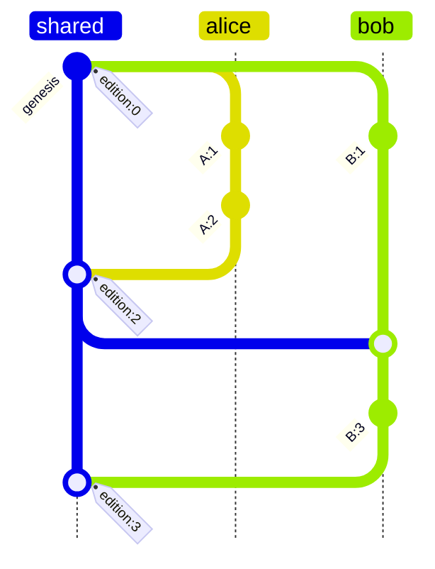

# Version Control

How Dialog keeps a database consistent across devices and people that
edit it independently and sync later. This is both an explainer and the
spec: it defines every term it uses and assumes no background beyond
"git exists", while staying precise enough that the implementation can
be checked against it.

## The problem

Picture a notebook app. You edit on your laptop on a plane, your phone
edited yesterday and hasn't synced, and a collaborator has a copy of
her own. Eventually the copies exchange changes. Four things must be
true afterwards:

1. **Everyone ends up with the same data.** No matter who syncs with
   whom, in what order, or how many times, two copies that have seen
   the same changes must be byte-for-byte identical.
2. **Deletions stick.** If you delete a note and then sync with a stale
   copy that still has it, the note must not come back from the dead.
3. **You can tell what happened first.** When two copies changed the
   same thing, the system must be able to say "yours came after mine",
   "mine came after yours", or "neither saw the other", and act on it.
4. **No coordinator.** All of this must work offline, peer to peer,
   with no server deciding the order of events.

Git solves a version of this problem for files, with a human resolving
conflicts. Dialog solves it for a database of facts, with merges that
are automatic and always agree.

## The picture in one page

Some vocabulary, each term defined once and used consistently:

- A **fact** is one statement: an entity, an attribute, and a value,
  like `(alice, person/email, "alice@example.com")`.
- A **repository** is a collection of facts, identified by a
  cryptographic identity (a DID).
- All the facts live in one **search tree**: a data structure stored as
  content-addressed blocks, where the hash of the root block uniquely
  identifies the entire state. Change anything and the root hash
  changes. Two trees with the same root hash are identical, full stop.
- A **branch** is a named line of development, like in git. It points
  at the current state through a **revision**.
- A **revision** is a named snapshot: "the tree with root X, produced
  by writer Y, building on Z". Committing produces a new revision.
- A **replica** is any copy of the repository: your laptop, your phone,
  a server.
- **Pull** brings another replica's changes into yours by merging.
  **Push** publishes yours to another replica, and only succeeds when
  the other side hasn't moved (otherwise you pull first). An
  **upstream** is a branch you regularly pull from or push to.

One design decision shapes everything else: **the tree holds both the
facts and their history.** The tree is divided into regions by key
prefix. The data regions hold the current facts, indexed three ways for
queries (by entity, by attribute, by value). The history region is an
append-only log: every write ever made, plus a metadata record for
every revision. One root hash therefore covers the data *and* the story
of how it got there.

From that follows the principle the whole design rests on:

> **The log is the truth. The current facts are a cache.**
>
> A fact is "live" exactly when nothing in the log has withdrawn or
> replaced it. The data regions materialize precisely that live set so
> queries are fast. Deletion is not a marker sitting in the data; it is
> an entry in the log, and merges keep the cache consistent with the
> growing log.

Why that matters becomes clear in the section on deletion. First, how
changes are named.

## Naming every change: editions, origins, versions

To merge histories you must be able to compare changes from different
writers. Dialog names every revision with two ingredients.

**The edition** is a counter that answers "how much history had this
revision seen?". Three rules define it:

- The first revision on a branch has edition `0`.
- A commit on top of a revision gets that revision's edition plus one.
- A merge of two revisions gets the larger of the two editions, plus
  one.

That is all. But those rules buy a powerful property: **if revision B
was made by someone who had seen revision A, then B's edition is
strictly greater than A's.** Seeing A forces you above A's number.
Flip it around and you get concurrency detection with no searching at
all: two revisions with the *same* edition from *different* writers
cannot have seen each other. If either had, its number would be higher.

(Two *independent* writers can reach the same edition by different
paths, so the edition alone does not name a revision. That is what the
second ingredient is for.)

**The origin** answers "who is counting?". It is a hash that identifies
one writer in one place: it folds together the user profile, the
repository, the branch name, and the session key of the device doing
the writing. Scoping it that finely is deliberate. The same person on
two branches gets two origins; the same person on two devices gets two
origins; two branches of one repository never share a counter. Each
origin is therefore a **single sequential actor**: it produces
revisions one at a time, in order, never in parallel with itself.

**The version** is the pair `(origin, edition)`, and it is the globally
unique name of a revision. Versions sort by edition (ties broken by
origin so the order is total), which means they sort by "how much
history they had seen".

### The rule everything rests on

The design's one non-negotiable invariant, stated plainly:

> **One origin never produces two different revisions with the same
> edition.**

This is what makes editions trustworthy and what makes the deletion
machinery below exact. It is enforced structurally, not by good
manners: within one session, writes to a branch go through a
compare-and-set on the branch head (explained later), so two racing
commits cannot both land; across sessions, each session has its own key
and therefore its own origin. If a replica ever *does* see two distinct
revisions claiming the same version, that is corruption of the
protocol. To avoid diverging over corrupt data, replicas order the
offenders deterministically by their content hash, but such a history
is broken and should surface an error.

One consequence worth knowing: resetting a branch backwards and
committing again would re-mint an edition that was already used. Reset
exists for fast-forward bookkeeping (push uses it), not for rewinding.

## What a revision is made of

A revision exists in two forms with two different jobs.

**The head** is a small signed value published to the branch (in a
storage cell named after the branch). It carries: the repository DID,
the branch name, the writer identities (the session key that signed,
and the user profile it claims to act for), the tree root hash, the
parent tree roots it built on, the edition, and the writer's signature
over all of it. The head is the thing another replica fetches when it
asks "where is this branch now?", and the signature is checked **before
anything else happens**: a forged or tampered head (wrong root,
reattributed writer, adjusted edition) is rejected before a single
block of its tree is read. Pull is the trust boundary.

**The record** is the revision's metadata written *into the tree
itself*, as one atomic fact in the reserved `dialog.` namespace. It
carries the parent versions (the edges of the history graph), the
attribution, so-called skip links (below), and its own signature. Two
details are worth spelling out:

- The record cannot contain the tree root, because the record lives
  inside that tree and a hash cannot contain itself. That is exactly
  why the head exists as a separate signed object: the head is what
  binds the root to the writer.
- The record defends itself. Its signature covers all its fields, and
  the version it is filed under is recomputable from its own contents
  (origin from the identities it names, edition from its parents). A
  tampered record, or a valid record copied to a different slot, fails
  the check every reader performs.

Because records are ordinary facts in the tree, history is queryable
like any other data: "who committed this revision", "is X an ancestor
of Y", and "show me the log" are normal queries over built-in derived
relations, and records that do not verify are simply not projected.

**Skip links** are an optimization for walking backwards through
history. Besides its parent, a revision records shortcuts that jump 2,
4, 8, ... revisions back along the chain, so finding a common ancestor
of two branches takes logarithmically many steps instead of one step
per revision. Two rules keep the shortcuts honest: a shortcut never
jumps across a merge (a merge has two parents, and jumping it would
skip the ancestry that enters through the other one), and searches
never jump below the point they are looking for.

**A known gap, stated honestly:** the record names the user profile it
acts for, but only the session key's signature backs that claim. A
session key could name any profile it likes. Cryptographically binding
the profile requires embedding delegation proofs, which is blocked on a
real problem: delegations expire, revisions are forever, and the
history deliberately contains no wall clocks, so "was the delegation
valid at commit time?" has no sound offline answer yet. Until there is
a time-anchoring story, treat the profile field as attribution
metadata; the session key is the cryptographically bound identity.

## One tree for data and history

The history region stores its entries under a key that starts with the
edition and origin, so scanning it yields history in an order
consistent with causality: revisions from different writers interleave,
but no revision ever appears before something it built on. (The keys
are longer than the tree's fixed key width, so they are stored as an
order-preserving prefix plus a hash of the full key; readers verify the
truncated parts against the stored entry.)

Putting history in the same tree as the data has three consequences
that the rest of the design leans on:

1. **History and data cannot drift apart.** A revision's root hash
   covers both. You can never replicate the facts without the story, or
   the story without the facts.
2. **Pulling merges history for free.** History entries ride the same
   tree diff as data. Every entry's key is unique to its version, so
   merging histories is a union with no conflicts, ever.
3. **"Same root hash" means "same everything".** If two trees have
   equal roots, their histories are equal too. So detecting that a pull
   is a plain fast-forward is a single hash comparison.

## Writing facts

Every commit tags the facts it writes with its version, and appends one
log entry (a **claim record**) per instruction describing what it did.
The log entry's most important field is **supersedes**: the versions of
the earlier claims this write replaced or withdrew. That field is how
later merges know what covered what.

There are three instructions:

- **Assert** adds a fact. It supersedes nothing (it is purely
  additive), and inserts the fact into all three data indexes.
- **Replace** sets the value of `(entity, attribute)`, superseding
  whatever different values were there. It deletes the old values from
  the indexes and its log entry lists their versions. If the same value
  is already in place it does nothing at all, and does not write a log
  entry either (re-recording an unchanged fact would pointlessly fork
  its lineage).
- **Retract** deletes a specific fact. It removes the fact's entries
  from all three indexes, and its log entry names the version of the
  claim it withdrew. Note what it does **not** do: it leaves no marker
  behind in the data. After a retract, the data regions look exactly as
  if the fact had never existed.

Small print that matters for correctness: an assert and a retract of
the same fact within one commit cancel to nothing (and the retract must
not cite its own commit as what it withdrew, so it records no
coverage); retracting a fact that never existed is a no-op.

That "no marker" choice is unusual, and it is the crux of the design.

## Deletion that survives sync

Here is the trap. Deletion-as-absence cannot survive syncing with a
stale copy:

1. Laptop and phone both have the note "buy milk".
2. Laptop deletes it. On the laptop the fact is simply gone.
3. Laptop pulls from the phone, which still has "buy milk".
4. From the laptop's point of view, here is a fact it does not have.
   Absent other information it would add it. The deleted note is back.

The classic fix is a **tombstone**: instead of removing the fact, write
a special "this is deleted" marker in its place, so the deletion is
itself a piece of data that wins against stale copies. Dialog's earlier
design did exactly that, and it worked, but at a price: markers
accumulate forever in the live indexes, every merge needs special rules
for marker-versus-fact collisions, and one of those rules (a tie broken
by hashing) turned out to resurrect deletions on roughly forty percent
of a particular class of merges before it was fixed. Deletion-as-data
is fragile because it makes correctness depend on a marker winning
races.

Dialog now takes a different route. Recall the principle: the log is
the truth, the current facts are a cache. The laptop does not need a
marker to reject the phone's stale copy. It needs to answer one
question:

> "Have I **already seen** the change that produced this incoming
> fact?"

If yes, the incoming fact is old news, and there are only two
possibilities. Either the fact is still in my cache (then there is
nothing to do), or it is not, and the only way a fact I once
incorporated can be absent from my cache is that something in my log
covered it: a retraction or a replacement. Re-applying it would undo a
deletion. So: **an incoming fact whose producing change I have already
seen is never re-applied.** That single rule is deletion-safety,
without a single marker.

### The watermark: answering "have I seen it?" cheaply

"Have I seen change X" sounds like it requires searching your whole
history. The version design makes it a table lookup.

Each origin writes sequentially, one revision at a time, each new
revision building on its own previous one. So the revisions you have
seen from any given origin are always a prefix of that origin's
history: if you have seen their revision 7, you have necessarily seen
their 0 through 6, because 7 was built on top of them. Therefore
everything you have ever incorporated compresses, without loss, into
one number per origin:

```text
watermark = { origin -> highest edition seen from that origin }

seen(version)  exactly when  version.edition <= watermark[version.origin]
```

The table has one entry per writer (per device, person, branch), not
per change. It never grows with the number of edits. Checking a version
is one lookup. And it is *exact*, not a heuristic, precisely because of
the one-writer-one-sequence invariant. (Editions can skip numbers when
an origin merges, but a skipped number was never used by that origin,
so the question "have I seen (origin, skipped-number)?" is never asked
about a real change.)

The watermark is a pure function of your current head: fold in every
revision in the head's ancestry. Two ways to obtain it:

- **The walk**: read every revision record in the ancestry and fold.
  This costs one signature-verified read per ancestry revision, which
  adds up (about 50 microseconds each; half a second at ten thousand
  commits). It is the cold-start path only.
- **The memo**: each branch handle keeps a small cache of watermarks
  keyed by head version. A head's ancestry never changes after the
  fact, so entries never need invalidating. Every commit extends the
  current watermark by its own version; every pull derives the merged
  head's watermark from the local one plus the revision records that
  arrived in the pull itself (they stream past anyway, so this costs
  zero extra reads). A test pins that the memo always equals the walk.
  In steady state, the walk happens at most once per opened branch.

For readers who do know the distributed-systems literature: this is an
observed-remove set whose element identifiers are the versions and
whose causal context is the watermark. If that sentence means nothing
to you, you have lost nothing; everything it says is above.

## Pulling changes: the merge

A pull merges an upstream branch into yours. The mechanics:

Your branch remembers, per upstream, the **sync base**: the upstream's
tree root as of your last sync with it. The pull computes what the
upstream added since then (a diff from the sync base to the upstream's
current tree, walking only the parts that differ), passes that incoming
diff through a **screen**, and applies the screened diff onto *your*
tree. Applying onto your own tree (rather than replaying your changes
onto theirs) is what lets *your* watermark protect *your* cache.

The screen is three rules. Their names, R1, R2, R3, are used in the
code:

- **R1, for incoming facts:** if your watermark says you have already
  seen the change that produced this fact, skip it. (Still live here:
  nothing to do. No longer live here: your log covered it, and applying
  it would resurrect a deletion.) Facts you have not seen are genuine
  news and pass through. This is the deletion-safety rule from the
  previous section.
- **R2, for incoming removals:** the upstream's diff can include "key X
  was removed". Apply it only if your copy of X is byte-for-byte what
  the upstream removed. If your copy differs, you know something the
  remover did not (for instance you re-added the fact after they
  deleted it), and the removal misses. Nothing newer is ever destroyed
  by an older removal.
- **R3, for incoming log entries:** every log entry arriving in the
  diff is appended to your log (history is append-only and per-version
  unique, so this never conflicts). And if the entry *supersedes*
  something (a retraction or replacement), the screen checks whether
  any of the superseded versions are still live in your cache, and
  retires them. It finds them by scanning your entries for that
  `(entity, attribute)` and matching **by version, not by value**: a
  replacement supersedes claims with *other* values, which live under
  other keys, so looking only at the entry's own key would miss them.
  R3 is how a deletion you never heard about reaches you, even when
  your sync base predates the deleted fact entirely.

R1 handles coverage that happened in your past. R3 handles coverage
arriving right now. R2 is the cheap guard both directions share.

**Order matters, and there is exactly one ordering rule:** log entries
are screened and applied before facts, in one combined pass. Here is
why. A single pull can deliver both a retraction and a later re-assert
of the same fact. The retraction (via R3) must clear the slot before
the re-asserted fact (via R1, as news) lands in it; the other order
would make an arbitrary tie-break decide something causality already
decided. The combined pass also must be applied as one batch with one
persist at the end; splitting it loses the in-flight blocks.

**After integrating**, the pull decides what the branch head becomes.
Four cases:

1. The result equals the upstream's tree: fast-forward, adopt the
   upstream's head as yours. (Safe by the "same root, same everything"
   consequence: if you had anything of your own, the roots would
   differ.)
2. You had no head at all: adopt theirs.
3. The result equals your own tree: they had nothing you lacked. Your
   head stands; only the sync base advances.
4. Otherwise: mint a **merge revision**. Its record lists both parents,
   its edition is the larger of the two plus one, its record is signed
   and written into the tree, and the head is signed over the final
   root.

**Ties.** After the screen, the only remaining collision in the data is
two copies of the *same fact* differing only in metadata (the version
tag of who wrote it), because the storage key includes a hash of the
value. The winner is picked by comparing hashes of the stored bytes:
arbitrary, but deterministic and the same on both replicas, which is
all that is required since both copies state the same fact.

**Why everyone converges.** The log only grows, and merging two logs is
a union, so exchange order cannot matter to the log. Whether a fact is
live is a property of the log alone (live means: nothing in the log
supersedes it), and once covered, always covered. The screen keeps each
replica's cache equal to its log's live set at every step. Same log,
same cache. Any order, any direction, any number of rounds.

### A worked example

The task label "urgent" on task 7, with four people. This is the
scenario that pins the semantics, and it is a test
(`it_keeps_a_concurrent_assertion_the_retraction_never_observed`):

1. **Bob** labels task 7 "urgent". Alice, Mallory, and Jordan all sync
   from Bob; everyone has the label.
2. **Alice** retracts the label. Her log entry supersedes *Bob's*
   claim, the one she had seen.
3. **Mallory**, before hearing from Alice, asserts "urgent" on task 7
   herself. Same fact, new version, from her origin.
4. **Jordan** pulls Alice: her retraction's coverage (R3) retires Bob's
   claim from his cache. The label is gone for him.
5. **Jordan** pulls Mallory: her claim's version is *above* his
   watermark for her origin, so R1 treats it as news and it lands. The
   label is back, and rightly so: Alice retracted what she had seen,
   and she had never seen Mallory's claim. A deletion only covers what
   its author knew about.
6. **Jordan**, who has now seen everything, retracts. His entry
   supersedes both Bob's and Mallory's versions. Everyone who pulls him
   loses the label, everywhere, permanently.

And deletion is still not forever: if anyone later re-asserts the
label, that is a fresh version above every watermark. R1 sees news
everywhere, R2 cannot touch it (different bytes), no existing log entry
supersedes it. The resurrection propagates and survives pulls from
arbitrarily stale peers (also a test:
`it_resurrects_a_deleted_fact_and_the_resurrection_survives`).

## Which of two writes wins?

Merging keeps replicas identical; it does not decide which of two
concurrent values a *query* should show. That is conflict detection,
and it runs on the log entries' supersedes chains, per
`(entity, attribute)`, in three escalating tiers:

- **Tier 0, compare versions.** Free, no reads. Same version: same
  write. Same origin: ordered by edition (one origin is sequential).
  Same edition, different origins: concurrent, by the edition property.
  Otherwise, keep going.
- **Tier 1, direct citation.** If one claim's supersedes list names the
  other's version, it wins. One lookup.
- **Tier 2, walk the chain.** Walk the higher-edition claim's
  supersedes chain backwards, looking for the other's version. Editions
  strictly decrease along the way, so any branch of the walk that drops
  to or below the target's edition without hitting it can be abandoned.
  Found it: supersedes. Exhausted: genuinely concurrent. The walk is
  bounded by the number of writes to that one `(entity, attribute)`
  between the two editions, not by the size of history.

Verdicts are cached and never expire: between two fixed claims the
relationship cannot change, because new history can only be added above
them, never between them. The one non-answer, "I am missing part of the
chain" (a partially replicated copy), surfaces as an error and is never
cached; once the missing records arrive, the next ask resolves.

When two claims are genuinely concurrent, both are valid; queries
resolve deterministically (by claim hash) so every replica shows the
same winner, and an application that wants to surface the conflict can
ask for all concurrent values.

### Walkthrough

Alice makes two revisions and Bob one, all from a shared start; then
Bob pulls and commits again:



When Alice's `A:2` (edition 2) meets Bob's `B:1` (edition 1): neither
cites the other (tier 1 fails), so tier 2 walks `A:2`'s chain backward.
It reaches `A:1` at edition 1, which matches `B:1`'s edition but not
its version, and nothing deeper can match (editions only decrease), so
the walk ends: concurrent. After Bob pulls and commits `B:3` citing
`A:2`, any later claim of Bob's beats Alice's at tier 1, one lookup.

## Branches and day-to-day sync

A branch is two small storage cells under the repository: the head
revision, and the upstream tracking state. Cells are versioned, and
every write is a **compare-and-set**: "replace contents, provided they
are still at the version I read". If someone else wrote in between, the
write fails loudly instead of silently overwriting, and the caller
re-reads and retries. Every race in this system resolves that way: a
commit racing a commit, a pull racing a commit, two pulls racing each
other. Nothing is ever silently lost (there are tests for each of these
races).

- **Commit** applies instructions to the head's tree, writes the log
  entries and the revision record, imports the new blocks, and
  publishes the new head with a compare-and-set against the head it
  built on.
- **Fetch** reads an upstream's current head. It changes nothing
  locally.
- **Pull** is the merge described above. A branch can track several
  upstreams, each with its own sync base; `pull().from(target)` pulls
  any local or remote branch, starting from an empty base the first
  time and tracking it thereafter. Pull runs in two phases so callers
  can hold locks briefly: `prepare` does all the network and CPU work
  with no writes, `commit` performs the two instant cell publishes.
- **Push** is fast-forward only: it verifies the upstream is still at
  your recorded sync base, uploads the tree blocks and blob bytes the
  upstream lacks (computed by the same region diff), and only then
  publishes the head, so a published revision never points at bytes the
  remote does not have. If the upstream moved, push fails and you pull
  first. Pushing when nothing changed is a no-op.

**Partially replicated copies work unchanged.** "Seen" means "in my
head's ancestry", not "bytes on my disk". A replica that adopts a head
holds that head's state regardless of which blocks it has actually
fetched; laziness changes what is materialized, never what the state
is. R1 is a watermark lookup in memory; R2 and R3 read only the
incoming diff, which touches only paths that differ, with missing
blocks fetched from the remote on demand. The one obligation: a partial
replica must not prune history entries. (Garbage-collecting old history
needs a published floor below which fresh replicas bootstrap by
adopting state instead of merging; that is future work.)

## Measured costs

Costs are pinned by a harness (`dialog-repository`, module
`read_amplification`, an ignored test; its docs show the invocation)
that measures **block reads** (content-addressed storage fetches) and
wall time, in release mode on an in-memory backend, across history
depths. Reads are the number that survives a change of backend:
IndexedDB or network multipliers apply directly to them.

Steady state (watermark memo primed), current implementation:

```text
depth   scenario                    block reads   wall ms
  100   no-op sync tick                       0         0
  100   fast-forward (1 commit)              24         1
  100   merge (both sides moved)             21         2
 1000   fast-forward (1 commit)              26         8
 1000   merge (both sides moved)             29         8
10000   initial pull (adopt all)            552       519
10000   no-op sync tick                       0         0
10000   fast-forward (1 commit)              34        12
10000   merge (both sides moved)             33        14
10000   watermark walk (cold start)          50       500
```

Reading the table: an idle sync tick is free at any depth. Once the
memo is warm, pull cost tracks the size of the incoming diff, not the
depth of history. The two ~500ms rows are one-time costs: adopting a
ten-thousand-commit history from scratch, and the cold watermark walk
(once per opened branch; about 50 microseconds of signature
verification per ancestry revision). Before the memo existed, that walk
ran on *every* non-trivial pull: 548ms per fast-forward at depth ten
thousand. The memo removed it from steady state.

Compared against the previous design (the tombstone-based merge,
measured at commit `43fdb450` with the same harness): merges are at
parity (33 reads / 19ms there, 33 / 14ms here, at depth ten thousand),
and two paths knowingly regressed:

- **Fast-forward** used to be a zero-work pointer adoption; it now
  integrates the incoming diff through the screen (34 reads / 12ms at
  depth ten thousand). That is the price of running deletion screening
  at all, and it bought determinism: the old design resurrected deleted
  facts on roughly forty percent of empty-base merges.
- **Initial adoption** of a deep history used to adopt the root and
  fetch lazily; it now materializes through the screen plus one cold
  walk (519ms at depth ten thousand, once per fresh replica). If clone
  latency ever matters, the empty-local, empty-base case can provably
  skip the screen and adopt the root directly; noted, not done.

To observe these numbers in an embedding application: wrap the
environment in the `Counting` provider (`dialog-repository`, `helpers`
feature), which tallies effect executions by type; `block_reads()`
before and after a `pull()`, plus a clock, is the whole recipe. Once
the workspace adopts a tracing crate, a span around `Pull::prepare` is
the natural home.

## Rules that must never break

Every future change to this machinery must preserve five properties.
Each one is load-bearing; breaking any of them breaks convergence or
deletion-safety silently:

1. **One origin, one sequence.** A branch lineage advanced by one
   session key, serialized by the head's compare-and-set. The watermark
   is exact only because of this. Do not add a way to mint two
   revisions with the same version (this includes "reset backwards,
   then commit").
2. **A tree's revision records are a subset of its head's ancestry.**
   True at mint (the record is written by the head that carries it) and
   preserved by every pull outcome (fast-forward adopts a superset,
   merges union both sides, the no-op arm changes nothing). This is
   what makes the watermark derivable locally, the incremental memo
   exact, and the fast-forward arm safe to reason about from root
   equality alone.
3. **Log entries before facts, one pass, one persist.** R3 must retire
   slots before R1's incoming facts can contest them, and the combined
   diff must be applied as a single batch.
4. **The merge reads only the receiver's own state** (its snapshot and
   its watermark) plus the incoming diff. Never the sender's watermark.
5. **The `dialog.` namespace is reserved.** Revision metadata is
   written only by the internal record path; user instructions cannot
   touch it.

## Not done yet

1. **Persist the watermark in the tree** as a `dialog.`-reserved
   record, maintained incrementally. The in-memory memo already removes
   the ancestry walk from steady state; persisting removes the
   remaining once-per-handle cold walk, and lets a fresh partial
   replica fetch the watermark in one read (verified opportunistically
   against the signed head's ancestry).
2. **Route replacements' local deletes through R3** so local and remote
   supersession share one code path (remote coverage already does).
3. **Retire `State::Removed`.** The tombstone variant survives only so
   old trees can still be read; the screen drops it on ingest. Removing
   the variant is a serialization format change, deliberately deferred.
4. **Bind the profile cryptographically** (the authority gap above):
   needs a time-anchoring story for delegation proofs.
5. **History garbage collection** behind a published bootstrap floor.
6. **Let re-asserts cite what they overrode.** An assert over a
   deletion could record the covered versions in its log entry, making
   intentional resurrection first-class in the lineage. Nothing depends
   on it; adopt when convenient.

## Where this came from

This document consolidates and supersedes the earlier design notes: the
[divergence clock] (an earlier causal encoding whose sync counters
could not be compared across repositories; editions fix that by
deriving position from the history graph itself), the version-control
convergence audit, and the observed-remove merge design note. The
tombstone-based interim it replaced is described in the "Measured
costs" and deletion sections where the comparison is instructive.

[divergence clock]: ./divergence-clock.md
