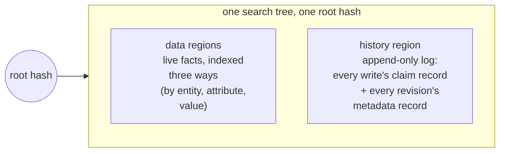
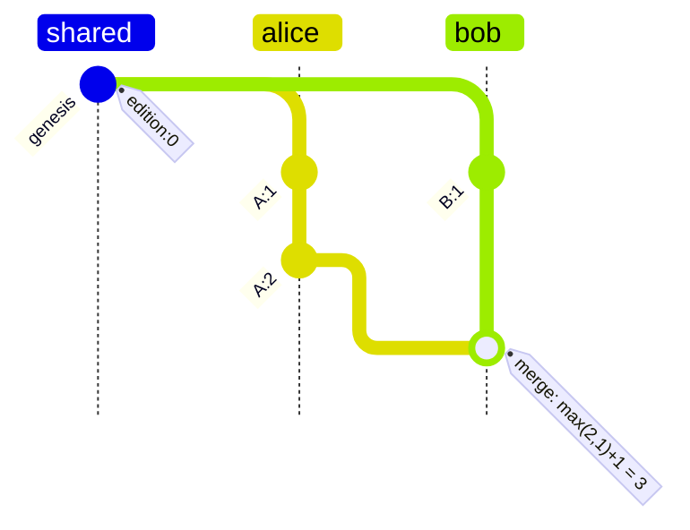
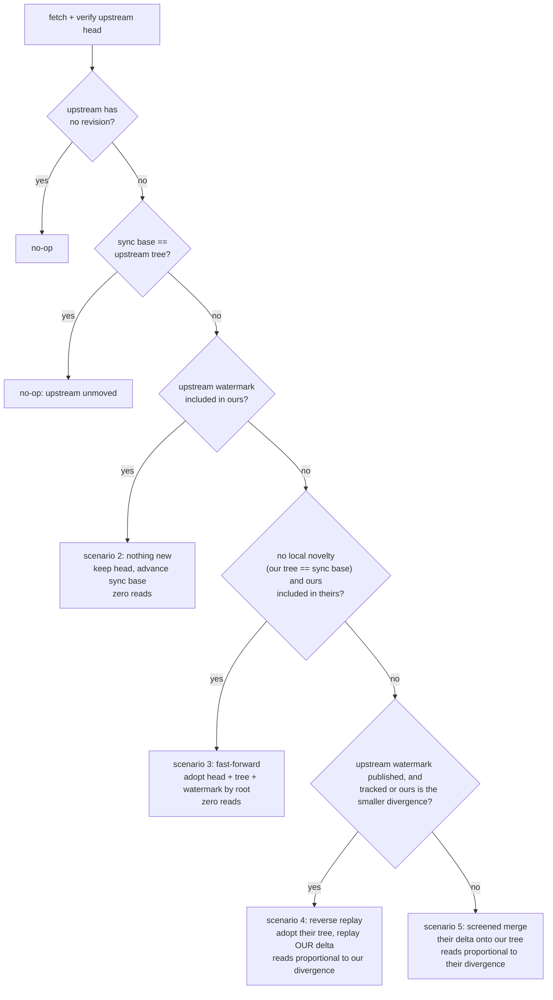
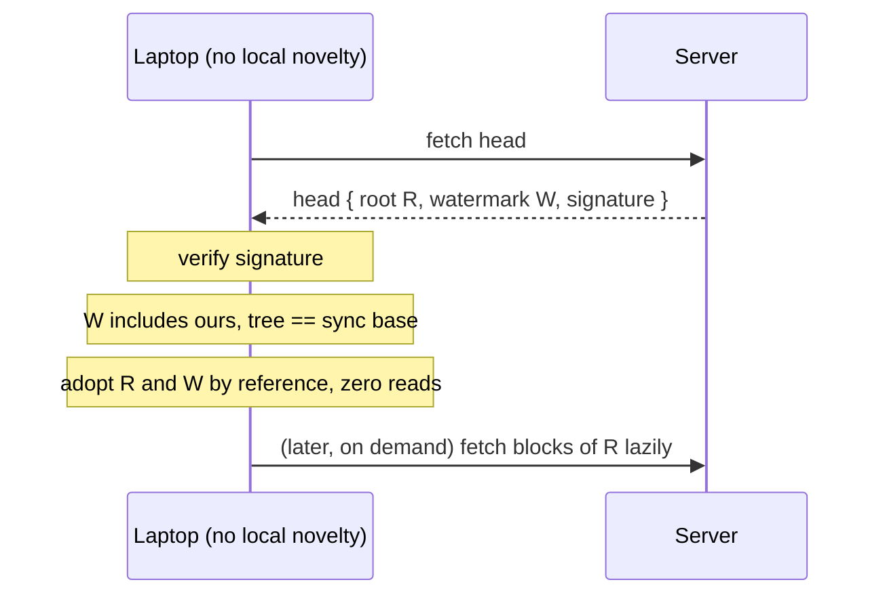
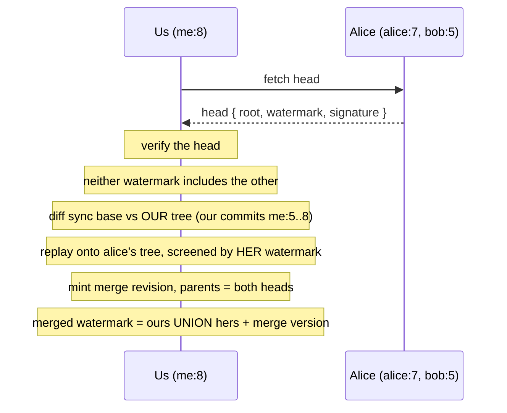
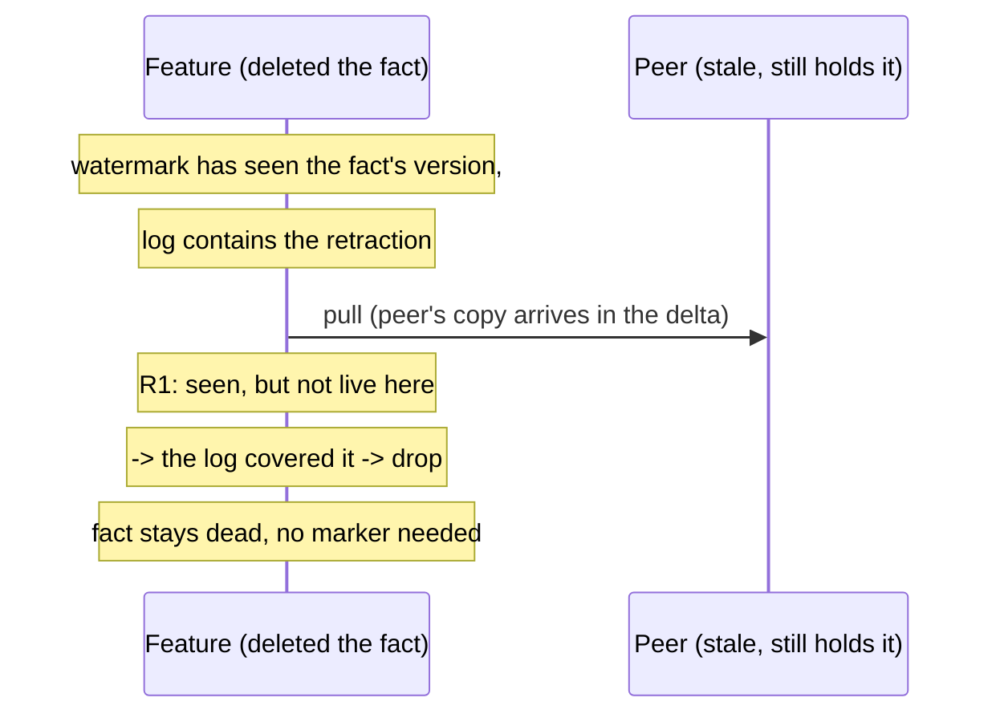
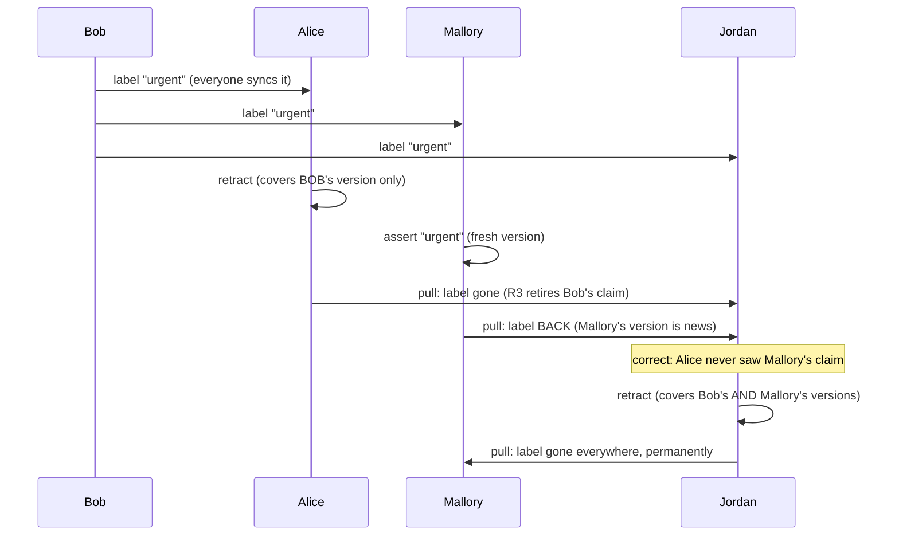
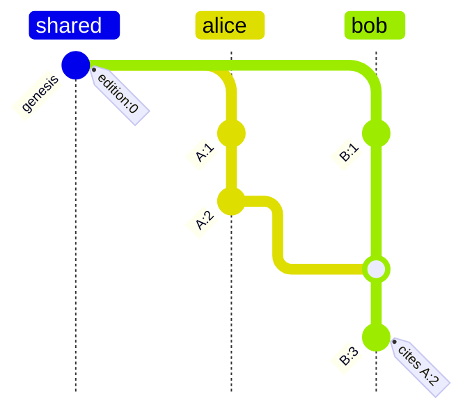

# Version Control

How Dialog keeps a database consistent across devices and people that edit it independently and sync later. This document is both an explainer and the spec: it defines every term it uses and assumes no background beyond "git exists", and it describes exactly what is implemented, scenario by scenario, with the test that pins each one.

## The problem

Picture a notebook app. You edit on your laptop on a plane, your phone edited yesterday and has not synced, and a collaborator has a copy of her own. Eventually the copies exchange changes. Four things must be true afterwards:

1. **Everyone ends up with the same data.** Two copies that have seen the same changes must be byte-for-byte identical, regardless of who synced with whom, in what order, how many times.
2. **Deletions stick.** Syncing with a stale copy must not bring a deleted fact back from the dead.
3. **You can tell what happened first.** When two copies changed the same thing, the system must be able to say "yours came after mine", "mine came after yours", or "neither saw the other".
4. **No coordinator.** All of this works offline and peer to peer.

And one more, which shapes the merge design throughout:

5. **Sync cost tracks what you exchange, not what exists.** A replica that only cares about a slice of the data must never be forced to download someone else's unrelated churn just to merge.

## The picture in one page

Vocabulary, each term defined once:

- A **fact** is one statement: entity, attribute, value, like `(alice, person/email, "alice@example.com")`.
- A **repository** is a collection of facts under a cryptographic identity (a DID).
- All facts live in one **search tree** of content-addressed blocks: the hash of the root block identifies the entire state. Two trees with the same root are identical, full stop.
- A **branch** points at the current state through a **revision**, a named snapshot ("the tree with root X, by writer Y, building on Z").
- A **replica** is any copy: laptop, phone, server.
- **Pull** merges another replica's branch into yours; **push** publishes yours (and only fast-forwards). An **upstream** is a branch you sync with; a branch can track several.
- The **sync base** is, per upstream, the upstream's tree root as of your last sync with it: the divergence marker both sides' deltas are measured against.

The tree is divided into regions by key prefix:



One root hash covers the facts *and* the story of how they got there, which gives the principle everything else rests on:

> **The log is the truth. The current facts are a cache.**
>
> A fact is live exactly when nothing in the log has withdrawn or replaced it. The data regions materialize precisely that live set so queries are fast. Deletion is not a marker in the data; it is an entry in the log, and merges keep the cache consistent with the growing log.

## Naming every change: editions, origins, versions

Merging histories requires comparing changes from different writers. Every revision is named by two ingredients.

**The edition** answers "how much history had this revision seen?":

- First revision on a branch: edition `0`.
- Commit on top of a revision: that revision's edition plus one.
- Merge of two revisions: the larger of the two editions, plus one.

Those three rules buy the property the whole design leans on: **if revision B was made by someone who had seen revision A, B's edition is strictly greater than A's.** Flipped around, that is concurrency detection with no searching: two revisions with the same edition from different writers cannot have seen each other.



Alice's `A:2` (edition 2) and Bob's `B:1` (edition 1) are ordered neither way by inspection alone, but Bob's merge has seen both, so it lands above both at edition 3.

**The origin** answers "who is counting?": a hash folding together the user profile, the repository, the branch name, and the session key of the writing device. The same person on two branches, or on two devices, gets two origins. Each origin is therefore a **single sequential actor**: it produces revisions one at a time, never in parallel with itself.

**The version** is the pair `(origin, edition)`, the globally unique name of a revision.

**The rule everything rests on:** one origin never produces two different revisions with the same edition. It is enforced structurally: branch-head writes go through compare-and-set, and each session has its own key and so its own origin. Two distinct revisions claiming one version is protocol corruption; replicas order the offenders deterministically by content hash to avoid diverging, but such a history is broken and should surface an error. (Consequence: resetting a branch backwards and committing would re-mint a used edition; reset exists for fast-forward bookkeeping, not rewind.)

## The watermark

The single most load-bearing derived structure. A replica's **watermark** (in code: `Context`) summarizes everything its head has ever incorporated:

```text
watermark = { origin -> highest edition seen from that origin }

seen(version)  exactly when  version.edition <= watermark[version.origin]
```

Why one number per writer suffices, exactly and not approximately: each origin writes sequentially, each revision building on its own previous one, so the revisions you have seen from any origin are always a prefix of that origin's history. Seen their 7 means seen their 0 through 6. The table has one entry per writer, never grows with edits, and answers "have I seen this change?" in one lookup.

Watermarks also order replicas by knowledge: if every entry of watermark P is at or below the corresponding entry of watermark Q, then Q has seen everything P has (in code: `Q.includes(P)`). The pull scenarios below are gated entirely on this comparison.

**Where the watermark lives.** Three places, in order of authority:

1. **On every head, inside the signature.** A published revision carries its watermark as a field, and the signing payload commits to it byte for byte. This is the branch memory record a peer fetches, so reading a replica's knowledge costs one small read and is exactly as trustworthy as the head itself: tampering with the watermark, or stripping it, fails verification.
2. **In a per-branch-handle memo**, keyed by head version. A fixed head's watermark never changes, so entries never invalidate. Every commit extends the memo by its own version; every pull writes the merged head's watermark back.
3. **Derivable by walking the ancestry records** in the tree. The fallback for heads minted before watermarks were published; costs one signature-verified read per ancestry revision.

A test pins that all three agree (`it_publishes_the_watermark_with_the_head`, `it_maintains_the_context_memo_incrementally`).

## What a revision is made of

**The head** is the small signed value published to the branch cell: repository DID, branch name, issuer (session key) and authority (profile) identities, the tree root, the parent tree roots, the edition, the watermark, and the issuer's signature over all of it. A replica verifies the signature **before anything else happens** with a head it did not mint: a forged or tampered head is rejected before a single block of its tree is read. Pull is the trust boundary (`it_refuses_to_pull_a_forged_head`).

**The record** is the revision's metadata written into the tree itself, one atomic fact in the reserved `dialog.` namespace: parent versions (the edges of the history graph), attribution, skip links, and its own signature. Two details:

- The record cannot contain the tree root, because it lives inside that tree and a hash cannot contain itself. The head carries the root; that is why both exist.
- The record defends itself: its signature covers its fields, and the version it is filed under is recomputable from its own contents, so a tampered record, or a valid one copied to another slot, fails the check every reader performs.

Because records are ordinary facts, history is queryable: "who committed this", "is X an ancestor of Y", "show the log" are normal queries over built-in derived relations, and records that do not verify are simply not projected.

**Skip links**: besides its parent, a revision records shortcuts jumping 2, 4, 8, ... revisions back, so ancestor search takes logarithmically many steps. A shortcut never jumps across a merge (it would skip the ancestry entering through the other parent), and searches never jump below the edition they seek.

**A known gap, stated honestly:** the record names the profile it acts for, but only the session key's signature backs that claim. Binding it cryptographically needs delegation proofs plus a time-anchoring story (delegations expire; revisions are forever; the history carries no wall clocks). Until then the profile field is attribution metadata; the session key is the bound identity.

## One tree for data and history

History entries are keyed edition-first, so scanning yields history in an order consistent with causality. Three consequences the design leans on:

1. **History and data cannot drift apart**: one root covers both.
2. **Pulling merges history for free**: entries ride the same tree diff as data, and every entry's key is unique to its version, so the log union is conflict-free.
3. **Same root means same everything**: fast-forward detection is one hash comparison.

## Writing facts

Every commit tags its facts with its version and appends one **claim record** per instruction. The record's key field is **supersedes**: the versions of the earlier claims this write replaced or withdrew.

- **Assert** adds a fact; supersedes nothing.
- **Replace** sets the value at `(entity, attribute)`, deleting different-valued priors from the indexes and listing their versions in its record. An identical value already in place is a full no-op.
- **Retract** deletes the fact's index entries and records the withdrawn claim's version. **No marker is left behind**: after a retract, the data regions look as if the fact never existed. What makes that safe across sync is the watermark, as the scenarios below show. (Same-batch assert+retract cancels to nothing; retracting a nonexistent fact is a no-op.)

## Pulling changes: every scenario

Pull is two-phase: `prepare` does all network and CPU work with no writes, `commit` performs two instant cell publishes (head and sync base) under compare-and-set, so racing writers fail loudly and retry rather than losing anything. What `prepare` does is a cascade of checks, cheapest first:



### The three screen rules

Both merge directions use the same three rules. They only ever consult the **receiver's** state: its tree, its watermark, and the incoming delta. In scenario 5 the receiver is us; in scenario 4 the receiver is the upstream (its tree is the substrate and its published watermark is the screen).

- **R1, incoming facts:** a fact whose producing version the receiver has *seen* is never re-applied. If it is still live in the receiver's tree, applying it changes nothing; if it is absent, the receiver's log covered it, and applying it would resurrect a deletion. Unseen facts are news and pass.
- **R2, incoming removals:** apply only when the receiver's copy is byte-for-byte what was removed. If the receiver holds something the remover never observed (a later re-assert), the removal misses.
- **R3, incoming records:** every record appends to the log (keys are per-version unique, so this never conflicts). A record that *supersedes* versions retires any of them still live in the receiver's tree, found by scanning the record's `(entity, attribute)` slot and matching **by version, not value** (a replacement supersedes claims of other values, which live under other keys).

One ordering rule: records screen before facts, in one combined pass with one persist, so a retraction and a later re-assert arriving together resolve by causality, not by a tie-break.

**Ties**: after screening, the only data collision left is two copies of the *same fact* differing in version metadata; the winner is the higher hash of the stored bytes, deterministic and identical on both replicas.

**Why everyone converges**: the log only grows and merges as a union, so exchange order cannot matter to it; liveness is a property of the log alone (once covered, always covered); the screens keep every replica's cache equal to its log's live set. Same log, same cache.

### Scenario 1: the idle tick

The upstream has no revision, or its tree still equals the sync base. Nothing to do; zero reads. This is what an auto-sync loop hits almost every time it fires.

### Scenario 2: the upstream has seen everything we have

Gate: `ours.includes(theirs)`. Everything in their ancestry is in ours, so every fact live with them is live or covered here already. The pull is a no-op detected from the two heads alone: the local head stands, and only the sync base advances (so the next pull's delta is measured from their current tree).

```text
ours              theirs
alice: 7          alice: 7
bob:   5          bob:   3
me:    8          me:    0

theirs is included in ours: skip, zero reads.
```

When does this actually happen, given that the upstream *did* move (the sync-base check already passed)? Whenever its movement consists of things that reached us another way first. The common shapes: the upstream merged a third party we had already pulled directly; the upstream absorbed our own pushes (possibly relayed through other devices of ours); or, in a mesh, we pulled peer A which had already merged peer B, and now we pull B, whose entire state came to us through A. In each case B moved, but its watermark is a subset of ours, and the comparison proves there is nothing to fetch before a single block is read.

This is also the mesh-sync primitive: in a five-replica mesh, pull the best-informed peer first, and the other pulls collapse to this check. Pinned by `it_skips_a_pull_from_an_upstream_that_has_seen_everything`.

### Scenario 3: fast-forward adoption

Gate: our tree equals the sync base (no local novelty) and `theirs.includes(ours)`. Nothing we know could contradict what survived their screen, so their head, tree, and watermark are adopted **by root**: no diff, no block reads, no import. Blocks hydrate lazily on demand later, like any partially replicated region. This covers both the everyday device pull and the fresh replica adopting a deep history, at zero cost either way.



Crucially, this is what keeps pull cost independent of upstream churn in namespaces we never touch: two hundred commits of `user/*` traffic we never query are adopted without downloading any of it. Pinned by `it_adopts_an_upstream_head_without_reading_its_novelty`.

### Scenario 4: both sides moved, the reverse replay

The general merge. We carry local novelty, the upstream carries churn, and its head published a watermark. Instead of screening *their* (arbitrarily large) delta onto our tree, adopt their tree as the substrate and replay **our** delta onto it, screened by *their* watermark and tree. Cost is proportional to our divergence and the seams it lands in, independent of their churn.

Worked example. Our watermark and the upstream's (alice's):

```text
ours              alice's
alice: 5          alice: 7
bob:   3          bob:   5
me:    8          me:    4

neither includes the other: ours is ahead on "me",
behind on "alice" and "bob" -> scenario 4.
```

Our delta is `diff(sync base -> our tree)`: everything we have that alice lacked at last sync. Usually that is just our own commits (me: 5 through 8), and every one of them sits above alice's `me: 4` watermark, so they pass R1 as pure news. Step by step:



The swapped screens earn their keep in the corner cases:

- **An add she has observed** (possible when our delta carries facts we adopted laterally from bob after our last alice-sync, and she has seen bob further than us): R1 drops it. If she still holds it, the add was a no-op; if she does not, her log covered it and applying it would resurrect her deletion. Our fresh claims are above her watermark and always land. Pinned by `it_drops_observed_adds_when_replaying_onto_a_covering_upstream`.
- **A deletion we acquired laterally** (we adopted bob's fact after our alice-base, then retracted it: net zero in our data diff): only our retract record carries it, and R3 screens her tree with it, retiring her live copy. Pinned by `it_carries_a_covering_record_when_replaying_onto_a_stale_holder`.
- **Her novelty needs no screen at all**: nothing she minted unseen by us can have been covered by us.

The merged head lists both parents, and its watermark is the union of the two published ones plus its own version, derived without a single read. Frugality pinned by `it_replays_local_novelty_onto_an_upstream_without_reading_its_churn` (one local commit against two hundred commits of foreign churn stays under thirty block reads).

### Scenario 5: first contact, or a legacy head

Two cases run the screened merge in the original direction (their delta since the sync base onto our tree, screened by *our* watermark): an upstream head minted before watermarks were published, and a first-contact pull where we are the *larger* side. On first contact (empty sync base) there is no divergence marker, so "our delta" is our entire tree and "their delta" is their entire tree; the direction is chosen by comparing the two watermarks' divergence masses (per-origin edition excess, summed; editions count writes, so the excess estimates delta size with zero reads). The smaller side gets replayed: a two-fact replica first-contacting a two-hundred-commit upstream replays its two facts (scenario 4, pinned by `it_first_contacts_a_churning_upstream_from_the_small_side`); a large replica pulling a small new upstream screens the small delta in (this scenario). Either way reads track the smaller divergence, never the larger side's churn. The screen is the same R1/R2/R3 with us as the receiver; the merged head's watermark is derived incrementally by folding the revision records that ride the delta (zero extra reads). Afterwards the head is chosen: adopt theirs if the result equals their tree (or we had no head), keep ours if the result equals ours, otherwise mint a merge revision.

This direction is also the safety net the watermark gates fall back to whenever knowledge has diverged in ways the frugal paths cannot serve. The gate refusal itself is load-bearing: `it_refuses_adoption_when_local_knowledge_exceeds_the_upstreams` pins the case where we learned of a deletion through one upstream and then pull another that still holds the fact live; wholesale adoption would resurrect it, so the screened merge runs and R1 rejects the stale copy.

## Deletion, scenario by scenario

Deletion is the acid test of the design, so each shape gets its own walkthrough. The cast: a fact `(post:1, post/title, "Spam")`.

### D1: a tracked deletion propagates

The plain case. `feature` retracted the fact; `main` moved on unrelated work; `feature` pulls. The retraction is part of feature's state, main's delta does not disturb it, and the merge keeps the fact dead. Pinned by `it_propagates_a_retraction_across_a_merge`.

### D2: a stale peer cannot resurrect it



The receiver's watermark answers "have I seen the change that produced this incoming fact?"; yes plus absent-from-cache means "something in my log covered it", and the copy is dropped. Symmetrically, when the stale peer pulls the deleter, the retract record arrives and R3 retires the peer's live copy. Both replicas converge on the deletion, in either pull direction. Pinned by `it_does_not_resurrect_a_deleted_fact_on_pull` (which exercises the tracked, empty-base, and reverse legs).

### D3: a deletion only covers what its author had seen

The four-writer scenario that defines the semantics. Bob labels a task; everyone syncs it. Alice retracts the label, having seen only Bob's claim. Mallory, concurrently, asserts the same label under her own version.



A retraction removes exactly the claims its author had observed; concurrent assertions survive it; a retraction made with full knowledge clears everything. Pinned by `it_keeps_a_concurrent_assertion_the_retraction_never_observed`.

### D4: deletion is not forever

A re-assert after a deletion mints a fresh version above every watermark in existence. R1 treats it as news everywhere, R2 cannot touch it (different bytes), and no existing record supersedes it. The resurrection propagates and survives pulls from arbitrarily stale peers still holding the pre-deletion copy: the stale copy is dropped (D2), the fresh claim stands. Pinned by `it_resurrects_a_deleted_fact_and_the_resurrection_survives`.

### D5: deletions survive the frugal paths

The zero-read scenarios never bypass deletion safety, because their gates are exactly the conditions under which nothing can go wrong:

- Scenario 2 (skip) fires only when we have seen everything they have, so any fact live with them that we deleted is already covered here.
- Scenario 3 (adopt) fires only when they have seen everything we have, so our deletions are reflected in their fold already.
- Scenario 4 (replay) screens our adds by their watermark and carries our covering records into their tree, per the two corner cases above.
- When we know a deletion the upstream does not and hold no shared base to express it through, the gates refuse and scenario 5's screen decides (`it_refuses_adoption_when_local_knowledge_exceeds_the_upstreams`).

## Which of two writes wins?

Merging keeps replicas identical; conflict *detection* decides which of two concurrent values a query shows. It runs on the claim records' supersedes chains, per `(entity, attribute)`, in three tiers:

- **Tier 0, compare versions** (free): same version, same write; same origin, ordered by edition; same edition and different origins, concurrent. Otherwise continue.
- **Tier 1, direct citation** (one lookup): a claim whose supersedes list names the other's version wins.
- **Tier 2, walk the chain**: walk the higher-edition claim's supersedes chain backwards; editions strictly decrease, so branches that drop below the target without hitting it are abandoned. Found means superseded; exhausted means concurrent. Bounded by the writes to that one `(entity, attribute)` between the two editions.



`A:2` versus `B:1`: neither cites the other; the tier-2 walk from `A:2` reaches `A:1` at edition 1, which matches `B:1`'s edition but not its version, so it prunes and exhausts: concurrent. After Bob merges and commits `B:3` citing `A:2`, any later claim of Bob's beats Alice's at tier 1.

Verdicts are cached forever (new history is only ever added above two fixed claims, never between them). The one revisable outcome, "part of the chain is missing" on a partial replica, surfaces as an error, is never cached, and resolves once the records replicate. Genuinely concurrent values are both valid; queries pick deterministically by claim hash, and applications can ask for all of them.

## Branches and day-to-day sync

A branch is two versioned cells under the repository subject: the head revision and the upstream tracking state. Every cell write is a compare-and-set: "replace contents, provided they are still at the version I read". A commit racing a commit, a pull racing a commit, two pulls racing: each loser fails loudly with a version mismatch, refreshes, and retries; nothing is silently lost (each race has a test).

- **Commit** applies instructions to the head's tree (facts, claim records, the revision record), imports the new blocks, extends the watermark by its own version, signs, and publishes through the checkpoint.
- **Fetch** reads an upstream's head; changes nothing locally.
- **Pull** is the scenario cascade above. A branch tracks several upstreams, each with its own sync base; `pull().from(target)` pulls any branch, tracking it from then on.
- **Push** is fast-forward only: verify the upstream still sits at our recorded sync base, upload the tree blocks and blob bytes it lacks, then publish the head, so a published revision never references bytes the remote is missing. If the upstream moved, pull first.

**Partial replication is unaffected throughout**: "seen" means "in my head's ancestry", not "bytes on my disk". A replica that adopts head H holds H's state regardless of which blocks it has fetched; laziness changes what is materialized, never what the state is. The one obligation: history entries must not be pruned (garbage collection needs a published floor below which fresh replicas bootstrap by adoption; future work).

## Measured costs

Pinned by the read-amplification harness (`dialog-repository`, module `read_amplification`, an ignored test; its docs show the invocation). Costs in **block reads** (content-addressed storage fetches) and wall time, release mode, in-memory backend; reads are the number IndexedDB and network multipliers apply to.

```text
depth   scenario                    block reads   wall ms
  100   no-op sync tick                       0         0
  100   fast-forward (1 commit)               0         0
  100   merge (both sides moved)             23         2
 1000   fast-forward (1 commit)               0         0
 1000   merge (both sides moved)             27         8
10000   initial pull (adopt all)              0         0
10000   no-op sync tick                       0         0
10000   fast-forward (1 commit)               0         0
10000   merge (both sides moved)             40        19
10000   watermark walk (legacy heads)        34       537
```

Reading it: every path is free except a genuine both-sides merge, whose cost tracks the *replica's own* divergence (the harness merge is symmetric; the asymmetric bound is pinned separately: one local commit against two hundred upstream commits stays under thirty reads). The last row is the ancestry-walk fallback, paid only for heads minted before watermarks were published.

To observe these numbers in an embedder: wrap the environment in the `Counting` provider (`dialog-repository`, `helpers` feature) and log `block_reads()` plus a clock around `pull()`.

## Rules that must never break

1. **One origin, one sequence.** The watermark is exact only because each origin writes sequentially (per-session keys, head CAS). Never add a way to mint two revisions with the same version; reset is not rewind.
2. **A tree's revision records are a subset of its head's ancestry.** True at mint, preserved by every pull outcome. This is what makes the watermark derivable locally and lets root equality stand in for history equality.
3. **Records before facts, one pass, one persist**, in both merge directions.
4. **A screen consults only the receiver's state** (its tree and watermark) plus the incoming delta: ours in scenario 5, the upstream's published one in scenario 4. Never mix the two sides' screens.
5. **Never act on an unverified head.** Signatures are checked before any gate fires; the watermark is only trustworthy because the signature covers it.
6. **The `dialog.` namespace is reserved**: revision metadata is written only by the internal record path.

## Not done yet

1. **Structural three-way merge**: graft adopted subtrees inside a contested merge so even the replica's own delta replay skips untouched spans. Residual value only, now that every steady-state path is already proportional to the replica's divergence; needs a canonical-shape-preserving merge operation in the search tree.
2. **Mesh sync planning**: with watermarks on every head, choosing the pull order across N peers is greedy set cover over version vectors (pull the peer covering the most of what you lack; peers whose watermark you include are skipped by scenario 2). No new protocol is needed; this is client policy.
3. **Content erasure** (GDPR): the log retains value bytes in claim records indefinitely, in any merge design. The fix is value indirection (records and index entries carry the content hash; bytes live outside the merkle structure) plus a replicated, grow-only erasure set peers honor by dropping bytes. Hashes of low-entropy values are brute-forceable, so strict erasure of such fields needs app-layer salting or encryption.
4. **Authority binding**: a time-anchoring story for delegation proofs in revision records (see the known gap above).
5. **History horizon GC** behind a published bootstrap floor.
6. **`State::Removed`** survives only for reading old trees; removing the variant is a serialization format change, deliberately deferred.
7. **Re-asserts citing what they override**, making intentional resurrection first-class in the lineage; nothing depends on it.
