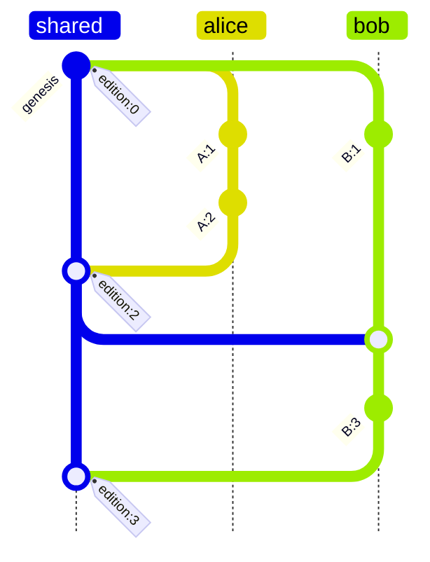

# Version Control

The spec for Dialog's version control: how repository state is named,
signed, merged, and how deletion works without tombstones. This
consolidates the earlier design notes (the divergence-clock successor
design, the convergence audit, and the observed-remove merge design)
into one document describing what is implemented on this branch.

## Overview

A repository is a search tree of facts plus a revision DAG describing
how that tree evolved. Both live in the same tree: the EAV/AEV/VAE
regions hold the live facts (the active indexes), and the history
region holds an append-only log of claims and revision records. One
root covers data and its history, so a revision's tree reference is the
atomic unit of sync.

The log is the truth; the active index is a cache of the live fold. A
claim is live iff no record in the log covers it (a retraction naming
it in its cause, or a replace naming it in its supersedes set). There
is no tombstone variant in the active indexes: deletion travels as
history, and merges keep the cache consistent with the growing log.

In CRDT terms the system is an optimized observed-remove set: the
`(Origin, Edition)` versions are its dots, and the revision DAG is its
causal context.

## Versions

Causal position is derived from the revision DAG itself rather than
from a synchronization counter (see [divergence clock] for the design
this replaces; its `since` counter was local to one repository's sync
history and incommensurable across repositories).

- **Edition** is a Lamport timestamp: `edition = max(edition of every
  version in cause) + 1`, with `0` for a genesis revision (empty
  cause). A local commit on top of the previous head yields
  `previous + 1`; a merge yields `max(local, upstream) + 1`. A higher
  edition has seen at least as much causal history as any lower one,
  regardless of which repository produced it.

- **Origin** is the lineage-scoped identity of the issuer. The lineage
  is the schema `Branch` entity, content-derived from the `(profile,
  subject)` origin and the branch name; the origin is derived from the
  lineage entity and the issuer DID, with both identifiers
  length-prefixed to keep the derivation injective
  (`Revision::origin_of(lineage, issuer)`). Folding in profile,
  subject, branch name, and the per-session operator key means: the
  same issuer on two repositories, or on two branches of one
  repository, produces distinct origins. A branch head is an
  independent sequential actor.

- **Version** is the pair `(origin, edition)`. Versions sort naturally
  by causal depth via edition (ties broken by origin so the order is
  total and deterministic). Two versions with the same edition but
  different origins are concurrent by inspection: neither can have
  seen the other, since seeing it would have forced a higher edition.

**Origin invariant (safety-critical).** Version uniqueness and the
exactness of the causal context below hold only if each origin is a
single sequential actor. Within a session, CAS on the branch head cell
serializes commits from concurrent handles; across sessions, each
session acts under its own operator key and therefore its own origin.
Two distinct revisions claiming the same version are protocol
corruption: replicas order the offenders deterministically by content
hash to preserve convergence, but such histories are corrupt and should
surface an error.

## Revisions

A revision names a concrete repository state and is stored in two
complementary shapes.

**The head** is the value published to the branch's revision cell:

```text
Revision {
    subject,    // DID of the repository
    issuer,     // DID of the operator (per-session key) that minted it
    authority,  // DID of the profile on whose behalf it was minted
    branch,     // name of the minting branch (part of the origin scope)
    tree,       // root of the search tree at this revision
    cause,      // parent tree roots (one on advance, upstream's on merge)
    edition,    // Lamport timestamp derived from the DAG
    signature,  // issuer's Ed25519 signature over the payload
}
```

The signing payload is a deterministic encoding of every field except
the signature: length-prefixed UTF-8 for subject, issuer, authority,
and branch; the 32-byte tree root; the sorted cause roots with a count
prefix; the big-endian edition. The signature binds the tree root to
the issuer, which matters because the in-tree record (below) cannot
contain the root of the tree it lives in. A replica verifies this
signature before adopting or merging any head it did not mint: pull is
the trust boundary, and a forged or tampered head (wrong root,
reattributed issuer, adjusted edition) is rejected before any of its
blocks are walked.

Advancing mints under the branch's own subject and name, passed
explicitly rather than inherited: a branch may have adopted a head
minted in a foreign repository (a fast-forward pull across subjects),
and commits on top of it belong to this branch's lineage scope, not the
foreign one.

**The record** (`RevisionRecord`) is the revision's durable metadata,
written into the history region as one atomic dag-cbor fact
(`dialog.db/revision`) on the content-derived revision entity, which
any replica derives from the version alone. It carries the format tag,
the lineage entity, issuer, authority, the parent versions (the DAG
edge), the skip links, and its own issuer signature over everything
else. One record per revision keeps the metadata all-or-nothing under
partial replication and makes each ancestor-traversal step a single
exact lookup.

Records vouch for themselves twice over: the signature covers every
other field, and the version a record was stored under is derivable
from its own contents (origin from lineage and issuer, edition from the
parents), so both a tampered record and a valid record replayed at
another revision entity fail the read-side check the history reader
enforces on every lookup.

Queries see revisions through verify-before-project formulas over the
record (`dialog/revision`, `dialog/revision-parent`), with built-in
derived concepts `Revision` and `RevisionParent`, and a recursive
`RevisionAncestor` concept closing the parent relation transitively via
the engine's semi-naive fixpoint. Forged records project nothing.
Causal verdicts between fixed claims are immutable and memoized
(`CausalityCache`).

The `dialog.` attribute namespace is reserved: user instructions cannot
write it, so lineage cannot be corrupted through the ordinary write
path.

**Skip links.** A revision advanced from a single parent also records
skip links: entries whose targets leap `2^k` first-parent steps back,
built by binary lifting from the parent's own table. Ancestor search
follows the longest recorded leap that stays at or above the sought
edition, descending long linear runs in logarithmically many reads. Two
rules preserve exactness: a leap never crosses a merge (merge revisions
record no skip table, since leaping one would lose the ancestry
entering through the other parent), and no leap descends past the lower
head's edition.

**The authority binding (known gap).** The record's `authority` field
is the issuer's claim that a profile authorized the revision; only the
issuer's key backs it. Embedding delegation proofs is blocked on a
semantic problem, not plumbing: delegations expire, revisions are
forever, and records deliberately carry no wall-clock timestamps.
Until a time-anchoring story exists (an epoch entity referenced by
content, or revocation-list semantics), treat `authority` as
attribution metadata; `issuer` is the cryptographically bound identity.

## One tree: data and history

History records live in the same search tree as the data, under their
own key tag. The logical history key is

```text
/edition/origin/entity/attribute/value_hash -> record
```

stored head-plus-hash: an order-preserving raw prefix (edition, origin,
the entity key form's raw head, up to 57 raw attribute bytes) with the
final 32 bytes a Blake3 hash of the entire untruncated key. Distinct
logical keys always store distinctly, the region stays range-scannable
by `(edition, origin, entity, attribute)`, and readers re-check
truncated components against the stored record.

Consequences of the single root:

- History can never be replicated separately from the data it
  describes, or vice versa.
- Pulling merges history automatically: records ride the same tree
  differential as data, and since every record's key is unique to its
  version, the union is conflict-free.
- Two identical trees necessarily carry identical histories, so
  fast-forward detection is a root comparison.

Because edition leads the key, scanning the history region yields
revisions in a total order consistent with causality: concurrent
revisions interleave, but no revision appears before one of its
ancestors.

## Claims and lineage

Every version-tagged write appends a claim record to the history region
alongside its effect on the active indexes. A claim's `cause`
identifies the prior claims on the same `(entity, attribute)` that it
supersedes, scoping lineage to individual fact histories rather than
the whole repository state. In the stored datum form, the cause
versions land in the `supersedes` field and the polarity in the
`retraction` flag.

- **Assert** is purely additive: it records a genesis cause and inserts
  the datum (tagged with the producing revision's version) at all three
  data orderings.
- **Replace** scans the `(entity, attribute)` slot for priors, deletes
  the different-valued ones from the indexes, and records their
  versions as its cause. A same-valued prior stands untouched at its
  original version (re-recording it would fork its lineage), and an
  identical no-op batch writes nothing.
- **Retract** deletes the fact's three index keys outright and records
  the withdrawn claim's version as its cause. No tombstone. A retract
  of an assert made in the same batch must not claim its own version as
  cause and degenerates to a genesis retraction; the pair cancels to
  nothing in the indexes. Retracting a fact that never existed is a
  no-op.

A `cause` entry is a `Version`: it identifies the revision that
produced the superseded claim, and combined with the claim's own
`(entity, attribute)` it locates that claim in the history index. For
cardinality-many attributes one revision may write several values at
the same `(entity, attribute)`; traversal follows the union of the
causes of all claims found at each position.

## Deletion: the causal context

Deletion is not state in the active index; it is a fact about the log.
What stops a stale peer from resurrecting a deleted fact is the
receiver's **causal context**: the per-origin watermark of its head's
ancestry.

```text
context(head) = { origin -> max edition of that origin in head's ancestry }
observes(v)  <=>  v.edition <= context[v.origin]
```

This summary is exact, not approximate. Because an origin is a
sequential actor, its revisions are totally ordered by ancestry and
strictly increasing in edition, so the set of one origin's versions in
any head's ancestry is a prefix; the watermark loses nothing. (Edition
gaps from merges are harmless: gap editions were never minted by that
origin, so `observes` is never asked about them.)

The context is a pure function of the head, derived by walking the
revision records in the head's ancestry (`history::context_of`), and
cacheable by head hash. Its size is one entry per origin (devices,
authors, branches), never growing with writes. Persisting it in the
tree as a `dialog.`-reserved record, maintained incrementally
(`context(commit) = context(parent) + own version`, `context(merge) =
union(parents) + own version`), is the main deferred optimization: pull
currently recomputes it per merge, an O(ancestry) walk.

A claim that is observed but not live in the active index was covered
by some record in the log. That is the whole deletion story: "have I
seen this incoming claim before" is answered by the watermark, and
"was it deleted" follows from it not being live.

## Merge

Pull integrates the **upstream's delta since the sync base onto the
local tree**, so the receiver's own context guards its own cache. The
delta is computed as two region-scoped differentials of
`base -> upstream` (history region; data regions), screened, and
chained into a **single** integrate pass with history changes ordered
before data changes. `integrate` applies changes in stream order
against the in-flight batch, so no intermediate persist is needed, and
none must be inserted: the first pass's new nodes live only in the
in-memory delta, and splitting the persist breaks block resolution.

Three rules, each O(1) per changed key, reading only the receiver's own
snapshot and context plus the differential itself:

- **R1 (data adds).** An incoming live claim whose version the receiver
  observes is never re-applied: if it is still live locally there is
  nothing to do, and if it is not, some local record covered it, and
  re-applying would resurrect a deletion. Unobserved claims are news
  and pass through. Claims without version tags (unversioned legacy
  writes) cannot be reasoned about and pass through. Legacy `Removed`
  tombstones from pre-observed-remove trees never propagate: the screen
  drops them on ingest.

- **R2 (removes).** Incoming removes pass through and stay
  byte-guarded: the tree deletes a key only when the local entry
  matches the incoming one exactly. This is already the correct
  observed-remove rule: if the local slot holds something the remover
  never observed (a later re-assert), the remove misses it.

- **R3 (coverage).** Each incoming covering record (a retraction, or a
  replace with a non-empty supersedes set) retires the covered claims
  still live locally: the screen scans the record's `(entity,
  attribute)` slot in the receiver's pre-merge snapshot and emits
  guarded removes (all three orderings) for every standing claim whose
  version appears in the record's supersedes set. Coverage matches by
  **version, not value**: a replace supersedes claims of other values,
  which live at other keys (data keys embed the value hash), so probing
  the record's own keys would silently miss them. This is how a
  deletion or replacement reaches a replica whose sync base never
  covered the fact (an empty-base pull from a newly tracked upstream, a
  stale third party). A genesis retraction covers nothing and skips the
  scan.

R1 handles coverage that happened in the receiver's past; R3 handles
coverage arriving in this delta; R2 is the fast path both directions
share. The ordering matters: an incoming re-assert and the retraction
it follows can arrive in one delta, and coverage must retire the old
claim before the data pass contests the slot.

**Head selection** after integration, with `merged` the resulting root:

- `merged == upstream.tree`: fast-forward, adopt the upstream head.
  Sound because history lives in the same tree: identical roots imply
  identical histories, so any novel local record would have made the
  roots differ.
- No local head: adopt the upstream head.
- `merged == local.tree`: the upstream had nothing the receiver lacks
  (its novelty was already in the ancestry, or screened as covered).
  The local head stands; only the sync base advances.
- Otherwise: mint a merge revision. Its record lists both parents (and
  no skip table), is signed before entering the tree, and the head is
  signed once the final root (including the record) is known. Its
  cause carries the upstream tree root; its edition is
  `max(local, upstream) + 1`.

**Contested slots.** The only remaining integrate contest in the data
regions is `Added` vs `Added`: the key embeds the value hash, so both
sides assert the same value and differ only in version metadata. The
deterministic last-write-wins hash race picks the same winner on both
sides, so mutual pulls quiesce onto identical trees. Caveat: the
surviving datum's version is the race winner's, so cause bookkeeping
derived from the standing datum may cite the loser's sibling; history
retains both claims and the lineage stays traversable.

**Convergence argument.** The log merges as a set union: order-free,
idempotent. Liveness of a claim is a monotone predicate of the log
(coverage records are immutable; once covered, always covered).
R1/R2/R3 maintain `cache = live(log)` across every merge, so two
replicas holding the same log hold the same cache, regardless of
exchange order or direction. No slot algebra, no tie-breaks beyond the
byte-variant race among copies of the same fact.

**Observed-remove semantics** follow: a retraction removes exactly the
assertions its author had observed. If Alice retracts Bob's assertion
of a value while Mallory concurrently asserts the same value, Mallory's
claim was never covered and survives everywhere; once Jordan, who has
seen both, retracts, his record covers both versions and the value is
gone everywhere. Deletion is not forever: a re-assert mints a fresh
version above every watermark, so R1 treats it as news, R2 cannot touch
it, and no existing record covers it; the resurrection propagates and
survives pulls from stale peers.

Acceptance tests pinning these properties live in
`dialog-repository/src/repository/branch/pull.rs` (`history_tests`):
deterministic non-resurrection across tracked, empty-base, and reverse
pulls; quiescence under mutual pulls; the Alice/Bob/Mallory/Jordan
OR-set scenario; resurrection surviving a stale-peer pull; and the
replaced-value stale-peer case.

## Conflict detection

When two claims on the same `(entity, attribute)` meet, resolution
proceeds in tiers:

**Tier 0, version comparison, O(1), no reads.** Same version: causally
equal. Same edition, different origin: concurrent. Same origin,
different edition: causally ordered (an origin is sequential).
Otherwise proceed.

**Tier 1, direct cause check, O(1).** If B's version is in A's cause, A
supersedes B, and vice versa. Otherwise proceed.

**Tier 2, cause traversal, O(k).** Walk the higher-edition claim's
causal history backward through the history index, maintaining a
frontier of unvisited versions (cause sets make it a DAG, not a chain).
Editions strictly decrease along every causal path, which bounds and
guides the walk: a frontier version matching the other claim means
superseded; a frontier version at or below the other claim's edition
without matching prunes that branch; an exhausted frontier means
concurrent. The bound k is the number of writes to that specific
`(entity, attribute)` between the two editions, not the total history.

Verdicts memoize soundly: between two fixed claims the relationship is
immutable (appending revisions extends the DAG above them, never
between them), so even `Concurrent` is a permanent answer
(`CausalityCache`, keyed by claim content). The one revisable outcome
is incomplete replication: if the cause chain has gaps, ordering cannot
be determined locally and resolution blocks until the missing records
replicate; that outcome is never cached.

Genuinely concurrent claims are both valid; a last-write-wins query
resolves deterministically by claim hash, and applications that want to
surface the conflict can request all concurrent values.

### Illustration

Alice makes two revisions, Bob one, from a shared base; Bob then pulls
and commits again:



When `A:2` and `B:1` meet, neither version appears in the other's
cause. Tier 2 walks `A:2`'s history backward: the frontier holds `A:1`
at edition 1, which matches `B:1`'s edition but not its version, so the
branch prunes; the frontier exhausts: concurrent. After Bob pulls and
commits `B:3` with `A:2` in its cause, any later claim of his
supersedes Alice's via the tier 1 direct check.

## Branches and sync

A branch is a pair of transactional cells under the repository subject:
the head revision and the upstream tracking state. Cells are cached,
versioned, and published with compare-and-swap semantics; read-compute-
write flows checkpoint the cell first and publish through the
checkpoint, so a concurrent write makes the publish fail loudly
(`VersionMismatch`) instead of being silently overwritten. Recovery is
refresh and retry.

- **Commit** applies a version-tagged instruction stream to the head's
  tree (data writes plus claim records plus the revision record),
  imports the resulting blocks, and publishes the new head through the
  checkpoint taken before applying.
- **Fetch** reads the upstream's current head without modifying local
  state.
- **Pull** is the merge above. It supports multiple tracked upstreams,
  each with its own sync base (the upstream tree at last sync, the
  divergence marker); `pull().from(target)` pulls an arbitrary local or
  remote branch, running from the empty base if untracked and tracking
  it on success. Pull is two-phase: `prepare` does all network and CPU
  work (fetch, verify, screen, integrate, import) with no cell writes,
  and `commit` performs the two instant cell publishes, so a caller can
  hold an exclusive lock over only the latter. Racing writes surface as
  CAS failures; the sync-base advance reconciles entry-wise when other
  upstreams' tracking state moved concurrently.
- **Push** is fast-forward only: if the upstream moved past the
  recorded sync base, it fails and the caller pulls first. For remote
  upstreams the novel tree nodes (computed by the same region
  differential) and newly referenced blobs are uploaded before the head
  is published, so a published revision never references bytes the
  remote lacks. A push with nothing new is a no-op.

**Partial replication is unaffected** by any of the above: "observed"
means "in my head's ancestry", not "bytes on my disk". A replica that
adopts head H holds H's fold regardless of which blocks it has fetched.
R1 is an in-memory watermark lookup; R2/R3 read only the differential,
which walks only divergent paths with lazy remote fallback. The one
thing a partial replica must not do is prune history-region entries;
horizon GC is a future story and needs a published floor below which
fresh replicas bootstrap by adopting state rather than merging.

## Invariants

Safety-critical properties every change to this machinery must
preserve:

1. **Origin-sequential.** One origin is one sequential actor: a branch
   lineage advanced by one session key, serialized by head-cell CAS.
   `observes()` is exact only because of this. Duplicate versions are
   protocol corruption with a deterministic fallback ordering and a
   surfaced error. Note that `branch.reset()` to an ancestor followed
   by a commit would re-mint an already-used version; reset is for
   fast-forward advancement (push), not rewind.
2. **A tree's history records are a subset of its head's ancestry.**
   Minting writes the record at the head that carries it; every pull
   arm preserves the inclusion (fast-forward adopts the superset,
   merges union both sides, the no-op arm changes nothing). This is
   what makes the context derivable from local state and lets the
   fast-forward arm reason from root equality.
3. **History before data, one integrate pass.** R3's coverage must
   retire slots before R1's data adds contest them, and the chained
   stream must persist once (intermediate persists lose the in-memory
   delta's nodes).
4. **The merge reads only the receiver's state** (snapshot + context)
   plus the incoming differential, never the sender's context.
5. **`dialog.` is reserved.** Lineage is written only through the
   record path, never through user instructions.

## Deferred work

1. **Persist the causal context in the tree** as a `dialog.`-reserved
   record maintained incrementally, replacing the per-pull O(ancestry)
   `context_of` walk; fresh partial replicas would obtain it in one
   lazy fetch, verified opportunistically against the signed head's
   ancestry.
2. **Fold `Replace`'s local hard-delete into R3** so local and remote
   supersession run through one code path (remote coverage already
   flows through R3).
3. **`State::Removed`** survives only as a legacy variant for reading
   pre-observed-remove trees; the screen drops it on ingest. Removing
   the enum variant is a serialization-format change, deliberately not
   done yet.
4. **Authority binding**: a time-anchoring story for delegation proofs
   in revision records (see the known gap above).
5. **History horizon GC** with a published bootstrap floor.
6. **Re-assert cause records**: an assert over a deletion could record
   the covered versions as its claim cause, making resurrection
   first-class in the lineage for `causality()`. Adopt when convenient;
   nothing depends on it.

[divergence clock]: ./divergence-clock.md
