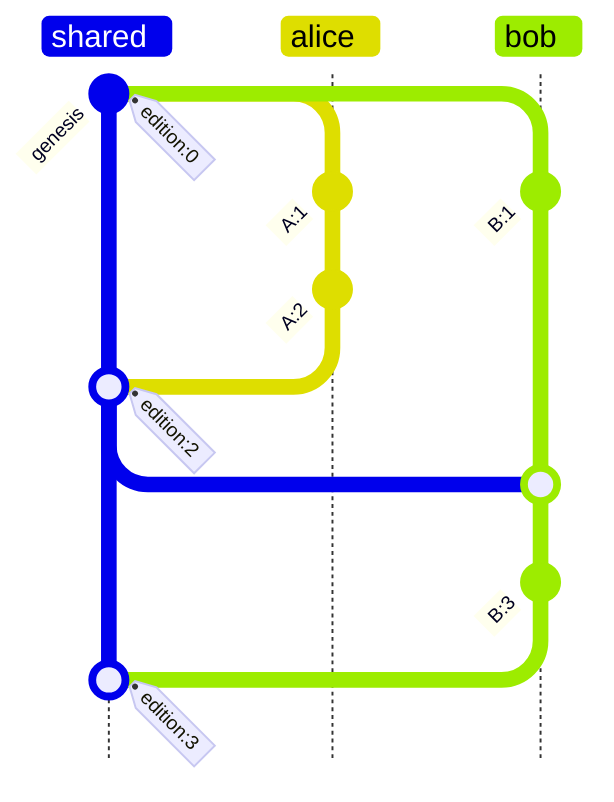
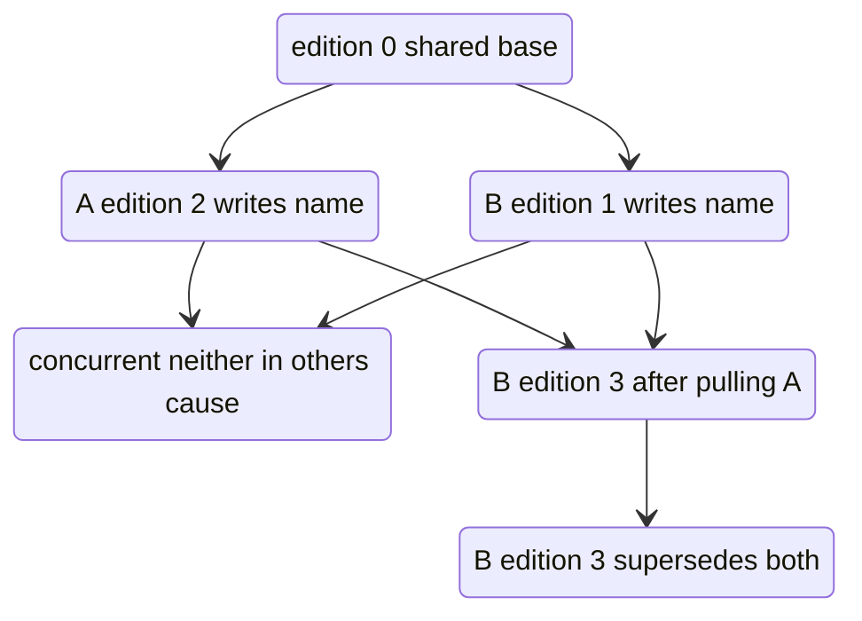
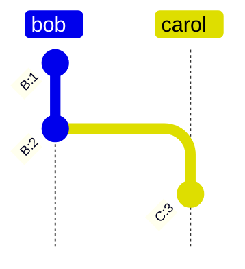
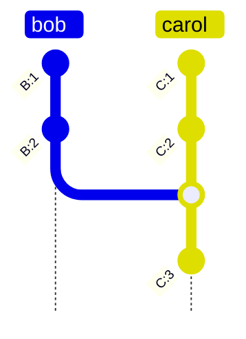
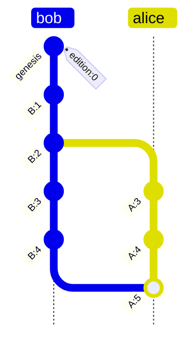

# Version Control

## Context

The [divergence clock] design encodes causal position as `{ since, at, drift }` where `since` increments at synchronization points, enabling cheap concurrency detection: two changes with the same `since` and different `at` values are concurrent by inspection, no traversal required.

This works well for a single collaborative repository. The limitation surfaces when two repositories with independent histories need to interact. The `since` counter is local to a repo's synchronization history. There is no meaningful way to compare `since: 3` from repo A with `since: 3` from repo B. They count different sync events. A cross-repo merge would require either renumbering one history (losing provenance) or accepting that the clock values are simply incommensurable.

A desired property of Dialog's collaboration model is that forks and follows work as first-class operations across independent repositories. This document describes a causal encoding grounded in the revision DAG that aims to preserve the divergence clock's fast concurrency detection while composing correctly across repo boundaries.

## Idea

Instead of deriving causal position from a logical counter, derive it from the structure of the revision DAG directly. Every revision has a natural position: the count of revisions in the causal chain leading to it. This is its `Edition`. An author increments their edition with each local revision and advances it to `max(seen) + 1` on sync. This is isomorphic to a Lamport timestamp, which gives it a useful property: a higher edition has seen at least as much causal history as any lower one, regardless of which repository it came from.

`Edition` alone is not enough to identify a revision globally, because two authors could independently reach the same edition count. It is therefore paired with `Origin`, a repository-scoped identity derived as `Blake3(issuer + subject)`. Because `issuer` is a fixed-width (32 byte) key, the concatenation is unambiguous. Deriving origin from both the signing key and the repository DID ensures that the same principal acting on two different repositories produces two distinct origins. Without this, a principal whose histories in two separate repositories later merge could produce colliding identifiers.

Together, `Origin` and `Edition` form a `Version`: a compact revision identifier that sorts naturally by causal depth and uniquely addresses any revision across all repositories.

**Origin invariant:** version uniqueness holds only if each origin is a single sequential actor. An origin is derived from `(issuer, subject)`, so the same signing key used concurrently on two devices shares one origin and can mint the same edition for two distinct revisions, producing colliding versions. Each replica MUST therefore act under its own issuer key (e.g. a per-device or per-agent key acting on behalf of a common authority). Replicas MUST treat two distinct revisions claiming the same version as a protocol violation; to preserve convergence they order the offending revisions deterministically by their content hash, but such histories are considered corrupt and should surface an error.

## Core Types

```rust
/// Root of the search tree at a given revision
#[derive(Attribute, Debug, Clone)]
#[domain("dialog.revision")]
pub struct Tree(Blake3Hash);

/// Count of revisions in the causal chain leading to this one.
/// Increments locally on each revision; advances to max(seen) + 1 on sync.
/// Isomorphic to a Lamport timestamp.
#[derive(Attribute, Debug, Clone)]
#[domain("dialog.revision")]
pub struct Edition(u64);

/// Repository membership identifier derived as Blake3(issuer + subject).
/// Deriving from both signing key and repository DID ensures that the same
/// principal acting on two different repositories produces two distinct origins,
/// preventing collisions when independent repositories later merge.
#[derive(Attribute, Debug, Clone)]
#[domain("dialog.revision")]
pub struct Origin(Blake3Hash);

/// Ed25519 authority on whose behalf the revision is committed.
/// Authorization of the issuer to act for the authority is established
/// out of band (e.g. via UCAN delegation) and is not part of this design.
#[derive(Attribute, Debug, Clone)]
#[domain("dialog.revision")]
pub struct Authority([u8; 32]);

/// Ed25519 principal committing (and signing) the revision
#[derive(Attribute, Debug, Clone)]
#[domain("dialog.revision")]
pub struct Issuer([u8; 32]);

/// Ed25519 signature by the issuer over the revision payload
#[derive(Attribute, Debug, Clone)]
#[domain("dialog.revision")]
pub struct Signature([u8; 64]);

/// Uniquely identifies a specific revision by a specific origin.
/// Sorts naturally by causal depth via edition.
/// Two versions with the same edition but different origins are concurrent.
pub struct Version {
    pub origin:  Origin,
    pub edition: Edition,
}

/// A set of versions identifying prior claims superseded by this one.
pub struct Cause(Vec<Version>);
```

## Revision

A revision is a Dialog concept stored as a claim in the EAV index under the repository DID as the entity, making revision history queryable via Datalog like any other data.

```rust
#[derive(Concept, Debug, Clone)]
pub struct Revision {
    pub this:      Entity,     // content-addressed hash of this Revision object
    pub tree:      Tree,
    pub edition:   Edition,
    pub subject:   Did,        // DID of the repository
    pub issuer:    Issuer,
    pub authority: Authority,
    pub signature: Signature,
    pub cause:     Cause,      // parent revision versions (one normally, multiple on merge)
}

impl Revision {
    /// Derives the origin from issuer and repository DID.
    /// Stored nowhere; always computed on demand.
    pub fn origin(&self) -> Origin {
        Origin(blake3::hash(&[self.issuer.0.as_ref(), self.subject.as_bytes()].concat()))
    }

    /// Returns the Version identifying this revision.
    pub fn version(&self) -> Version {
        Version {
            origin:  self.origin(),
            edition: self.edition.clone(),
        }
    }
}
```

**Signing and content addressing:** the revision *payload* is the deterministic encoding of `{tree, edition, subject, issuer, authority, cause}`. The `signature` is the issuer's Ed25519 signature over `Blake3(payload)`. The revision's entity identifier `this` is `Blake3(payload + signature)`. Ordering matters: the signature covers the payload (not `this`), and `this` covers both, so verification recomputes the payload encoding, checks the signature against the issuer key, and checks the hash. The issuer signs; the authority is the principal on whose behalf the revision is made, with the issuer's right to act for the authority validated out of band.

A revision is stored in two complementary shapes:

1. **As a concept:** per the usual concept decomposition, the Revision's attribute claims (`dialog.revision/tree`, `dialog.revision/edition`, ...) are stored with `of = this` (the revision's content-addressed entity). This makes every field of every revision queryable via Datalog.

2. **As a lineage claim:** a single claim links the repository to the revision, recording the revision DAG edge:

```
Claim {
    the:   "dialog.db/revision",
    of:    repository_did,
    is:    this,                  // the revision's content-addressed entity
    cause: Cause(vec![...]),      // parent revision version(s)
}
```

The repository DID as `of` means querying the current revision is a simple lookup, and the full revision history is all `dialog.db/revision` claims on that entity ordered by edition. Note that `is` carries the revision's entity hash — not a hash of the `Version`. The `Version` is never hashed: it is stored structurally (in `cause` fields and history index keys) precisely because hashing it would destroy its natural sort order by edition. Multiple repositories each maintain their own independent lineage under their respective DIDs.

**Edition rule:** a revision's edition is derived from the revision DAG: `edition = max(edition of every version in cause) + 1`, and a genesis revision (empty `cause`) has `edition = 0`. This single rule subsumes both the sequential and the sync case: a local revision on top of the previous one yields `previous + 1`, and a merge revision on top of local and received heads yields `max(local, received) + 1`. Implementations typically cache the result as a per-replica counter that advances when remote revisions are observed, but the counter is an optimization — the DAG-derived value is authoritative. A higher edition has seen at least as much causal history regardless of which repository it came from.

**Offline construction:** a new revision requires only the previous revision. No fetches needed. The new version is derived from the previous revision's edition and origin, and `cause` points to the previous revision's version.

**Merge revisions:** when incorporating changes from another revision lineage, `cause` lists the versions of all parent revisions. This is the only case where `cause` contains more than one entry.

## Claim Structure

Claims carry a `cause` field identifying the prior claims on the same `(entity, attribute)` that this claim supersedes. This is analogous to how a git commit records which commits it builds on, but scoped to individual fact lineages rather than the full repository state.

```rust
pub struct Claim {
    pub the:   The,
    pub of:    Entity,
    pub is:    Value,
    pub cause: Cause,
}
```

`cause` is empty on first write to an attribute. It contains one entry in the normal sequential case. It contains multiple entries when explicitly resolving concurrent claims from different authors, recording that the author saw and deliberately superseded all of them.

Retractions are claims like any other and participate in the same lineage: a retraction's `cause` identifies the claim(s) whose assertion it withdraws, so a retraction supersedes an assertion (and can itself be superseded by a later assertion) through exactly the same machinery.

A `cause` entry is a `Version` — it identifies the *revision* that produced the superseded claim, and combined with the claim's own `(entity, attribute)` it locates that claim in the history index. For cardinality-many attributes a single revision may write several values for the same `(entity, attribute)`; a `Version` then identifies the set of claims written at that position. This is harmless: the lineage that conflict detection traverses is scoped per `(entity, attribute)`, so traversal follows the union of the causes of all claims found at each position.

This enables conflict detection scoped to individual attribute lineages rather than requiring full revision DAG traversal.

## History Index

Revisions and claims share a unified history index:

```
/edition/origin/entity/attribute/value_hash -> Claim
```

The index is not a separate tree: history records live in the same search tree as the EAV/AEV/VAE indexes, under their own key tag, with the entity and attribute components hashed down to fit the fixed key width (history lookups are exact-match on components taken from a claim in hand, so hashing loses nothing until range queries over entities are needed). One root therefore covers both data and its history:

- A revision's tree reference is the atomic unit of sync — history can never be replicated separately from the data it describes, or vice versa.
- Pulling merges history automatically: records ride the same tree differential as data, and since every record's key is unique to its version, the union is conflict-free.
- Two identical trees necessarily carry identical histories, so fast-forward detection is a root comparison.

This key structure serves two purposes.

**Revision DAG traversal:** revision claims are stored under `entity = repository_did`. Because edition leads the key, scanning the index and filtering on `entity = repository_did` yields revision history in a total order consistent with causality (concurrent revisions interleave, but no revision ever appears before one of its ancestors). Finding a common ancestor between two revision lineages is done by following `cause` pointers backward from each head.

**Claim conflict resolution:** when two conflicting claims on the same `(entity, attribute)` are encountered, the index allows efficient traversal of the attribute's causal lineage. Given a conflicting claim's `Version`, the key `/edition/origin/entity/attribute` locates it directly and its `cause` chain can be followed backward.

## Conflict Detection

When two claims A and B conflict on the same `(entity, attribute)`, resolution proceeds in tiers.

**Tier 0: Version comparison, O(1), no reads:**
- Same version: same revision produced both — the claims are causally equal
- Same edition, different origin: concurrent — neither can have seen the other, since seeing it would have forced a higher edition
- Same origin, different edition: causally ordered — an origin is a single sequential actor, so its claims are totally ordered by edition
- Different origin, different edition: proceed to tier 1

**Tier 1: Direct cause check, O(1):**
- If B's version is in A's `cause`, A supersedes B
- If A's version is in B's `cause`, B supersedes A
- If neither, proceed to tier 2

**Tier 2: Cause traversal, O(k):**

Traverse the higher-edition claim's causal history backward through the history index, looking for the lower-edition claim's version. Because `cause` may contain multiple entries (concurrent-resolution claims), the history is a DAG rather than a chain: traversal maintains a frontier of unvisited versions rather than following a single pointer. Editions strictly decrease along every causal path (a cause is in the causal past of its effect), which bounds and guides the traversal:

- Frontier version equals the other claim's version: superseded
- Frontier version's edition is less than or equal to the other claim's edition (without matching it): prune that branch — everything deeper has a strictly lower edition and cannot match
- Frontier exhausted: concurrent

The traversal is bounded by k, the number of writes to that specific `(entity, attribute)` between the two editions, not the total revision history. In practice k is small since most attributes are written infrequently.

**Incomplete replication:**

If the cause chain is incomplete due to missing claims, causal ordering cannot be determined locally. Resolution blocks until the missing claims have been replicated. This is expected behavior: a partial replica does not have enough information to resolve conflicts it has not fully received yet.

### Conflict Detection Illustrated

Two authors work independently from the same revision then sync. Alice makes two revisions, Bob makes one, then Bob pulls Alice's work before committing again:



| Author | Action | Edition |
|--------|--------|---------|
| Alice | commit | 1 |
| Alice | commit | 2 |
| Bob | commit | 1 |
| Alice | push | 2 |
| Bob | pull | counter advances so next commit lands at max(2, 1) + 1 = 3 |
| Bob | commit | 3, cause references both A:2 and B:1 |
| Bob | push | 3 |

When Alice's `A:2` and Bob's `B:1` meet during sync, neither version appears in the other's `cause`. Following Tier 2, we traverse `A:2`'s causal history backward. We check the higher edition because it may have seen the lower one, while the lower edition cannot have seen something with a higher edition. The frontier contains only `A:1` at edition 1, which matches `B:1`'s edition but not its version — the branch is pruned, since everything deeper has a strictly lower edition. The frontier is exhausted: concurrent.

After Bob pulls and commits `B:3`, his `cause` contains `A:2`'s version. Any subsequent claim from Bob on an attribute Alice also wrote supersedes hers via Tier 1 direct check, O(1).



## Cross-Repo Merges and Forks

Each repository maintains its own revision lineage identified by its DID. Because `Edition` is a Lamport timestamp, editions from different repositories are directly comparable: a higher edition has seen more causal history regardless of which repository produced it.

**Forking:** Alice creates her own repository DID and writes her first revision with `cause` pointing to Bob's current head version. Her edition takes `max(Bob's edition) + 1`. All subsequent edition comparisons are meaningful relative to Bob's history.

**Merging upstream:** Alice finds the common ancestor by traversing both revision lineages via `cause` pointers. Conflicting claims are resolved using the tiered conflict detection above.

**Collaborator joining with no prior history:** Carol initializes a fresh repository (edition 0, no claims), accepts Bob's invite, and pulls his history. Her counter advances to `max(Bob's edition) + 1` on pull. She then makes her first commit at that edition.



Carol has no prior claims. She pulls Bob's history, her counter advances to 3 (max(2, 0) + 1), and her first commit lands at edition 3. No reconciliation needed.

**Collaborator joining with prior history:** Carol has been working independently and has reached edition 2 with her own claims. She accepts Bob's invite and pulls his history. Her editions were incommensurable with Bob's since both reached edition 2 via independent histories. On pulling, her counter advances to `max(Bob's edition, Carol's edition) + 1`. Her prior claims are preserved in the revision DAG and her cause chain re-anchors from the merge point.



Carol's pre-join claims at C:1 and C:2 are preserved with their original editions. Her first new revision after joining is edition 3 (max(2, 2) + 1).

### Fork and Merge Illustrated

Alice forks Bob's repository at edition 2. Both continue writing independently, then Alice merges Bob's updates:



Alice forks at Bob's `edition: 2`. Her first revision is `edition: 3` (max(2) + 1). When she merges Bob's `B:3` and `B:4`, the common ancestor at `edition: 2` is found by traversing the revision DAG via `cause` pointers. Conflicting claims are resolved using the tiered conflict detection. The merge itself is the revision `A:5`: its `cause` references both lineages (`A:4` and `B:4`) and its edition is `max(4, 4) + 1 = 5`.

## Concurrent Claim Resolution

When two claims on the same `(entity, attribute)` are genuinely concurrent (neither appears in the other's cause chain), both are valid. A last-write-wins query resolves this deterministically by sorting on claim hash, producing a stable winner without requiring user intervention. Applications that need to surface the conflict explicitly can do so by requesting all concurrent values.

## Cross-Repository Collaboration

The [divergence clock] `since` counter is local to a repository's synchronization history. Two independent repositories that later merge have incommensurable counters: `since: 3` from repo A and `since: 3` from repo B count different sync events. Reconciling them requires either renumbering one history, losing provenance, or treating the merge as a special case outside the normal conflict detection machinery.

This design addresses that limitation directly. Because `Edition` is a Lamport timestamp and `Origin` is derived from `Blake3(issuer + subject)`, both are meaningful across repository boundaries without coordination. Two revisions from independent repositories can be compared, their common ancestor can be found by following `cause` pointers, and conflicting claims can be resolved using the same tiered detection that works within a single repository. Forks, merges, and collaborators joining with prior history all follow naturally from the same primitives.

[divergence clock]:./divergence-clock.md
