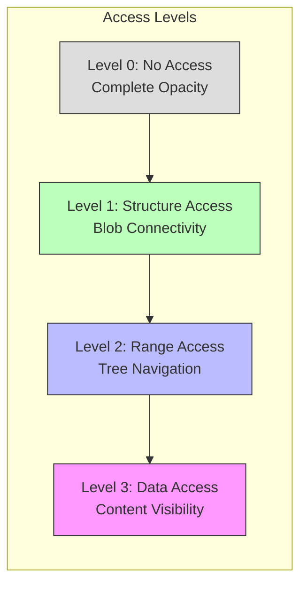
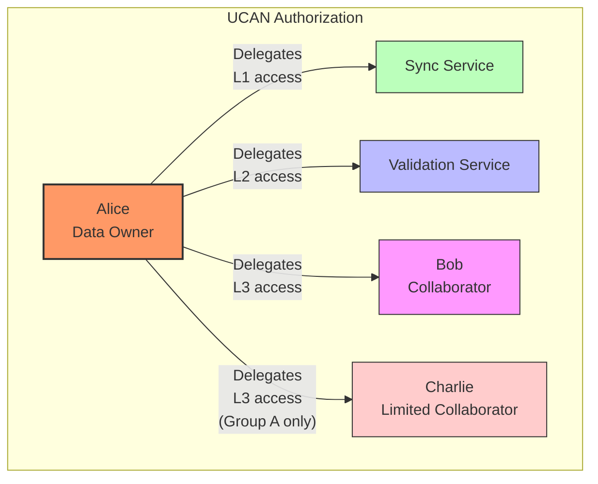
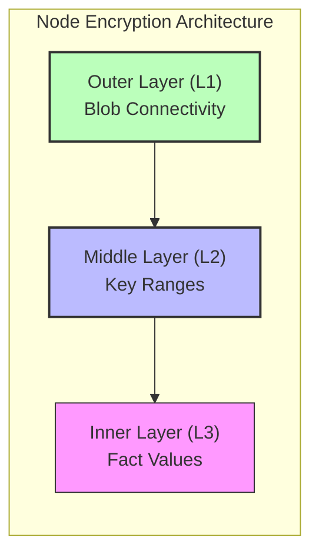
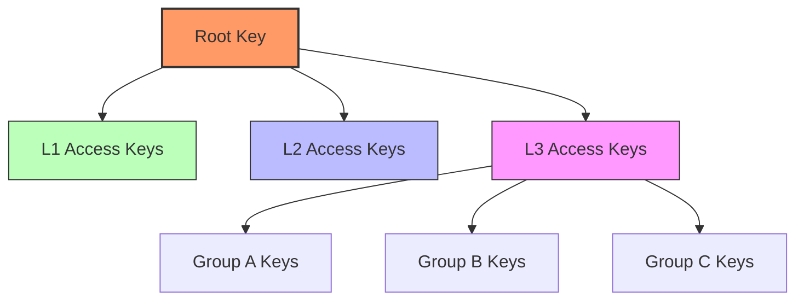
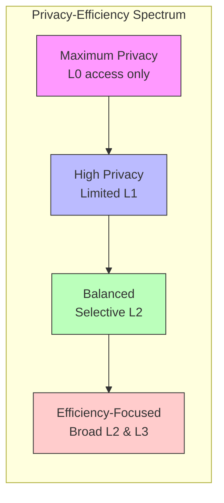
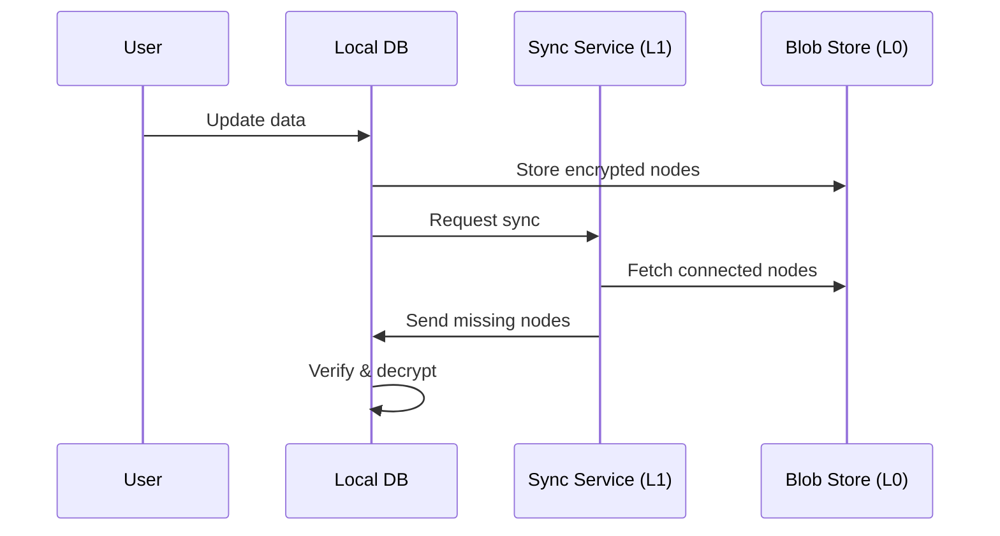
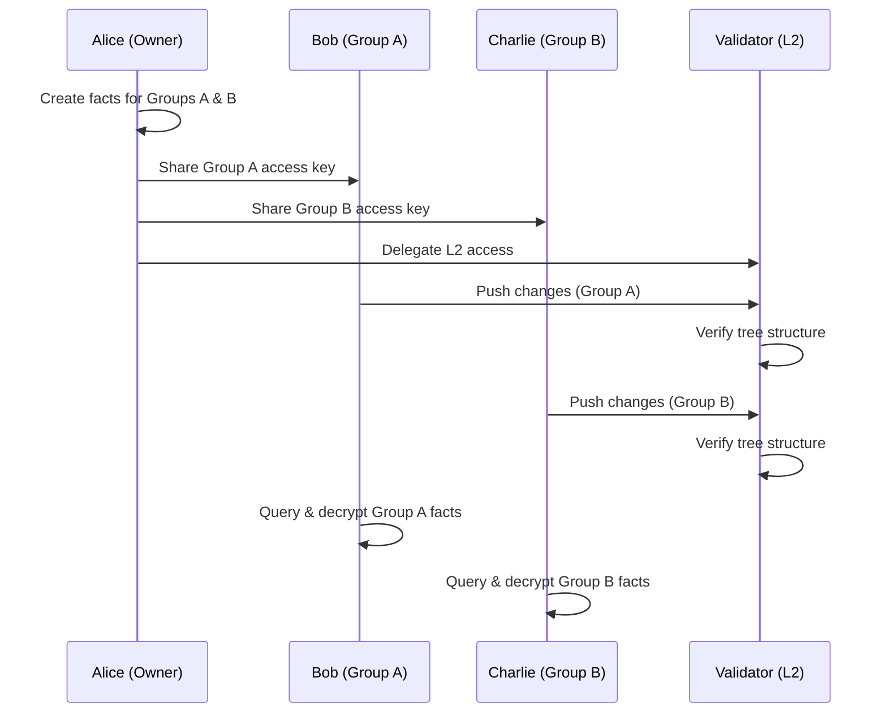

# DialogDB Privacy RFC

## Design Goals

DialogDB's privacy model is designed with the following goals:

1. **Full Infrastructure Privacy**: Storage and coordination infrastructure should have no access to user data
2. **Tiered Access Levels**: Different actors can be granted different levels of access
3. **Selective Sharing**: Fine-grained control over which parts of the database are shared
4. **Authorization Integration**: Support for capability-based authorization systems like UCAN
5. **Privacy-Efficiency Tradeoffs**: Allow users to choose their preferred balance

## Access Levels

DialogDB implements a layered privacy model with distinct access levels:

### Level 0: No Access

The base infrastructure level:

- **Blob Store**: Stores fully encrypted, opaque blobs without any knowledge of their content or relationships
- **Mutable Pointer**: Manages references without knowledge of what is being referenced
- **No Data Visibility**: Cannot see or derive any value from user data
- **Authorization Only**: Access only through proper authorization credentials

At this level, infrastructure components are completely unaware of the data, only handling completely opaque, encrypted content. This ensures that infrastructure providers cannot derive any value from user data or metadata.

### Level 1: Structure Access

Limited structural visibility:

- **Blob Traversal**: Authorized actors can follow links between blobs
- **Sync Assistance**: Can help with synchronization by providing missing connected nodes
- **No Content Insight**: Still cannot see data content or key ranges
- **Minimal Metadata**: Only visibility is blob connectivity

This level enables efficient synchronization help - an L1 actor can bundle all connected nodes a user is missing into a single compressed package, improving transfer efficiency without revealing data content.

### Level 2: Range Access

Tree structure visibility:

- **Key Range Awareness**: Can see key ranges to verify proper tree structure
- **Tree Validation**: Can validate the consistency of the Probabilistic B-Tree
- **Range-Based Retrieval**: Can retrieve subtrees covering specific key ranges
- **No Content Access**: Still cannot see actual fact values

L2 access reveals some metadata (key distribution) but enables significant efficiency gains, like fetching specific subtrees for selective replication. It allows for server-side validation of tree structure while keeping content private.

### Level 3: Data Access

Content visibility with group-based access:

- **Fact Decryption**: Can decrypt and view actual facts
- **Local Querying**: Enables full query capabilities against the database
- **Group-Based Encryption**: Different facts can be encrypted for different access groups
- **Selective Visibility**: Members of one group cannot see facts encrypted for other groups

This level is primarily for collaborators who need to see and work with the actual data. Different facts within the database can be encrypted for different groups, providing fine-grained access control within the L3 level itself.

## Authorization Model

DialogDB supports capability-based authorization through UCANs (User Controlled Authorization Networks):

### UCAN Integration

- **Capability-Based**: Authorization uses "bearer tokens" that encode specific capabilities
- **Delegation Chain**: Capabilities can be delegated from users to services or other users
- **Proofs**: Authorization can be cryptographically verified
- **In-Tree Storage**: Delegation tokens can be stored within the tree structure itself
- **Parent-Child Authorization**: Parent nodes can contain delegations for their children

UCANs enable a powerful authorization model where:

1. The owner of a database can issue capabilities to others
2. Those capabilities can be precisely scoped to specific access levels and subtrees
3. Capabilities can be delegated further with equal or more restrictive permissions
4. Access can be verified without a central authority

## Implementation Architecture

The multi-layered encryption approach is implemented through a nested structure:

### Tiered Encryption Implementation

1. **Level 3 Encryption (Inner Layer)**
   - Encrypts the actual fact values
   - Can use different encryption keys for different fact groups
   - Only accessible to authorized collaborators

2. **Level 2 Encryption (Middle Layer)**
   - Encrypts key range information
   - Wraps the L3-encrypted content
   - Enables tree structure validation

3. **Level 1 Encryption (Outer Layer)**
   - Encrypts child references
   - Wraps the L2-encrypted content
   - Enables basic blob connectivity traversal

### Key Derivation and Management

- **Hierarchical Keys**: Access keys are derived from a root key
- **Group-Specific Keys**: Within L3, different groups can have different keys
- **Key Distribution**: Keys are securely distributed to authorized parties
- **Key Rotation**: Support for key rotation without rebuilding the entire tree

## Privacy Tradeoffs and User Choice

A core principle of DialogDB is that users should be able to choose their own privacy-efficiency tradeoffs:

Users can configure their database to operate anywhere on this spectrum:

- **Maximum Privacy**: Everything fully encrypted, limited delegation
- **Balanced Approach**: Strategic delegation of L1/L2 access to trusted services
- **Collaboration Focus**: Broader sharing with appropriate access controls
- **Different Regions**: Apply different policies to different subtrees

## Practical Use Cases

### Private Cloud Sync

The sync service can help transfer connected nodes without seeing their content.

### Collaborative Editing with Group Access

Different collaborators can work on different parts of the database with appropriate access.

## Security Considerations

1. **Key Management**: Secure storage and rotation of encryption keys
2. **Authorization Validation**: Proper validation of UCAN chains
3. **Side-Channel Attacks**: Protection against metadata leakage
4. **Forward Secrecy**: Key rotation strategies
5. **Revocation**: Methods to revoke delegated access

## Next Steps

1. Implement UCAN integration for authorization
2. Develop key management protocols
3. Create reference implementations of multi-layer encryption
4. Design user interfaces for managing access levels and delegations
5. Benchmark performance across different privacy configurations